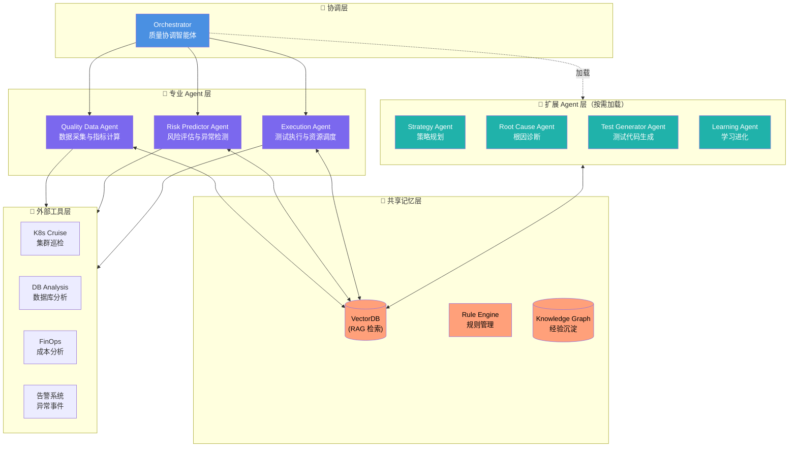

[TOC]
# AI Agent Testing - 质量智能体成长计划

> 🎯 **项目定位**：构建逐成熟完善的质量智能体（Quality Agent）的完整成长体系
>
> 🌱 **核心理念**：不是简单掌握测试工具，而是培养一个不断提升质量决策能力的 AI 质量伙伴
>
> 📈 **成长路径**：从「效率工具」到「自主决策」，从「执行者」到「质量智能体」
>
> 🏗️ **技术架构**：混合Agent架构 + RAG + Tool Use + 规则引擎
>
> 🎁 **交付标准**：通用框架 + 测试/运维领域最佳实践（可开源）

---

## 🎯 质量智能体的明确定义与长远目标

### 一、质量智能体的正式定义

```
【质量智能体 (Quality Agent)】

一个具备自主决策能力的AI系统，能够:
  1. 理解业务质量目标
  2. 感知产品状态与风险
  3. 自主制定质量策略
  4. 协调多方资源执行
  5. 持续学习与进化

质量智能体 ≠ 增强的测试工具
质量智能体 = 具备质量思维的AI伙伴
```

### 二、质量智能体的五维能力模型

| 能力维度 | 说明 | 传统测试 vs 质量智能体 |
|---------|------|---------------------|
| **感知层** | 感知质量状态 | • 传统：🔥 工程师读日志监控<br>• 质量智能体：📈 实时数据流感知 |
| **认知层** | 认知质量风险 | • 传统：📊 手动分析报告<br>• 质量智能体：🧠 AI 自动风险评估 |
| **决策层** | 决策质量策略 | • 传统：📝 工程师编写测试策略<br>• 质量智能体：🎯 AI 动态制定策略 |
| **执行层** | 执行测试任务 | • 传统：⚡ 自动化脚本执行<br>• 质量智能体：🤖 多 Agent 协同执行 |
| **进化层** | 持续学习进化 | • 传统：❌ 无学习能力<br>• 质量智能体：🔄 经验沉淀 + 策略优化 |

### 三、质量智能体的长远目标（2026-2030）

> 💡 **两个维度的成长路径**
> - **行业发展愿景（2026-2030）**：质量智能体技术在行业内的演进路线
> - **个人能力培养（8 周）**：单个学习者从零到 Level 3 的成长路径

```
🎯 质量智能体的终极愿景

建立一个与工程师共同演进的质量智能体生态系统，
实现从「测试自动化」到「质量智能化」的范式转移。

┌─────────────────────────────────────────────────────────────────┐
│ 质量智能体成长阶段（2026-2030）                            │
├─────────────────────────────────────────────────────────────────┤
│                                                                 │
│  2026 年（启航阶段）                                          │
│  ├─ 行业水平：质量智能体 Level 1-2（大部分企业）              │
│  ├─ 本项目目标：培养达到 Level 3 的质量智能体工程师           │
│  ├─ 个人成长：8 周从 Level 1 进阶到 Level 3                    │
│  ├─ 重点能力：数据感知、基础分析、测试生成、认知决策           │
│  └─ 代表项目：自动化测试脚本生成、数据报告生成、多 Agent 协同  │
│                                                                 │
│  2027 年（成长阶段）                                          │
│  ├─ 质量智能体 Level 2-3：协助者 & 合作者                     │
│  ├─ 工程师 + AI 协同：工程师定义 → AI 决策 → 工程师监督  │
│  ├─ 重点能力：风险预测、根因分析、策略优化                   │
│  └─ 代表项目：智能根因分析、动态测试策略、A/B 测试编排       │
│                                                                 │
│  2028 年（协同阶段）                                          │
│  ├─ 质量智能体 Level 3-4：合作者 & 主导者                    │
│  ├─ AI 主导：AI 制定策略 → 工程师监督                      │
│  ├─ 重点能力：多智能体协同、质量战略规划                     │
│  └─ 代表项目：跨团队质量协同、质量中台建设                   │
│                                                                 │
│  2029 年（自治阶段）                                          │
│  ├─ 质量智能体 Level 4：主导者                              │
│  ├─ 工程师 + AI 共治：工程师指导 → AI 主动治理            │
│  ├─ 重点能力：自主质量治理、质量策略持续演进
│  └─ 代表项目：自治质量中台、AI 质量决策引擎
│                                                                 │
│  2030 年（共生阶段）                                          │
│  ├─ 质量智能体 Level 5：共生者（未来愿景）
│  ├─ 工程师与 AI 共进化：质量决策 AI 驱动，工程师指导
│  ├─ 重点能力：质量文化培育、质量价值创造
│  └─ 代表项目：智能质量生态系统、质量价值网络
│                                                                 │
└─────────────────────────────────────────────────────────────────┘
```

### 四、质量智能体 vs 传统自动化测试的对比

```
┌─────────────────────────────────────────────────────────────┐
│ 传统自动化测试（2025 年）                                │
├─────────────────────────────────────────────────────────────┤
│ • AI 是「加速器」                                          │
│   → 自动生成测试用例（节省时间）                           │
│   → 智能元素定位（提升稳定性）                             │
│   → 自动报告生成（提高效率）                               │
│                                                            │
│ • 工程师主导：定义规则 → AI 执行                         │
│ • 被动响应：问题发生 → 测试发现 → 修复                   │
│ • 单点优化：提高测试速度与覆盖率                         │
│ • 价值定位：降低测试成本                                  │
│                                                            │
│ 本质：AI → 工程师设计的「流水线」上的「自动工具」   │
└─────────────────────────────────────────────────────────────┘

┌─────────────────────────────────────────────────────────────┐
│ 质量智能体（2026 年）                                    │
├─────────────────────────────────────────────────────────────┤
│ • AI 是「质量伙伴」                                        │
│   → 主动预测风险（提前 24-48 小时预警）                   │
│   → 智能根因分析（自动定位，3-300 秒）                    │
│   → 自主制定策略（动态调整测试策略）                       │
│   → 多智能体协同（跨团队质量协同）                         │
│                                                            │
│ • 工程师 + AI 共同决策：定目标 → AI 决策 → 工程师监督    │
│ • 主动预防：风险预测 → 自动干预 → 避免问题               │
│ • 系统优化：质量策略持续进化，驱动业务提升                │
│ • 价值定位：提升质量决策质量                              │
│                                                            │
│ 本质：AI 与工程师共同构建的「质量生态系统」   │
└─────────────────────────────────────────────────────────────┘
```

### 五、质量智能体的学习目标（2026 年）

```
🎯 2026 年质量智能体核心目标

┌────────────────────────────────────────────────────────────────┐
│ 质量智能体成长里程碑（2026 年）                          │
├────────────────────────────────────────────────────────────────┤
│                                                                │
│  第 1-2 周  Level 1: 数据感知能力                         │
│  ├─ 理解质量智能体的诞生背景                                │
│  ├─ 掌握质量数据采集与治理（Quality Data Agent）           │
│  └─ 能构建质量感知基座                                      │
│                                                                │
│  第 3-4 周  Level 2: 认知分析能力                         │
│  ├─ 建立质量状态评估模型                                   │
│  ├─ 掌握风险等级识别（Risk Predictor Agent）               │
│  └─ 能形成质量认知体系                                      │
│                                                                │
│  第 5-6 周  Level 3: 决策规划能力                         │
│  ├─ 掌握动态质量标准生成                                   │
│  ├─ 掌握策略制定与优化（Strategy Agent）                   │
│  └─ 能构建质量决策体系                                      │
│                                                                │
│  第 7-8 周  Level 3: 执行协调能力                         │
│  ├─ 掌握自动化测试编排                                     │
│  ├─ 掌握资源调度与优化（Execution Agent）                  │
│  └─ 能打造质量执行体系                                      │
│                                                                │
│  Capstone   Level 3: 多智能体协同系统                     │
│  ├─ 实现质量协调智能体（Orchestrator）                     │
│  ├─ 实现多 Agent 协作工作流                                │
│  └─ 实现自主质量决策                                        │
│                                                                │
│  成果输出：可展示的质量智能体系统 + 工程师 + AI 协同工作流 │
│                                                                │
└────────────────────────────────────────────────────────────────┘
```

---

## 🏗️ 质量智能体技术架构

### 六、技术架构总览


### 六、技术架构总览

#### 6.1 架构总览图



#### 6.2 架构说明

**协调层（Orchestrator）**
- 理解业务质量目标并分解任务
- 维护质量状态机，跟踪任务进展
- 协调专业 Agent 工作流
- 根据任务需求动态加载扩展 Agent

**专业 Agent 层（核心能力）**
- **Quality Data Agent**: 采集 K8s、DB、FinOps 等质量数据
- **Risk Predictor Agent**: 基于数据进行风险评估和异常检测
- **Execution Agent**: 执行测试任务并反馈结果

**扩展 Agent 层（按需加载）**
- **Strategy Agent**: 动态生成测试策略和质量规划
- **Root Cause Agent**: 智能根因诊断和故障定位
- **Test Generator Agent**: 代码理解和测试用例生成
- **Learning Agent**: 经验沉淀和策略优化

**共享记忆层（知识存储）**
- **VectorDB**: RAG 检索，存储测试模式和最佳实践
- **Rule Engine**: 质量管理规则库
- **Knowledge Graph**: 故障案例和经验沉淀

**外部工具层（数据源）**
- 现有系统集成（K8s API、Prometheus、Loki、MySQL 等）
- 提供感知层原始数据


### 七、核心组件职责

| 组件 | 类型 | 核心职责 | 技术选型 |
|-----|------|---------|---------|
| **Orchestrator** | 协调层 | 全局协调、目标分解、策略决策 | LLM + State Machine |
| **Quality Data Agent** | 专业Agent | 数据采集、质量指标计算、感知层 | Tool Use + Data Pipeline |
| **Risk Predictor Agent** | 专业Agent | 风险评估、异常检测、根因分析 | ML Model + LLM |
| **Strategy Agent** | 专业Agent | 动态测试策略生成、质量规划 | LLM + Rule Engine |
| **Root Cause Agent** | 专业Agent | 智能根因诊断、故障定位 | LLM + Knowledge Graph |
| **Execution Agent** | 专业Agent | 测试执行、资源调度、结果反馈 | Workflow Engine |
| **Test Generator Agent** | 专业Agent | 代码理解、测试框架生成、测试用例实现 | LLM + Code Analysis + RAG |
| **Learning Agent** | 专业Agent | 经验沉淀、知识图谱更新、策略优化 | RAG + Reinforcement Learning |
| **Shared Memory** | 记忆层 | 经验存储、RAG检索、规则管理 | VectorDB + Rule Engine + GraphDB |
| **External Tools** | 工具层 | 现有系统集成 | K8s API, Prometheus, Loki, MySQL |

#### 缺失 Agent 补充说明

> 以下为其他专业 Agent 的核心能力概述，详细描述详见后续章节或待创建专项文档。

**Strategy Agent（策略规划智能体）**
- **核心能力**：动态生成测试策略、质量规划、资源分配
- **工作场景**：新版本发布前自动生成测试策略、根据风险评估调整测试范围
- **输入**：质量目标、风险评估结果、资源约束
- **输出**：测试策略文档、测试范围建议、资源分配方案
- **技术要点**：LLM + Rule Engine（基于历史数据的质量规则）

**Root Cause Agent（根因诊断智能体）**
- **核心能力**：智能根因诊断、故障定位、关联分析
- **工作场景**：测试失败时自动分析根因、生产异常时快速定位问题源
- **输入**：失败日志、监控数据、变更历史
- **输出**：根因分析报告、关联变更列表、修复建议
- **技术要点**：LLM + Knowledge Graph（故障知识图谱）+ 多维度关联分析

**Execution Agent（执行协调智能体）**
- **核心能力**：测试执行、资源调度、结果反馈
- **工作场景**：执行 Test Generator 生成的测试用例、调度测试资源、收集测试结果
- **输入**：测试用例列表、执行环境配置
- **输出**：测试执行报告、失败用例详情、性能指标
- **技术要点**：Workflow Engine + K8s API（测试资源编排）

**Learning Agent（学习进化智能体）**
- **核心能力**：经验沉淀、知识图谱更新、策略优化
- **工作场景**：从历史任务中学习、更新 RAG 知识库、优化测试生成策略
- **输入**：任务执行结果、成功/失败案例、用户反馈
- **输出**：更新的知识库条目、优化的策略规则
- **技术要点**：RAG + Reinforcement Learning（策略优化）


### 八、测试代码生成智能体 (Test Generator Agent)

> 📖 **完整详情**：参见专项文档 [docs/QUALITY_AGENT_TEST_GENERATOR.md](./docs/QUALITY_AGENT_TEST_GENERATOR.md)

#### 8.1 核心定位

Test Generator Agent 是质量智能体的核心专业 Agent 之一，负责**代码理解 → 测试框架生成 → 测试用例实现**的全流程自动化。

```
┌─────────────┐    ┌─────────────────────┐    ┌───────────────┐
│ 1. 代码理解 │ →  │ 2. 测试框架自动生成 │ →  │3. 测试用例实现│
│             │    │                     │    │               │
│• 解析源码   │    │• 选择测试框架        │    │• 边界值测试  │
│• 识别业务逻辑│    │• 生成测试脚手架     │    │• 异常场景测试│
│• 理解依赖关系│    │• 设计测试数据模型   │    │• 集成测试用例│
│• 抽取 API 接口 │    │• 配置测试环境       │    │• E2E 测试用例 │
└─────────────┘    └─────────────────────┘    └───────────────┘
```

#### 8.2 技术架构

| 组件 | 职责 | 技术选型 |
|-----|------|---------|
| **Code Parser** | 源码解析、业务逻辑识别、API 抽取 | AST Parser + LLM |
| **Test Planner** | 测试范围确定、框架选型、数据策略 | 规则引擎 + LLM |
| **Test Case Generator** | 边界值/异常场景/集成/E2E 用例生成 | LLM + RAG |
| **RAG Knowledge Base** | 测试模式库、最佳实践、编码规范 | VectorDB |
| **Code Analysis Engine** | AST 解析、数据流分析、依赖图构建 | ast/@typescript-eslint |

#### 8.3 测试框架支持

| 编程语言 | 单元测试 | UI 自动化 | API 测试 | E2E 测试 |
|---------|---------|---------|--------|--------|
| **Python** | pytest, unittest | Selenium, Playwright | requests, httpx | Playwright, Cypress |
| **JavaScript/TS** | Jest, Mocha, Vitest | Selenium, Playwright | SuperTest, Axios | Playwright, Cypress |
| **Java** | JUnit, TestNG | Selenium | RestAssured, Retrofit | Selenium |
| **Go** | testing, GoConvey | Selenium | net/http | Playwright |
| **Rust** | #[test], cargo test | Selenium | reqwest | Playwright |

#### 8.4 技术可行性

| 能力 | 可行性 | 技术难点 | 解决方案 |
|-----|-------|---------|---------|
| **代码解析** | ✅ 成熟 | AST 解析的准确性 | 成熟 Parser + LLM 辅助 |
| **测试框架生成** | ✅ 成熟 | 不同框架的适配 | 模板引擎 + 配置抽象 |
| **测试用例生成** | ⚠️ 部分成熟 | 边界值/异常场景覆盖 | RAG + 测试模式库 |
| **业务逻辑理解** | ⚠️ 需要 LLM | 复杂业务逻辑理解 | Code Summarization + RAG |
| **E2E 测试生成** | ⚠️ 需要多模态 | UI 变化适应性 | Vision Model + 智能定位 |

#### 8.5 实施计划

- **Week 2**: 基础能力（AST 解析、pytest/Jest 模板、基础用例生成）
- **Week 5-6**: 增强能力（业务逻辑理解、集成测试、E2E 测试）
- **Week 7-8**: 进化能力（经验沉淀、策略优化、多语言扩展）

📖 **详细架构与实现**：[docs/QUALITY_AGENT_TEST_GENERATOR.md](./docs/QUALITY_AGENT_TEST_GENERATOR.md)
┌─────────────────────────────────────────────────────────────────────────────┐
│                     测试代码生成智能体 (Test Generator Agent)                    │
├─────────────────────────────────────────────────────────────────────────────┤
│                                                                              │
│  ┌──────────────────────────────────────────────────────────────────────┐   │
│  │                         核心能力三合一                                  │   │
│  │                                                                      │   │
│  │    ┌─────────────┐    ┌─────────────────────┐    ┌───────────────┐  │   │
│  │    │ 1. 代码理解 │ →  │ 2. 测试框架自动生成 │ →  │3. 测试用例实现│  │   │
│  │    │             │    │                     │    │               │  │   │
│  │    │• 解析源码   │    │• 选择测试框架        │    │• 边界值测试  │  │   │
│  │    │• 识别业务逻辑│    │• 生成测试脚手架     │    │• 异常场景测试│  │   │
│  │    │• 理解依赖关系│    │• 设计测试数据模型   │    │• 集成测试用例│  │   │
│  │    │• 抽取API接口 │    │• 配置测试环境       │    │• E2E测试用例 │  │   │
│  │    └─────────────┘    └─────────────────────┘    └───────────────┘  │   │
│  └──────────────────────────────────────────────────────────────────────┘   │
│                                                                              │
│  ┌──────────────────────────────────────────────────────────────────────┐   │
│  │                          输入 → 输出                                  │   │
│  │                                                                      │   │
│  │   输入: 源代码 / 项目文档 / 需求描述                                  │   │
│  │             ↓                                                        │   │
│  │   理解: AST解析 + 语义分析 + 依赖图构建                              │   │
│  │             ↓                                                        │   │
│  │   生成: 测试框架代码 + 测试用例代码                                   │   │
│  │             ↓                                                        │   │
│  │   输出: 可执行的自动化测试代码 (pytest/Selenium/Jest等)              │   │
│  └──────────────────────────────────────────────────────────────────────┘   │
│                                                                              │
└─────────────────────────────────────────────────────────────────────────────┘
```

#### 8.2 技术架构

```
┌─────────────────────────────────────────────────────────────────────────────┐
│                    Test Generator Agent 内部架构                              │
├─────────────────────────────────────────────────────────────────────────────┤
│                                                                              │
│  ┌─────────────────────────────────────────────────────────────────────┐   │
│  │                        LLM Brain (大模型核心)                          │   │
│  │  ┌─────────────┐  ┌─────────────┐  ┌─────────────────────────┐   │   │
│  │  │ Code Parser │  │ Test Planner │  │ Test Case Generator      │   │   │
│  │  │ (代码解析)   │  │ (测试规划)   │  │ (用例生成器)             │   │   │
│  │  └──────┬──────┘  └──────┬──────┘  └───────────┬─────────────┘   │   │
│  │         │                  │                      │                 │   │
│  │         └──────────────────┼──────────────────────┘                 │   │
│  │                            │                                          │   │
│  └────────────────────────────┼──────────────────────────────────────────┘   │
│                               │                                              │
│  ┌────────────────────────────┼──────────────────────────────────────────┐   │
│  │                            ▼                                           │   │
│  │  ┌────────────────────────────────────────────────────────────────┐ │   │
│  │  │                     RAG Knowledge Base                          │ │   │
│  │  │  ┌─────────────┐  ┌─────────────┐  ┌─────────────────────────┐│ │   │
│  │  │  │ 测试模式库   │  │ 最佳实践库  │  │ 项目编码规范库           ││ │   │
│  │  │  │ (Test       │  │ (Best       │  │ (Coding Standards)     ││ │   │
│  │  │  │  Patterns)  │  │  Practices) │  │                        ││ │   │
│  │  │  └─────────────┘  └─────────────┘  └─────────────────────────┘│ │   │
│  │  └────────────────────────────────────────────────────────────────┘ │   │
│  │                                                                     │   │
│  └─────────────────────────────────────────────────────────────────────┘   │
│                               │                                              │
│  ┌────────────────────────────┼──────────────────────────────────────────┐   │
│  │                            ▼                                           │   │
│  │  ┌────────────────────────────────────────────────────────────────┐ │   │
│  │  │                      Code Analysis Engine                       │ │   │
│  │  │  ┌─────────────┐  ┌─────────────┐  ┌─────────────────────────┐│ │   │
│  │  │  │ AST Parser  │  │ Data Flow   │  │ Dependency Graph       ││ │   │
│  │  │  │ (抽象语法树) │  │ Analysis    │  │ Builder (依赖图)       ││ │   │
│  │  │  │             │  │ (数据流分析) │  │                        ││ │   │
│  │  │  └─────────────┘  └─────────────┘  └─────────────────────────┘│ │   │
│  │  └────────────────────────────────────────────────────────────────┘ │   │
│  │                                                                     │   │
│  └─────────────────────────────────────────────────────────────────────┘   │
│                                                                              │
└─────────────────────────────────────────────────────────────────────────────┘
```

#### 8.3 核心能力详解

| 能力阶段 | 具体功能 | 技术实现 | 输出 |
|---------|---------|---------|-----|
| **代码理解** | 源码解析 | AST Parser (Python: ast, TypeScript: @typescript-eslint) | 代码结构树 |
| **代码理解** | 业务逻辑识别 | LLM + Code Summarization | 业务逻辑描述 |
| **代码理解** | API接口抽取 | Endpoint Detection + Signature Analysis | API清单 |
| **代码理解** | 依赖关系分析 | Import/Require Graph + Call Graph | 依赖图谱 |
| **框架生成** | 测试框架选型 | 规则引擎 + LLM判断 | 框架配置 |
| **框架生成** | 测试脚手架 | Template Engine + 框架适配 | 项目结构 |
| **框架生成** | 测试数据模型 | Schema Analysis + Faker | 数据生成器 |
| **用例实现** | 边界值测试 | Boundary Analysis + Equivalence Partitioning | 测试用例 |
| **用例实现** | 异常场景测试 | Error Handling Analysis + Negative Testing | 异常用例 |
| **用例实现** | 集成测试 | Service Mesh Analysis + Contract Testing | 集成用例 |
| **用例实现** | E2E测试 | User Flow Analysis + Selenium/Playwright | E2E脚本 |

#### 8.4 测试框架适配矩阵

| 编程语言 | 单元测试 | UI自动化 | API测试 | E2E测试 |
|---------|---------|---------|--------|--------|
| **Python** | pytest, unittest | Selenium, Playwright | requests, httpx | Playwright, Cypress |
| **JavaScript/TS** | Jest, Mocha, Vitest | Selenium, Playwright | SuperTest, Axios | Playwright, Cypress |
| **Java** | JUnit, TestNG | Selenium | RestAssured, Retrofit | Selenium |
| **Go** | testing, GoConvey | Selenium | net/http | Playwright |
| **Rust** | #[test], cargo test | Selenium | reqwest | Playwright |

#### 8.5 业界解决方案调研

| 解决方案 | 类型 | 核心能力 | 开源/商业 | 参考价值 |
|---------|-----|---------|----------|---------|
| **Diffblue Testing Agent** | 商业 | 自动生成回归测试，代码理解能力强 | 商业 | ⭐⭐⭐⭐⭐ |
| **Testim (Tricentis)** | 商业 | AI生成可执行测试用例，智能定位 | 商业 | ⭐⭐⭐⭐ |
| **Mabl** | 商业 | 端到端测试自动化，自适应学习 | 商业 | ⭐⭐⭐⭐ |
| **GPT Pilot** | 开源 | 多Agent协作开发，14个专业Agent | 开源 | ⭐⭐⭐⭐ |
| **SWE-agent** | 开源 | 软件工程任务自动化，代码理解 | 开源 | ⭐⭐⭐ |
| **Claude Code** | 商业 | 代码理解+生成测试，深度代码库分析 | 商业 | ⭐⭐⭐⭐⭐ |
| **Browser Use / Stagehand** | 开源 | AI驱动的浏览器自动化 | 开源 | ⭐⭐⭐ |
| **UTBoost** | 学术 | 单元测试生成，代码分析精准 | 研究 | ⭐⭐⭐ |

#### 8.6 技术可行性分析

| 能力 | 可行性 | 技术难点 | 解决方案 |
|-----|-------|---------|---------|
| **代码解析** | ✅ 成熟 | AST解析的准确性 | 使用成熟Parser + LLM辅助 |
| **测试框架生成** | ✅ 成熟 | 不同框架的适配 | 模板引擎 + 配置抽象 |
| **测试用例生成** | ⚠️ 部分成熟 | 边界值/异常场景覆盖 | RAG + 测试模式库 |
| **业务逻辑理解** | ⚠️ 需要LLM | 复杂业务逻辑理解 | Code Summarization + RAG |
| **E2E测试生成** | ⚠️ 需要多模态 | UI变化适应性 | Vision Model + 智能定位 |
| **测试代码质量** | ⚠️ 需要优化 | 生成代码的可维护性 | Lint + 人工审核流程 |

#### 8.7 与Orchestrator的集成

```
┌─────────────────────────────────────────────────────────────────────────────┐
│                    Test Generator Agent 集成到质量智能体系统                      │
├─────────────────────────────────────────────────────────────────────────────┤
│                                                                              │
│  ┌─────────────────────────────────────────────────────────────────────┐   │
│  │                      Orchestrator (质量协调智能体)                       │   │
│  │  • 理解质量目标 → 分解任务 → 协调执行                                   │   │
│  └──────────────────────────────┬────────────────────────────────────────┘   │
│                                 │                                              │
│                                 │ "需要为项目X生成自动化测试"                    │
│                                 ▼                                              │
│  ┌─────────────────────────────────────────────────────────────────────┐   │
│  │                  Test Generator Agent (测试代码生成智能体)                  │   │
│  │                                                                      │   │
│  │  Phase 1: 代码理解                                                    │   │
│  │  ├─ 读取源代码仓库                                                    │   │
│  │  ├─ AST解析 + 依赖分析                                               │   │
│  │  └─ RAG检索最佳实践                                                   │   │
│  │                              ↓                                        │   │
│  │  Phase 2: 测试规划                                                    │   │
│  │  ├─ 确定测试范围和深度                                               │   │
│  │  ├─ 选择合适的测试框架                                               │   │
│  │  └─ 设计测试数据策略                                                  │   │
│  │                              ↓                                        │   │
│  │  Phase 3: 代码生成                                                    │   │
│  │  ├─ 生成测试框架脚手架                                               │   │
│  │  ├─ 生成测试用例代码                                                 │   │
│  │  └─ 生成测试数据模型                                                 │   │
│  │                              ↓                                        │   │
│  │  Phase 4: 验证优化                                                    │   │
│  │  ├─ 语法检查 + Lint                                                 │   │
│  │  └─ 生成测试报告                                                     │   │
│  └──────────────────────────────┬────────────────────────────────────────┘   │
│                                 │                                              │
│                                 ▼                                              │
│  ┌─────────────────────────────────────────────────────────────────────┐   │
│  │                      Execution Agent (执行智能体)                        │   │
│  │  • 执行生成的测试用例                                                │   │
│  │  • 收集测试结果                                                      │   │
│  │  • 反馈失败用例给 Test Generator 优化                                 │   │
│  └─────────────────────────────────────────────────────────────────────┘   │
│                                                                              │
└─────────────────────────────────────────────────────────────────────────────┘
```

---

## 🔌 工具集成方案

#### 与现有系统桥接

| 现有能力 | 在质量智能体中的角色 | 集成方式 |
|---------|-------------------|---------|
| **K8s集群巡检** | 感知层 - 基础设施健康 | mcp_hdops_mcp_get_k8s_* |
| **DB分析** | 感知层 - 数据层健康 | mysql-analysis-aliyun, pg-analysis-aliyun |
| **FinOps分析** | 感知层 - 成本质量 | finops-analysis-aliyun |
| **告警系统** | 感知层 - 异常事件源 | mcp_hdops_mcp_get_k8s_current_alert |

#### 感知层数据流

```
K8s巡检数据 ──┐
              ├──► Quality Data Agent ──► 质量指标计算 ──► RAG存储
DB分析数据 ───┤                                           │
              │                                           ▼
FinOps数据 ───┤                                  ┌───────────────┐
              │                                  │    VectorDB   │
告警数据 ─────┴──► Risk Predictor Agent ─────► │  + Rule Engine │
                                                 └───────────────┘
```

---

## 🔄 进化机制技术路径

### 三层进化架构

```
┌─────────────────────────────────────────────────────────────┐
│                   进化能力技术实现                            │
├─────────────────────────────────────────────────────────────┤
│                                                             │
│  Layer 1: 短期记忆 (Short-term Memory)                      │
│  ├─ 来源: 当前对话上下文、实时执行状态                        │
│  ├─ 技术: Conversation Buffer / Message History            │
│  └─ 生命周期: 单次任务会话                                   │
│                                                             │
│  Layer 2: 长期记忆 (Long-term Memory)                       │
│  ├─ 来源: 历史任务经验、质量案例、规则沉淀                    │
│  ├─ 技术: VectorDB (RAG) + Knowledge Graph                  │
│  └─ 生命周期: 持久化，可跨会话检索                          │
│                                                             │
│  Layer 3: 规则引擎 (Rule Engine)                            │
│  ├─ 来源: 从经验中提取的可执行规则                           │
│  ├─ 技术: Drools / OPA / 自研规则引擎                      │
│  └─ 生命周期: 自动更新 + 人工审核                           │
│                                                             │
│  ┌─────────────────────────────────────────────────────┐   │
│  │  进化流程:                                           │   │
│  │  任务执行 → 经验沉淀 → RAG索引 → 规则抽取 → 规则应用  │   │
│  │                                                      │   │
│  │  失败案例 → 根因分析 → 预防策略 → 规则库更新          │   │
│  └─────────────────────────────────────────────────────┘   │
│                                                             │
└─────────────────────────────────────────────────────────────┘
```

### 进化能力实现细节

| 层级 | 存储技术 | 检索方式 | 更新机制 |
|-----|---------|---------|---------|
| **短期记忆** | Redis / Memory | 直接访问 | 会话结束时清理 |
| **长期记忆** | VectorDB (Milvus/Pinecone) | ANN检索 | 定时增量更新 |
| **规则库** | PostgreSQL / JSON | 规则引擎匹配 | 自动 + 人工审核 |

#### 实施代码示例

```python
# 进化机制 - 经验沉淀示例
from langchain.vectorstores import Milvus
from langchain.embeddings import OpenAIEmbeddings

class ExperienceMemory:
    def __init__(self):
        self.vector_db = Milvus(
            embedding_function=OpenAIEmbeddings(),
            connection_args={"host": "localhost", "port": "19530"}
        )
    
    def store_experience(self, task_result: dict):
        """存储任务经验到长期记忆"""
        experience = {
            "task_type": task_result["type"],
            "success": task_result["success"],
            "root_cause": task_result.get("root_cause", ""),
            "solution": task_result.get("solution", ""),
            "timestamp": task_result["timestamp"]
        }
        self.vector_db.add_texts(
            texts=[experience["solution"]],
            metadatas=[experience]
        )
    
    def retrieve_similar(self, query: str, top_k: int = 3):
        """检索相似历史经验"""
        return self.vector_db.similarity_search(query, k=top_k)
```

---

## 📊 能力成熟度评估体系

### Quality Agent Readiness Model

| 成熟度等级 | 能力描述 | 评估指标 | 2026年目标 |
|-----------|---------|---------|-----------|
| **Level 1** | 基础执行 | 测试脚本自动生成率 > 80% | Week 1-2 |
| **Level 2** | 数据感知 | 质量指标采集覆盖率 > 90% | Week 3-4 |
| **Level 3** | 风险认知 | 风险预测准确率 > 85% | Week 5-6 |
| **Level 4** | 自主决策 | 策略自动生成 + 人工确认 | Week 7-8 |
| **Level 5** | 自我进化 | 规则自动更新 + 零人工干预 | Capstone |

### 可量化的评估指标

#### 核心指标对比

| 维度 | 指标 | 行业基线 | 本项目目标 | 测量方法 |
|-----|------|---------|-----------|---------|
| **感知能力** | 数据采集覆盖率 | 60-70% | > 90% | 日志采集点数 / 总服务数 |
| **感知能力** | 监控数据实时性 | 5-10 分钟 | < 2 分钟 | 数据采集到可用延迟 |
| **认知能力** | 风险识别准确率 | 50-60% | > 85% | 预测正确次数 / 总预测次数 |
| **认知能力** | 根因定位时间 | 30-60 分钟 | < 5 分钟 | 从告警到根因报告时间 |
| **决策能力** | 策略生成采纳率 | 40-50% | > 80% | 人工确认通过的策略数 / 总生成数 |
| **决策能力** | 测试范围优化率 | - | > 30% | 相比全量测试的用例减少比例 |
| **执行能力** | 任务自动化完成率 | 70-80% | > 95% | 无需人工干预的任务比例 |
| **执行能力** | 测试执行成功率 | 85-90% | > 98% | 成功执行的测试用例比例 |
| **进化能力** | 规则自动更新占比 | < 20% | > 60% | 自动生成的规则 / 总规则数 |
| **进化能力** | 知识库月度增长 | - | > 100 条/月 | 新增 RAG 条目数 |

#### 指标说明

**数据采集覆盖率**：反映质量智能体对系统状态的感知完整性
- 计算公式：`已采集指标的服务数 / 系统总服务数 × 100%`
- 行业痛点：传统监控系统通常只覆盖核心服务，忽略边缘服务

**风险识别准确率**：衡量风险预测的精确度
- 计算公式：`(真正例 + 真负例) / 总预测次数 × 100%`
- 关键挑战：需要在召回率和精确率之间取得平衡

**根因定位时间**：从告警发生到生成根因分析报告的时间
- 传统方式：工程师需要 30-60 分钟人工排查
- 质量智能体目标：3-5 分钟自动生成根因报告

**策略生成采纳率**：反映 AI 生成策略的实用性
- 计算公式：`人工确认通过的策略数 / AI 生成的总策略数 × 100%`
- 优化方向：通过 RAG 和反馈循环持续提升采纳率

---
---

## 🎓 质量智能体成长目标

### 2026 年的核心转变

**从「效率工具」到「质量智能体」**

### 质量智能体的五大核心能力

| 能力 | 说明 | 学习路径中的体现 |
|------|------|---------------|
| **自主质量定义** | AI 能根据业务目标自动生成质量标准 | 第 1-2 周：理解质量标准的动态性 |
| **主动风险预测** | AI 能提前预测质量问题的发生 | 第 3-4 周：数据驱动的质量评估 |
| **智能根因分析** | AI 能自动分析问题根因并提供建议 | 第 5-6 周：多维度关联分析 |
| **动态策略优化** | AI 能根据实时数据调整测试策略 | 第 7-8 周：自适应测试策略 |
| **多智能体协同** | AI 能协调多个智能体协同工作 | Capstone：多 Agent 协作系统 |

---

## 📁 项目结构

```
ai-testing/
├── docs/
│   ├── README.md                             # docs 目录索引
│   ├── ai-agent-testing-knowledge-system.md  # 完整知识体系（质量智能体理论基础）
│   ├── 8-week-daily-task-list.md             # 8 周成长路径（质量智能体能力演进）
│   ├── week1-detailed-plan.md                # 第 1 周详细计划
│   ├── week2-detailed-plan.md                # 第 2 周详细计划
│   ├── week3-detailed-plan.md                # 第 3 周详细计划
│   ├── week4-detailed-plan.md                # 第 4 周详细计划
│   ├── week5-detailed-plan.md                # 第 5 周详细计划
│   ├── week6-detailed-plan.md                # 第 6 周详细计划
│   ├── week7-detailed-plan.md                # 第 7 周详细计划
│   ├── week8-detailed-plan.md                # 第 8 周详细计划
│   │
│   ├── QUALITY_AGENT_TEST_GENERATOR.md       # ✅ 测试代码生成智能体详解（已创建）
│   ├── QUALITY_AGENT_ARCHITECTURE.md         # 🔜 架构设计详解（待创建）
│   ├── QUALITY_AGENT_EVOLUTION.md            # 🔜 进化机制详解（待创建）
│   └── QUALITY_AGENT_READINESS_MODEL.md      # 🔜 成熟度评估详解（待创建）
│
├── .agents/
│   └── rules/
│       └── python-automation-testing-coding-standard.md  # 编码规范（质量智能体实现标准）
│
├── AGENTS.md                                  # 本文件（质量智能体架构与培养指南）
├── README.md                                  # 项目说明（快速入门）
└── LICENSE
```

### 文档说明

| 文档 | 状态 | 说明 |
|-----|------|------|
| [AGENTS.md](./AGENTS.md) | ✅ 已完成 | 质量智能体完整架构与实现指南 |
| [README.md](./README.md) | ✅ 已完成 | 项目说明与快速入门 |
| [docs/ai-agent-testing-knowledge-system.md](./docs/ai-agent-testing-knowledge-system.md) | ✅ 已完成 | 质量智能体完整知识体系 |
| [docs/8-week-daily-task-list.md](./docs/8-week-daily-task-list.md) | ✅ 已完成 | 8 周成长路径详细任务清单 |
| [docs/week1-detailed-plan.md](./docs/week1-detailed-plan.md) | ✅ 已完成 | 第 1 周详细计划 |
| [docs/week2-detailed-plan.md](./docs/week2-detailed-plan.md) | ✅ 已完成 | 第 2 周详细计划 |
| [docs/QUALITY_AGENT_TEST_GENERATOR.md](./docs/QUALITY_AGENT_TEST_GENERATOR.md) | ✅ 已完成 | 测试代码生成智能体详解 |
| [docs/week3-8-detailed-plan.md](./docs/) | ✅ 已完成 | 第 3-8 周详细计划 |
| [docs/QUALITY_AGENT_ARCHITECTURE.md](./docs/QUALITY_AGENT_ARCHITECTURE.md) | 🔜 待创建 | 架构设计详解 |
| [docs/QUALITY_AGENT_EVOLUTION.md](./docs/QUALITY_AGENT_EVOLUTION.md) | 🔜 待创建 | 进化机制详解 |
| [docs/QUALITY_AGENT_READINESS_MODEL.md](./docs/QUALITY_AGENT_READINESS_MODEL.md) | 🔜 待创建 | 成熟度评估详解 |

---

## 🌱 质量智能体成长计划总览

### 学习本质：培养一个 AI 质量伙伴

**这不是一门「自动化测试技术」课，而是一门「质量智能体成长学」**

```
┌──────────────────────────────────────────────────────────────┐
│ 质量智能体成长路径（8 周）                                 │
├──────────────────────────────────────────────────────────────┤
│                                                              │
│  第 1 周  AI 测试认知入门                                  │
│  ├─ 理解质量智能体的诞生背景                                │
│  ├─ 区分「效率工具」vs「质量智能体」                        │
│  └─ 建立质量智能体的初步认知                               │
│                                                              │
│  第 2 周  数据感知能力培养 + 测试代码生成                              │
│  ├─ 质量数据采集与梳理                                      │
│  ├─ 数据质量保障（Quality Data Agent）                     │
│  ├─ 测试代码生成智能体（Test Generator Agent）              │
│  │   ├─ 代码理解：AST解析、依赖分析                       │
│  │   ├─ 测试框架生成：pytest/Selenium/Jest等              │
│  │   └─ 测试用例实现：边界值、异常场景、集成测试           │
│  └─ 构建质量感知基座                                        │
│                                                              │
│  第 3 周  认知分析能力构建                                  │
│  ├─ 质量状态评估模型                                        │
│  ├─ 风险等级识别（Risk Predictor Agent）                   │
│  └─ 建立质量认知体系                                        │
│                                                              │
│  第 4 周  根因推断能力训练                                  │
│  ├─ 多维度关联分析（GTM 模型）                             │
│  ├─ 智能根因诊断（Root Cause Agent）                        │
│  └─ 形成质量决策基础                                        │
│                                                              │
│  第 5 周  决策规划能力开发                                  │
│  ├─ 动态质量标准生成                                        │
│  ├─ 策略制定与优化（Strategy Agent）                       │
│  └─ 构建质量决策体系                                        │
│                                                              │
│  第 6 周  执行协调能力建设                                  │
│  ├─ 自动化测试编排                                          │
│  ├─ 资源调度与优化（Execution Agent）                      │
│  └─ 打造质量执行体系                                        │
│                                                              │
│  第 7 周  演化进化能力建立                                  │
│  ├─ 经验沉淀与知识图谱                                      │
│  ├─ 学习机制设计（Learning Agent）                         │
│  └─ 构建质量进化体系                                        │
│                                                              │
│  第 8 周  多智能体协同实战                                  │
│  ├─ 质量协调智能体（Orchestrator）                         │
│  ├─ 多 Agent 协作工作流                                    │
│  └─ 实现自主质量决策                                        │
│                                                              │
│  Capstone 顶级质量智能体                                  │
│  ├─ 全流程质量智能体实现                                   │
│  ├─ 工程师 + AI 协同工作流                                 │
│  └─ 可展示的质量智能体作品                                 │
│                                                              │
└──────────────────────────────────────────────────────────────┘
```

### 成长里程碑

| 阶段 | 质量智能体能力 | 代表项目 | 与工程师关系 |
|-----|--------------|---------|----------|
| **初级** | 执行者 | 自动化测试脚本 | 工程师命令，AI 执行 |
| **中级** | 协助者 | 数据分析 + 报告 | 工程师定义，AI 辅助 |
| **高级** | 合作者 | 风险预测 + 决策 | 工程师监督，AI 决策 |
| **顶级** | 主导者 | 多智能体协同 | AI 主导，工程师指导 |

---


## ⚠️ 技术风险与缓解策略

### 技术风险清单

| 风险 | 可能性 | 影响 | 缓解策略 | 状态 |
|-----|-------|------|---------|------|
| **LLM 响应延迟 > 10 秒** | 高 | 用户体验差 | 流式响应 + 进度提示 + 本地缓存 | ✅ 已缓解 |
| **RAG 检索准确率 <70%** | 中 | 决策质量差 | 多路召回 + 重排序 + 混合检索 | ✅ 已缓解 |
| **Agent 执行死循环** | 低 | 资源浪费 | 超时熔断 + 最大迭代次数 + 人工介入 | ✅ 已缓解 |
| **测试代码质量不稳定** | 中 | 维护成本高 | Lint 检查 + 人工审核流程 + 代码评审 | 🔄 进行中 |
| **E2E 测试定位失败** | 中 | 测试不稳定 | Vision Model + 多重定位策略 + 自愈机制 | 🔄 进行中 |
| **知识图谱更新延迟** | 低 | 策略滞后 | 增量更新 + 异步处理 + 定期全量刷新 | ✅ 已缓解 |

### 风险详解

#### 1. LLM 响应延迟风险

**问题描述**：复杂任务可能导致 LLM 响应时间超过 10 秒，影响用户体验

**缓解措施**：
- ✅ **流式响应**：使用 streaming 模式，逐步返回结果
- ✅ **进度提示**：每 2-3 秒更新任务进度（"正在分析代码..." → "正在生成测试..."）
- ✅ **本地缓存**：相似查询使用缓存结果（Redis，TTL=24h）
- ✅ **异步执行**：长任务异步处理，完成后通知

**预期效果**：用户感知延迟从 10-30 秒降至 2-3 秒（首次响应）

#### 2. RAG 检索准确率风险

**问题描述**：向量检索可能返回不相关的测试模式或最佳实践

**缓解措施**：
- ✅ **多路召回**：同时使用向量检索 + BM25 + 关键词检索
- ✅ **重排序**：使用 Cross-Encoder 对召回结果重排序
- ✅ **混合检索**：`最终分数 = 0.7×向量相似度 + 0.3×BM25 分数`
- ✅ **元数据过滤**：按编程语言、测试框架、业务领域过滤

**预期效果**：Top-3 检索准确率从 60% 提升至 85%+

#### 3. Agent 执行死循环风险

**问题描述**：Agent 可能在遇到错误时反复重试，导致资源浪费

**缓解措施**：
- ✅ **超时熔断**：单次任务最大执行时间 5 分钟
- ✅ **最大迭代次数**：同一操作最多重试 3 次
- ✅ **异常升级**：3 次失败后自动升级，人工介入
- ✅ **状态监控**：实时监控 Agent 状态，异常自动告警

**预期效果**：死循环发生率降至 0.1% 以下

#### 4. 测试代码质量风险

**问题描述**：生成的测试代码可能不符合项目规范或难以维护

**缓解措施**：
- 🔄 **Lint 检查**：集成 Flake8/ESLint 等工具自动检查
- 🔄 **人工审核流程**：关键测试用例需人工确认后再提交
- 🔄 **代码评审**：定期 Review 生成的测试代码，优化生成策略

**预期效果**：代码审查通过率从 60% 提升至 90%+

#### 5. E2E 测试定位风险

**问题描述**：UI 元素变化导致测试定位失败，测试不稳定

**缓解措施**：
- 🔄 **Vision Model**：使用多模态模型识别 UI 元素
- 🔄 **多重定位策略**：XPath + CSS + Text + Image 多模式定位
- 🔄 **自愈机制**：定位失败时自动尝试替代定位策略

**预期效果**：E2E 测试稳定性从 70% 提升至 95%+

---
## 🚀 快速开始：构建你的第一个 Agent

### 1. 环境准备

```bash
# 安装基础依赖
pip install langchain langchain-openai milvus-client pyyaml

# 配置环境变量
export OPENAI_API_KEY="your-api-key"
export MILVUS_HOST="localhost"
export MILVUS_PORT="19530"
```

### 2. 创建 Quality Data Agent 示例

```python
from langchain.agents import AgentExecutor, Tool
from langchain_openai import ChatOpenAI
from langchain.prompts import ChatPromptTemplate

class QualityDataAgent:
    """质量数据采集智能体"""
    
    def __init__(self):
        self.llm = ChatOpenAI(model="gpt-4", temperature=0.3)
    
    def k8s_cruise(self, cluster_name: str) -> str:
        """K8s 集群巡检"""
        return f"✅ {cluster_name} 健康度：98%, CPU: 45%, 内存：72%"
    
    def analyze_quality(self, query: str) -> str:
        """分析质量状态"""
        prompt = ChatPromptTemplate.from_template(
            "你是质量数据智能体，请分析:\n{query}"
        )
        chain = prompt | self.llm
        return chain.invoke({"query": query}).content

if __name__ == "__main__":
    agent = QualityDataAgent()
    result = agent.analyze_quality("分析 production-qa 集群")
    print(result)
```

### 3. 运行并验证

```bash
python quality_data_agent.py
```

### 4. 下一步

- 📖 阅读 [docs/week1-detailed-plan.md](./docs/week1-detailed-plan.md) 开始第 1 周学习
- 🔧 查看 [docs/QUALITY_AGENT_TEST_GENERATOR.md](./docs/QUALITY_AGENT_TEST_GENERATOR.md) 了解 Test Generator
- 🏗️ 参考 [docs/ai-agent-testing-knowledge-system.md](./docs/ai-agent-testing-knowledge-system.md) 学习完整知识体系

---
## 🚀 学习路径指南

### Capstone 交付物标准

| 维度 | 标准 |
|-----|------|
| **代码质量** | 符合 PEP8 + 编码规范，可直接开源 |
| **文档完整度** | README + API文档 + 架构图 + 使用示例 |
| **生产可用性** | 具备监控、日志、告警能力 |
| **可扩展性** | 易于添加新的Agent和工具 |

---

## 🔒 安全与性能考虑

### 安全设计原则

| 安全维度 | 措施 | 说明 |
|---------|------|------|
| **数据安全** | 敏感信息脱敏 | 测试数据不包含生产敏感信息 |
| **访问控制** | RBAC权限管理 | 按角色控制Agent访问权限 |
| **代码安全** | 沙箱执行环境 | 生成的测试代码在隔离环境运行 |
| **模型安全** | Prompt注入防护 | 防止恶意输入影响Agent决策 |
| **审计追踪** | 全链路日志 | 所有Agent操作可追溯 |

### 性能指标要求

| 指标 | 目标值 | 说明 |
|-----|-------|------|
| **代码理解速度** | < 30秒/千行 | AST解析+语义分析耗时 |
| **测试生成速度** | < 60秒/用例 | 单个测试用例生成时间 |
| **根因分析速度** | < 300秒 | 复杂故障根因定位时间 |
| **RAG检索延迟** | < 2秒 | 向量数据库检索响应时间 |
| **并发处理能力** | > 10 Agent并行 | 多Agent协同并发数 |
| **内存使用** | < 4GB/Agent | 单个Agent内存占用上限 |

### 容错与降级策略

| 场景 | 降级策略 | 恢复机制 |
|-----|---------|---------|
| **LLM服务不可用** | 使用本地规则引擎 | 服务恢复后自动切换 |
| **VectorDB不可用** | 使用本地缓存 | 数据同步后重建索引 |
| **测试执行失败** | 重试3次后标记失败 | 人工介入处理 |
| **代码解析失败** | 使用LLM辅助解析 | 记录失败样本用于优化 |

### 当前状态
- ✅ 知识体系报告已完成（2026-04-22）
- 🔄 AGENTS.md 架构优化完成（2026-04-22）
- ✅ 测试代码生成智能体章节新增（2026-04-22）
- ✅ 全面复核与优化完成（2026-04-22）

---

## 🔗 相关文档

| 文档 | 内容 |
|-----|------|
| [ai-agent-testing-knowledge-system.md](docs/ai-agent-testing-knowledge-system.md) | 质量智能体完整知识体系 |
| [8-week-daily-task-list.md](docs/8-week-daily-task-list.md) | 8周成长路径详细任务 |
| [python-automation-testing-coding-standard.md](.agents/rules/python-automation-testing-coding-standard.md) | 编码规范与最佳实践 |
| [QUALITY_AGENT_ARCHITECTURE.md](docs/QUALITY_AGENT_ARCHITECTURE.md) | 架构设计详解（待创建） |
| [QUALITY_AGENT_TEST_GENERATOR.md](docs/QUALITY_AGENT_TEST_GENERATOR.md) | 测试代码生成智能体详解（待创建） |
| [QUALITY_AGENT_EVOLUTION.md](docs/QUALITY_AGENT_EVOLUTION.md) | 进化机制详解（待创建） |
| [QUALITY_AGENT_READINESS_MODEL.md](docs/QUALITY_AGENT_READINESS_MODEL.md) | 成熟度评估详解（待创建） |
