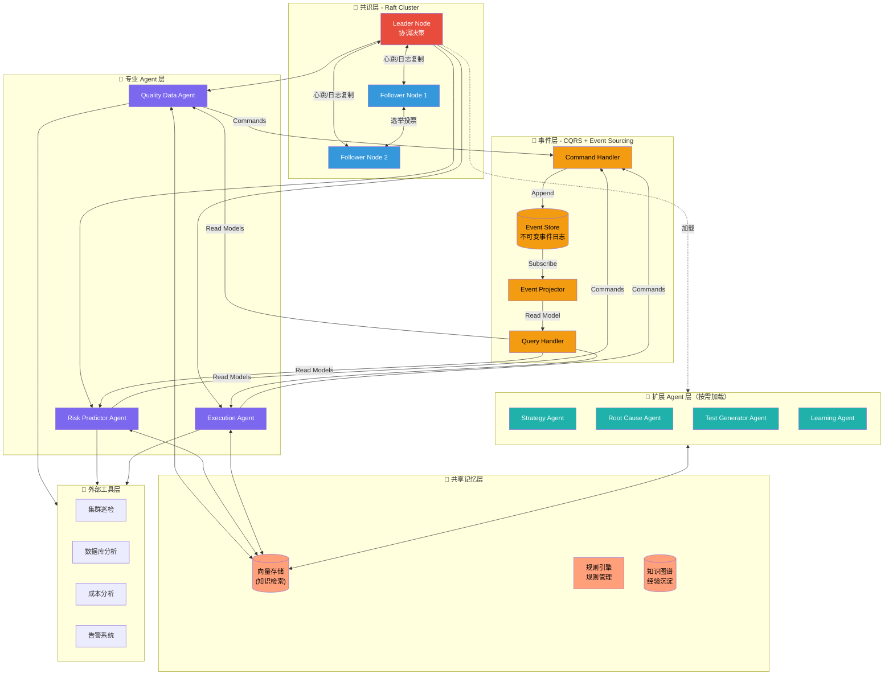

# AI Agent Testing - 质量智能体成长计划

| 属性 | 值 |
|-----|-----|
| **文档类型** | ARCH |
| **版本** | v2.4.0 |
| **最后更新** | 2026-04-26 |
| **维护者** | Quality Agent 培养计划 |
| **关联文档** | [docs/TERMINOLOGY.md](docs/TERMINOLOGY.md), [docs/VERSIONING.md](docs/VERSIONING.md), [docs/INDEX.md](docs/INDEX.md), [docs/DYNAMIC_THRESHOLD_INCENTIVE_COMPATIBILITY.md](docs/DYNAMIC_THRESHOLD_INCENTIVE_COMPATIBILITY.md), [docs/MULTI_LANGUAGE_AGENT_ARCHITECTURE_ASSESSMENT.md](docs/MULTI_LANGUAGE_AGENT_ARCHITECTURE_ASSESSMENT.md), [docs/ZERO_TRUST_AGENT_MESH.md](docs/ZERO_TRUST_AGENT_MESH.md) |

> 🚦 **当前阶段**：技术方案讨论阶段（Technology Discussion Phase）
>
> 本阶段聚焦于架构设计、技术选型、方案论证与文档完善，**不涉及任何编码实现**。所有工程决策必须通过文档化方式记录，确保方案的可追溯性与可评审性。

> 🎯 **项目定位**：构建逐成熟完善的质量智能体（Quality Agent）的完整成长体系
>
> 🌱 **核心理念**：不是简单掌握测试工具，而是培养一个不断提升质量决策能力的 AI 质量伙伴
>
> 📈 **成长路径**：从「效率工具」到「自主决策」，从「执行者」到「质量智能体」
>
> 🏗️ **技术架构**：混合Agent架构 + [知识检索](docs/TERMINOLOGY.md) + Tool Use + 规则引擎
>
> 🎁 **交付标准**：通用框架 + 测试/运维领域最佳实践（可开源）

---

## ⚖️ 基本原则（必须严格遵守）

> **核心准则**：所有工程讨论必须完全基于 **AI4SE（AI for Software Engineering）** 的最佳前沿行业成熟技术和最佳实践为标准

### 视角原则：AI4SE 生命周期视角

> **所有问题的审视、分析与决策，必须站在 AI4SE 全生命周期的角度进行。**

这意味着：
- **需求阶段**：AI 辅助需求分析与测试策略规划
- **设计阶段**：AI 驱动的架构质量评估与测试框架设计
- **编码阶段**：AI 代码审查、智能测试生成、实时质量反馈
- **测试阶段**：AI 测试编排、智能分析、根因定位
- **部署阶段**：AI 风险预测、灰度质量监控
- **运维阶段**：AI 异常检测、自愈机制、持续优化
- **反馈阶段**：AI 经验沉淀、知识图谱更新、策略进化

**拒绝孤立视角**：任何技术方案、架构设计或工具选型，都必须评估其在 AI4SE 全生命周期中的价值与影响，而非仅解决单点问题。

### 基本原则说明

| 原则层级 | 说明 | 实践要求 |
|---------|------|---------|
| **理论指导** | 以AI4SE行业成熟理论为基础 | 拒绝拍脑袋决策，所有方案需有理论支撑 |
| **技术标准** | 采用业界验证的最佳实践 | 优先使用经过大规模验证的技术方案 |
| **持续进化** | 紧跟AI4SE前沿发展 | 定期评估并引入新兴技术和方法论 |
| **工程严谨** | 遵循工程化方法论 | 确保方案的可落地性、可维护性和可扩展性 |
| **生命周期视角** | 站在AI4SE全生命周期审视问题 | 任何方案必须评估其在全生命周期中的价值与影响 |

### AI4SE核心实践领域

```
AI4SE最佳实践涵盖以下核心领域：
  ├── 测试智能化............基于AI的测试用例生成、优化与执行
  ├── 代码质量分析..........AI驱动的代码审查与质量评估
  ├── 缺陷预测与预防........机器学习驱动的缺陷风险识别
  ├── 智能自动化............LLM/ML赋能的自动化测试编排
  ├── 根因分析与定位........多维度关联分析与因果推理
  └── 持续优化..............数据驱动的质量策略迭代
```

### 原则优先级

1. **第一优先**：AI4SE行业成熟实践（已被业界大规模验证）
2. **第二优先**：AI4SE前沿探索（学术/工业界已验证，待大规模应用）
3. **第三优先**：内部创新实践（需有清晰的验证计划和成功标准）

---

## 技术方案讨论阶段规范

> 本节定义技术方案讨论阶段的工作规范与交付标准，确保所有参与者在统一框架下进行方案论证。

### 阶段目标

| 目标层级 | 描述 | 交付物 |
|---------|------|--------|
| **核心目标** | 完成质量智能体完整技术架构设计 | 架构设计文档（本文档及子文档） |
| **关键目标** | 确定技术选型与集成方案 | 技术决策记录（ADR） |
| **基础目标** | 建立统一的术语体系与规范 | 术语表、编码规范、接口规范 |

### 讨论范围

```
技术方案讨论阶段覆盖范围：
├── 架构设计 ............... 系统分层、组件职责、交互协议
├── 技术选型 ............... 框架、工具、平台的选择与论证
├── 接口设计 ............... Agent 间通信接口、外部系统集成接口
├── 安全设计 ............... 威胁模型、访问控制、数据安全
├── 演进规划 ............... 版本迭代路线、能力演进路径
└── 风险评估 ............... 技术风险识别与缓解策略
```

### 明确排除项

以下事项**不属于**本阶段讨论范围，将在后续阶段处理：

| 排除项 | 原因 | 计划阶段 |
|-------|------|---------|
| 具体代码实现 | 需待架构冻结后进入实现阶段 | 编码实现阶段 |
| 单元测试/集成测试编写 | 属于实现阶段的工程活动 | 编码实现阶段 |
| 性能基准测试 | 需基于具体实现进行测量 | 性能验证阶段 |
| 生产环境部署 | 需待系统开发完成后进行 | 部署上线阶段 |
| 运维监控配置 | 属于系统交付后的运维活动 | 运维阶段 |

### 文档化要求

所有技术决策必须遵循以下文档化规范：

1. **决策记录**：每个关键技术决策必须创建 ADR（Architecture Decision Record），包含决策背景、选项对比、选择理由、回滚条件
2. **版本控制**：所有文档纳入版本控制，变更需通过评审流程
3. **可追溯性**：架构设计需与需求目标建立明确的追溯关系
4. **评审机制**：重大架构变更需经过至少两人评审后方可合并

### 子文档状态跟踪

| 子文档 | 版本 | 状态 | 说明 |
|-------|------|------|------|
| [QUALITY_AGENT_ARCHITECTURE.md](docs/QUALITY_AGENT_ARCHITECTURE.md) | v2.0.0 | 🔄 迭代中 | 架构设计 + 安全与性能详解 |
| [QUALITY_AGENT_EXECUTION.md](docs/QUALITY_AGENT_EXECUTION.md) | v1.1.0 | 🔄 迭代中 | 执行协调智能体详解（双引擎架构） |
| [QUALITY_AGENT_TEST_GENERATOR.md](docs/QUALITY_AGENT_TEST_GENERATOR.md) | v2.2.0 | 🔄 迭代中 | 测试代码生成智能体详解 |
| [QUALITY_AGENT_EVOLUTION.md](docs/QUALITY_AGENT_EVOLUTION.md) | v2.0.0 | 🔄 迭代中 | 进化机制详解 |
| [QUALITY_AGENT_RISK_MANAGEMENT.md](docs/QUALITY_AGENT_RISK_MANAGEMENT.md) | v1.0.0 | 🔄 迭代中 | 技术风险与缓解策略详解 |
| [ZERO_TRUST_AGENT_MESH.md](docs/ZERO_TRUST_AGENT_MESH.md) | v1.0.0 | ✅ 已评审 | 零信任 Agent 网格架构设计 |
| [TERMINOLOGY.md](docs/TERMINOLOGY.md) | - | ✅ 基线版 | 术语体系（变更需严格评审） |
| [VERSIONING.md](docs/VERSIONING.md) | - | ✅ 基线版 | 版本管理规范 |

> **图例说明**：🔄 迭代中 = 技术方案讨论阶段可继续完善；✅ 基线版 = 已进入稳定状态，变更需走正式评审流程

---

## 一、质量智能体的明确定义与长远目标

### 1. 质量智能体的正式定义

```
【质量智能体 (Quality Agent)】

一个具备自主决策能力的AI系统，能够:
  1. 理解业务质量目标
  2. 感知产品状态与风险
  3. 自主制定质量策略
  4. 协调多方资源执行
  5. 持续学习与进化

质量智能体 ≠ 增强的测试工具
质量智能体 = 具备质量思维的AI伙伴
```

### 2. 质量智能体的五维能力模型

| 能力维度 | 说明 | 传统测试 vs 质量智能体 |
|---------|------|---------------------|
| **感知层** | 感知质量状态 | • 传统：🔥 工程师读日志监控<br>• 质量智能体：📈 实时数据流感知 |
| **认知层** | 认知质量风险 | • 传统：📊 手动分析报告<br>• 质量智能体：🧠 AI 自动风险评估 |
| **决策层** | 决策质量策略 | • 传统：📝 工程师编写测试策略<br>• 质量智能体：🎯 AI 动态制定策略 |
| **执行层** | 执行测试任务 + 智能分析 | • 传统：⚡ 自动化脚本执行<br>• 质量智能体：🤖 多 Agent 协同执行 + 🧠 AI 驱动结果分析（根因定位、归因分析、优化建议） |
| **进化层** | 持续学习进化 | • 传统：❌ 无学习能力<br>• 质量智能体：🔄 经验沉淀 + 策略优化 |

### 3. 质量智能体的长远目标（2026-2028）

> 💡 **两个维度的成长路径**
> - **行业发展愿景（2026-2028）**：质量智能体技术在行业内的演进路线
> - **个人能力培养（8 周）**：单个学习者从零到 Level 3 的成长路径

| 阶段 | 年份 | 能力等级 | 重点能力 | 代表项目 |
|-----|------|---------|---------|---------|
| 启航 | 2026 | Level 1-2 | 数据感知、基础分析、测试生成、认知决策 | 自动化测试脚本生成、数据报告生成、多 Agent 协同 |
| 成长 | 2027 | Level 2-3 | 风险预测、根因分析、策略优化 | 智能根因分析、动态测试策略、A/B 测试编排 |
| 卓越 | 2028 | Level 3-4 | 多智能体协同、质量战略规划、自主决策 | 跨团队质量协同、质量中台建设、AI 质量决策引擎 |
| 未来 | 2029+ | Level 5 | 自我进化、零人工干预 | 完全自主质量决策引擎、自适应质量生态系统 |

### 4. 质量智能体 vs 传统自动化测试

| 维度 | 传统自动化测试（2025） | 质量智能体（2026） |
|-----|---------------------|------------------|
| **AI定位** | 加速器（节省时间） | 质量伙伴（主动预防） |
| **决策模式** | 工程师定义规则 → AI 执行 | 工程师定目标 → AI 决策 → 工程师监督 |
| **响应方式** | 被动响应：问题发生 → 测试发现 → 修复 | 主动预防：风险预测 → 自动干预 → 避免问题 |
| **优化范围** | 单点优化：提高测试速度与覆盖率 | 系统优化：质量策略持续进化，驱动业务提升 |
| **价值定位** | 降低测试成本 | 提升质量决策质量 |
| **本质** | AI 是流水线上的自动工具 | AI 与工程师共同构建的质量生态系统 |

### 5. 质量智能体的学习目标（2026 年）

| 阶段 | 能力等级 | 核心能力 | 代表 Agent |
|-----|---------|---------|-----------|
| 第 1-2 周 | Level 1: 数据感知 | 质量数据采集与治理 | Quality Data Agent |
| 第 3-4 周 | Level 2: 认知分析 | 质量状态评估、风险识别 | Risk Predictor Agent |
| 第 5-6 周 | Level 3: 决策规划 | 动态质量标准、策略优化 | Strategy Agent |
| 第 7-8 周 | Level 3: 执行协调 | 自动化测试编排、资源调度 | Execution Agent |
| Capstone | Level 3: 多智能体协同 | 质量协调、自主决策 | Orchestrator |

**学习节奏**：每天 4-5 小时，6 天/周  
**总时长**：200-250 小时

---

## 二、质量智能体技术架构

### 1. 技术架构总览

#### 1.1 去中心化共识架构（Raft协议）



### 2. 核心组件职责

| 组件 | 类型 | 核心职责 | 决策边界 |
|-----|------|---------|---------|
| **Consensus Layer** | 共识层 | 去中心化协调、Raft共识决策、Leader选举 | 全局状态一致性维护；不直接参与业务决策 |
| **Orchestrator** | 协调层 | 全局协调、目标分解、策略决策 | 任务优先级、资源分配；标准变更需人工确认 |
| **Quality Data Agent** | 专业Agent | 数据采集、质量指标计算、感知层 | 仅负责数据采集，不做决策 |
| **Risk Predictor Agent** | 专业Agent | 风险评估、异常检测、根因分析 | 提供风险评估，不做处置决策 |
| **Strategy Agent** | 专业Agent | 动态测试策略生成、质量规划 | 生成策略建议，采纳需人工确认 |
| **Root Cause Agent** | 专业Agent | 智能根因诊断、故障定位 | 提供根因分析，不直接触发修复 |
| **Execution Agent** | 专业Agent | 测试执行、资源调度、结果智能分析 | 执行确定任务，分析结果供参考 |
| **Test Generator Agent** | 专业Agent | 代码理解、测试框架生成、测试用例实现 | 生成测试代码，需人工审核 |
| **Learning Agent** | 专业Agent | 经验沉淀、知识图谱更新、策略优化 | 优化建议仅供参考 |
| **Dynamic Threshold Engine** | 核心引擎 | 动态阈值计算、风险分级评估、环境因子感知 | 阈值计算由共识层 Leader 统一执行 |
| **Incentive Compatibility Engine** | 核心引擎 | Agent 效用计算、信誉管理、资源分配策略 | 确保 Agent 个体理性与集体理性一致 |
| **Shared Memory** | 记忆层 | 经验存储、RAG检索、规则管理 | 仅存储和检索，不做决策 |
| **Event Store** | 事件层 | CQRS命令处理、事件溯源存储、状态投影 | 事件不可变存储；支持时间旅行查询 |

#### 1.2 Harness Engineering 平台集成

质量智能体架构已全面集成 Harness Engineering 平台能力，构建 AI 驱动的质量工程体系：

| Harness 能力 | Quality Agent 集成点 | 实现方式 |
|-------------|---------------------|---------|
| **Pipeline** | 测试生成→执行→分析全流程编排 | Pipeline Stage 串联 |
| **Policy** | 代码生成约束强制执行 | Policy Engine 拦截 |
| **Approval** | 关键决策点人工确认网关 | Approval Stage 必经 |
| **STO** | 安全测试需求纳入生成意图 | STO 扫描结果 → 测试意图 |
| **SRM** | 故障驱动测试生成 | SRM 事件 → 针对性测试场景 |

**AI 置信度驱动的自动化分级策略**：

| 置信度范围 | 风险等级 | 执行策略 |
|-----------|---------|---------|
| ≥ 0.95 | 🔵 低 | ✅ 自动执行 |
| 0.85 ~ 0.95 | 🟡 中 | ⏳ 通知后执行（5分钟撤销窗口） |
| < 0.85 | 🔴 高 | 🛑 强制确认 |
| 任意（关键操作） | ⚫ 关键 | 🛑 强制确认（生产部署等） |

📖 **详细架构设计与安全性能规范**：[QUALITY_AGENT_ARCHITECTURE.md](docs/QUALITY_AGENT_ARCHITECTURE.md)

#### 1.3 去中心化共识架构设计原则

**核心设计决策**：采用 Raft 共识协议替代单一 Orchestrator，实现去中心化协调。

| 架构维度 | 中心化方案（旧） | 去中心化方案（新） | 优势 |
|---------|----------------|------------------|------|
| **协调方式** | 单一 Orchestrator 决策 | Raft Leader 选举 + 日志复制 | 消除单点故障，Leader 故障自动切换 |
| **决策机制** | Orchestrator 直接指派 | 共识集群投票决策 | 多数节点同意才执行，提高决策可靠性 |
| **扩展性** | 新增 Agent 需修改 Orchestrator | 新 Agent 加入共识网络即可 | 即插即用，不影响现有节点 |
| **容错性** | Orchestrator 故障则系统瘫痪 | 只要多数节点存活，系统继续工作 | 高可用，自动故障恢复 |
| **审计性** | 依赖 Orchestrator 日志 | 共识日志天然不可篡改 | 所有决策都有完整追溯链 |

**Raft 共识核心流程**：

```
┌─────────────────────────────────────────────────────────────────┐
│                    Raft 共识状态机                               │
├─────────────────────────────────────────────────────────────────┤
│                                                                 │
│   ┌──────────┐         ┌──────────┐         ┌──────────┐       │
│   │ Follower │ ──────▶ │ Candidate│ ──────▶ │  Leader  │       │
│   │ (跟随者)  │ 超时未收到 │ (候选者)  │ 获得多数票 │ (领导者) │       │
│   └──────────┘ 心跳    └──────────┘         └──────────┘       │
│        ▲                                      │                 │
│        │                                      │ 心跳/日志复制    │
│        └──────────────────────────────────────┘                 │
│                                                                 │
│   Leader 职责：                                                  │
│   1. 接收客户端（Agent）请求                                      │
│   2. 将请求作为日志条目复制到所有 Follower                         │
│   3. 当日志在多数节点确认后，提交并执行                            │
│   4. 定期发送心跳维持领导地位                                      │
│                                                                 │
│   安全性保证：                                                    │
│   - 只有一个 Leader（任意任期）                                   │
│   - 已提交的日志不会被覆盖                                        │
│   - 日志顺序一致性                                                │
│                                                                 │
└─────────────────────────────────────────────────────────────────┘
```

**Agent 节点类型**：

| 节点类型 | 角色 | 职责 | 数量要求 |
|---------|------|------|---------|
| **Consensus Node** | 共识节点 | 参与 Raft 选举和日志复制，维护全局状态 | 奇数个（3, 5, 7...） |
| **Agent Node** | 业务节点 | 执行具体业务逻辑，向 Leader 发送请求 | 任意数量 |
| **Observer Node** | 观察节点 | 只接收日志复制，不参与选举（用于扩展读） | 任意数量 |

---

#### 1.4 CQRS + Event Sourcing 事件层设计

**核心设计决策**：采用 CQRS（命令查询职责分离）+ Event Sourcing（事件溯源）作为 Agent 间通信和状态管理的基础设施。

| 传统方案 | CQRS + Event Sourcing | 优势 |
|---------|---------------------|------|
| 直接 API 调用 | 命令 → 事件存储 → 投影 → 查询 | 松耦合，异步处理 |
| 状态直接更新 | 状态变更记录为不可变事件 | 完整审计追溯 |
| 单点状态存储 | 事件日志即为唯一事实来源 | 支持时间旅行查询 |
| 同步阻塞调用 | 异步事件驱动 | 高吞吐，低延迟 |

**事件流架构**：

```
┌─────────────────────────────────────────────────────────────────┐
│              CQRS + Event Sourcing 数据流                        │
├─────────────────────────────────────────────────────────────────┤
│                                                                 │
│   写路径（Command Side）：                                         │
│   ┌─────────┐    ┌──────────┐    ┌──────────┐                  │
│   │  Agent  │───▶│ Command  │───▶│  Event   │                  │
│   │ 请求    │    │ Handler  │    │  Store   │                  │
│   └─────────┘    └──────────┘    └────┬─────┘                  │
│                                        │ Append                 │
│                                        ▼                        │
│                               ┌──────────────────┐             │
│                               │  Immutable Log   │             │
│                               │  [Event1][Event2]│             │
│                               └──────────────────┘             │
│                                                                 │
│   读路径（Query Side）：                                          │
│                               ┌──────────┐                     │
│                               │ Event    │                     │
│                               │ Projector│                     │
│                               └────┬─────┘                     │
│                                    │ Subscribe                  │
│                                    ▼                           │
│                               ┌──────────┐                     │
│                               │  Read    │                     │
│                               │  Models  │                     │
│                               └────┬─────┘                     │
│                                    │ Query                      │
│                                    ▼                           │
│                               ┌──────────┐                     │
│                               │  Query   │                     │
│                               │ Handler  │                     │
│                               └──────────┘                     │
│                                                                 │
└─────────────────────────────────────────────────────────────────┘
```

**核心事件类型**：

| 事件类型 | 描述 | 示例 |
|---------|------|------|
| **TaskCreated** | 任务创建事件 | {"task_id": "123", "type": "risk_assessment", "priority": "P2"} |
| **AgentAssigned** | Agent 分配事件 | {"task_id": "123", "agent_id": "risk-agent-01"} |
| **DecisionProposed** | 决策提案事件 | {"task_id": "123", "proposal": "scale_up", "confidence": 0.92} |
| **DecisionCommitted** | 决策提交事件 | {"task_id": "123", "decision": "scale_up", "consensus": "majority"} |
| **TaskCompleted** | 任务完成事件 | {"task_id": "123", "status": "success", "result": {...}} |
| **TaskFailed** | 任务失败事件 | {"task_id": "123", "status": "failed", "error": "timeout"} |

---

#### 1.5 Self-Play 验证机制设计

**核心设计决策**：引入对抗式验证机制，通过 Generator-Critic-Arbiter 三角验证提升测试代码质量。

**问题背景**：
- Test Generator Agent 生成的测试代码可能存在盲点
- 传统人工审核成本高、速度慢
- 需要一种自动化、可扩展的验证机制

**Self-Play 架构**：

```
┌─────────────────────────────────────────────────────────────────┐
│                    Self-Play 验证机制                            │
├─────────────────────────────────────────────────────────────────┤
│                                                                 │
│   ┌──────────────┐                                              │
│   │   Generator  │───▶ 生成测试代码 T                            │
│   │    Agent     │                                              │
│   └──────────────┘                                              │
│          │                                                      │
│          ▼                                                      │
│   ┌──────────────┐                                              │
│   │    Critic    │───▶ 审查 T，尝试构造反例                      │
│   │    Agent     │      （使 T 失败但代码正确的输入）              │
│   └──────────────┘                                              │
│          │                                                      │
│          ▼                                                      │
│   ┌─────────────────────────────────────────┐                  │
│   │              裁决逻辑                    │                  │
│   │  IF Critic 成功构造反例:                │                  │
│   │     → T 有缺陷，返回修改建议给 Generator │                  │
│   │     → 循环最多 N 次                     │                  │
│   │  ELSE:                                  │                  │
│   │     → T 通过验证，进入 Arbiter 审核      │                  │
│   └─────────────────────────────────────────┘                  │
│          │                                                      │
│          ▼                                                      │
│   ┌──────────────┐                                              │
│   │   Arbiter    │───▶ 最终审核，确保公平性                      │
│   │    Agent     │      监督 Generator 和 Critic 的行为           │
│   └──────────────┘                                              │
│          │                                                      │
│          ▼                                                      │
│   ┌──────────────┐                                              │
│   │   输出结果    │───▶ 通过 / 失败 / 需人工审核                  │
│   └──────────────┘                                              │
│                                                                 │
│   优势：                                                         │
│   1. 相当于"红队 vs 蓝队"对抗训练                                 │
│   2. 自动发现测试盲点                                            │
│   3. 显著提升测试覆盖率                                          │
│   4. 减少人工审核工作量                                          │
│                                                                 │
└─────────────────────────────────────────────────────────────────┘
```

**角色职责**：

| 角色 | 职责 | 能力要求 |
|-----|------|---------|
| **Generator** | 生成测试代码 | 代码理解、测试框架知识、边界条件识别 |
| **Critic** | 审查测试代码，构造反例 | 漏洞挖掘、边界条件分析、对抗思维 |
| **Arbiter** | 监督验证过程，最终裁决 | 公平性判断、规则执行、争议解决 |

**验证流程状态机**：

```
┌──────────┐    生成测试    ┌──────────┐    Critic审查   ┌──────────┐
│  Start   │ ────────────▶ │ Review   │ ─────────────▶ │ Decision │
│          │               │          │                │          │
└──────────┘               └──────────┘                └────┬─────┘
                                                            │
                              ┌─────────────────────────────┼─────────┐
                              │                             │         │
                              ▼                             ▼         ▼
                        ┌──────────┐                  ┌──────────┐ ┌──────────┐
                        │  Revise  │                  │ Arbiter  │ │  Human   │
                        │ (Generator│                 │ Review   │ │ Review   │
                        │ 修改)     │                  │          │ │ (复杂场景)│
                        └────┬─────┘                  └────┬─────┘ └────┬─────┘
                             │                             │            │
                             └─────────────────────────────┴────────────┘
                                                           │
                                                           ▼
                                                    ┌──────────┐
                                                    │  Accept  │
                                                    │  /Reject │
                                                    └──────────┘
```

---

**各 Agent 核心能力概述**：

**Strategy Agent（策略规划智能体）**
- **核心能力**：动态生成测试策略、质量规划、资源分配
- **能力边界**：生成的策略为建议性质，需人工确认后执行

**Root Cause Agent（根因诊断智能体）**
- **核心能力**：智能根因诊断、故障定位、关联分析
- **能力边界**：提供根因分析结果，不直接触发修复动作

**Execution Agent（执行协调智能体）**
- **核心能力**：测试执行、资源调度、AI驱动的测试结果智能分析
- **能力边界**：分析结果仅供参考，关键决策需人工确认
- **分析引擎四大核心能力**：
  - 测试结果智能分析（关键指标提取、异常模式识别、历史趋势关联）
  - 根因分析（失败分类、多维度关联、因果链路推导）
  - 归因分析（责任维度映射、影响范围评估、归因报告生成）
  - 优化建议生成（建议分类、优先级排序、上下文相关建议）

📖 **技术实现详见**：[docs/QUALITY_AGENT_EXECUTION.md](./docs/QUALITY_AGENT_EXECUTION.md)

**Learning Agent（学习进化智能体）**
- **核心能力**：经验沉淀、知识图谱更新、策略优化
- **能力边界**：优化建议仅供参考，人工审核后生效

### 3. 测试代码生成智能体 (Test Generator Agent)

Test Generator Agent 是质量智能体的核心专业 Agent 之一，负责**代码理解 → 测试框架生成 → 测试用例实现**的全流程自动化。

**核心能力三合一**：
- 代码理解：源码解析、业务逻辑识别、API抽取、依赖分析
- 测试框架生成：框架选型、脚手架创建、数据模型设计、环境配置
- 测试用例实现：边界值测试、异常场景测试、集成测试、E2E测试

📖 **技术实现详见**：[docs/QUALITY_AGENT_TEST_GENERATOR.md](./docs/QUALITY_AGENT_TEST_GENERATOR.md)

**前端框架适配支持**：
- 🟢 **Vue.js**：SFC单文件组件，Vitest + Vue Test Utils生态成熟
- 🟢 **React.js**：JSX标准化，Jest + React Testing Library行业标准
- 🟡 **ExtJS**：遗留系统支持，需自定义解析策略

---

## 三、工具集成方案

#### 与现有系统桥接

| 现有能力 | 在质量智能体中的角色 | 集成方式 |
|---------|-------------------|---------|
| **集群巡检** | 感知层 - 基础设施健康 | 通过标准化接口集成 |
| **数据库分析** | 感知层 - 数据层健康 | 通过标准化接口集成 |
| **成本分析** | 感知层 - 成本质量 | 通过标准化接口集成 |
| **告警系统** | 感知层 - 异常事件源 | 通过标准化接口集成 |

#### 开源能力生态集成

| 能力领域 | 定位 | 集成方式 | 核心价值 |
|---------|------|---------|---------|
| **测试生成能力** | 测试生成能力层 | 直接集成并扩展 | 多语言测试用例自动生成、智能断言补全、测试策略推荐 |
| **Agent 执行方法论** | 方法论参考 | 参考借鉴，不直接集成 | TDD 红绿重构循环、微任务规划、并行子 Agent 执行、结构化代码审查 |
| **代码分析能力** | 核心分析能力 | 当前架构纳入 | 静态控制流分析 + 动态覆盖率分析 → 迭代引导 AI 生成测试 |

📖 **具体开源工具选型与集成细节详见**：[docs/QUALITY_AGENT_TEST_GENERATOR.md](./docs/QUALITY_AGENT_TEST_GENERATOR.md)

#### 感知层数据流

```
集群巡检数据 ──┐
               ├──► Quality Data Agent ──► 质量指标计算 ──► 知识存储
数据库分析数据 ─┤                                        │
               │                                        ▼
成本分析数据 ───┤                               ┌───────────────┐
               │                               │   共享记忆层   │
告警数据 ──────┴──► Risk Predictor Agent ──► │  (向量库+规则) │
                                              └───────────────┘
```

---

## 四、进化机制技术路径

### 三层进化架构概要

| 层级 | 职责 | 存储特性 | 生命周期 |
|-----|------|---------|---------|
| **短期记忆** | 会话级上下文保持 | 高速访问、会话结束清理 | 单次任务会话 |
| **长期记忆** | 跨会话知识积累 | 持久化存储、增量更新 | 持久化，可跨会话检索 |
| **规则库** | 业务规则与质量标准 | 结构化存储、人工审核 | 自动更新 + 人工审核 |

**进化流程**：任务执行 → 经验沉淀 → 知识索引 → 规则抽取 → 规则应用

**失败学习**：失败案例 → 根因分析 → 预防策略 → 规则库更新

📖 **三层进化架构图、实施代码示例、经验沉淀机制详见**：[docs/QUALITY_AGENT_EVOLUTION.md](./docs/QUALITY_AGENT_EVOLUTION.md)

---

## 五、能力成熟度评估体系

### Quality Agent Readiness Model

| 成熟度等级 | 能力描述 | 评估指标 | 目标时间 |
|-----------|---------|---------|---------|
| **Level 1** | 基础执行 | 测试脚本自动生成率 > 80% | Week 1-2 |
| **Level 2** | 数据感知 | 质量指标采集覆盖率 > 90% | Week 3-4 |
| **Level 3** | 风险认知 | 风险预测准确率 > 85% | Week 5-6 |
| **Level 4** | 自主决策 | 策略自动生成 + 人工确认 | Week 7-8 |
| **Level 5** | 自我进化 | 规则自动更新 + 零人工干预 | 2028+（未来愿景） |

### 核心指标对比

| 维度 | 指标 | 行业基线 | 本项目目标 | 测量方法 |
|-----|------|---------|-----------|---------|
| **感知能力** | 数据采集覆盖率 | 60-70% | > 90% | 日志采集点数 / 总服务数 |
| **感知能力** | 监控数据实时性 | 5-10 分钟 | < 2 分钟 | 数据采集到可用延迟 |
| **认知能力** | 风险识别准确率 | 50-60% | > 85% | 预测正确次数 / 总预测次数 |
| **认知能力** | 根因定位时间 | 30-60 分钟 | < 5 分钟 | 从告警到根因报告时间 |
| **决策能力** | 策略生成采纳率 | 40-50% | > 80% | 人工确认通过的策略数 / 总生成数 |
| **执行能力** | 任务自动化完成率 | 70-80% | > 95% | 无需人工干预的任务比例 |
| **进化能力** | 规则自动更新占比 | < 20% | > 60% | 自动生成的规则 / 总规则数 |

---

## 六、质量智能体成长目标

### 2026 年的核心转变：从「效率工具」到「质量智能体」

### 质量智能体的五大核心能力

| 能力 | 说明 | 学习路径中的体现 |
|------|------|---------------|
| **自主质量定义** | AI 能根据业务目标自动生成质量标准 | 第 1-2 周：理解质量标准的动态性 |
| **主动风险预测** | AI 能提前预测质量问题的发生 | 第 3-4 周：数据驱动的质量评估 |
| **智能根因分析** | AI 能自动分析问题根因并提供建议 | 第 5-6 周：多维度关联分析 |
| **动态策略优化** | AI 能根据实时数据调整测试策略 | 第 7-8 周：自适应测试策略 |
| **多智能体协同** | AI 能协调多个智能体协同工作 | Capstone：多 Agent 协作系统 |

---

## 七、项目结构

```
ai-testing/
├── docs/
│   ├── README.md                             # docs 目录索引
│   ├── INDEX.md                              # 文档总索引与导航
│   ├── TERMINOLOGY.md                        # 术语体系（质量智能体领域标准术语）
│   ├── VERSIONING.md                         # 版本管理规范
│   │
│   ├── ai-agent-testing-knowledge-system.md  # 完整知识体系（质量智能体理论基础）
│   ├── 8-week-daily-task-list.md             # 8 周成长路径（质量智能体能力演进）
│   ├── week1-detailed-plan.md ~ week8-detailed-plan.md  # 各周详细计划
│   │
│   ├── industry-skills-analysis.md           # 行业技能分析（市场需求与技能图谱）
│   ├── interview-guide.md                    # 面试指南（质量智能体方向）
│   ├── istqb-ctai-study-guide.md             # ISTQB CT-AI 学习指南
│   │
│   ├── QUALITY_AGENT_ARCHITECTURE.md         # ✅ 架构设计 + 安全与性能详解
│   ├── QUALITY_AGENT_EXECUTION.md            # ✅ 执行协调智能体详解（双引擎架构）
│   ├── QUALITY_AGENT_TEST_GENERATOR.md       # ✅ 测试代码生成智能体详解
│   ├── QUALITY_AGENT_EVOLUTION.md            # ✅ 进化机制详解
│   └── QUALITY_AGENT_RISK_MANAGEMENT.md      # ✅ 技术风险与缓解策略详解
│
├── .agents/
│   └── rules/
│       └── python-automation-testing-coding-standard.md  # 编码规范
│
├── AGENTS.md                                  # 本文件（质量智能体架构与培养指南）
├── README.md                                  # 项目说明（快速入门）
└── LICENSE
```

### 文档分类说明

#### 核心架构文档（技术方案讨论阶段重点）

| 文档 | 版本 | 状态 | 说明 |
|-----|------|------|------|
| [AGENTS.md](./AGENTS.md) | v2.2.0 | 🔄 迭代中 | 质量智能体核心架构与行动指南（本文档） |
| [docs/QUALITY_AGENT_ARCHITECTURE.md](./docs/QUALITY_AGENT_ARCHITECTURE.md) | v2.0.0 | 🔄 迭代中 | 架构设计 + 安全与性能详解（Harness 集成、STRIDE 威胁模型、RBAC、沙箱） |
| [docs/QUALITY_AGENT_EXECUTION.md](./docs/QUALITY_AGENT_EXECUTION.md) | v1.1.0 | 🔄 迭代中 | 执行协调智能体详解（双引擎架构、四大核心能力） |
| [docs/QUALITY_AGENT_TEST_GENERATOR.md](./docs/QUALITY_AGENT_TEST_GENERATOR.md) | v2.2.0 | 🔄 迭代中 | 测试代码生成智能体详解（术语体系、框架适配、集成方案） |
| [docs/QUALITY_AGENT_EVOLUTION.md](./docs/QUALITY_AGENT_EVOLUTION.md) | v2.0.0 | 🔄 迭代中 | 进化机制详解（三层架构、RAG 工程实现、经验沉淀） |
| [docs/QUALITY_AGENT_RISK_MANAGEMENT.md](./docs/QUALITY_AGENT_RISK_MANAGEMENT.md) | v1.0.0 | 🔄 迭代中 | 技术风险与缓解策略详解 |
| [docs/DYNAMIC_THRESHOLD_INCENTIVE_COMPATIBILITY.md](./docs/DYNAMIC_THRESHOLD_INCENTIVE_COMPATIBILITY.md) | v1.0.0 | ✅ 已确认 | 动态阈值与激励相容机制设计（方案已确认，架构已集成） |

#### 基础规范文档（基线版，变更需评审）

| 文档 | 状态 | 说明 |
|-----|------|------|
| [docs/TERMINOLOGY.md](./docs/TERMINOLOGY.md) | ✅ 基线版 | 质量智能体领域标准术语体系 |
| [docs/VERSIONING.md](./docs/VERSIONING.md) | ✅ 基线版 | 文档与代码版本管理规范 |
| [docs/INDEX.md](./docs/INDEX.md) | ✅ 基线版 | 文档总索引与导航 |

#### 学习路径文档（培养计划配套）

| 文档 | 状态 | 说明 |
|-----|------|------|
| [docs/ai-agent-testing-knowledge-system.md](./docs/ai-agent-testing-knowledge-system.md) | ✅ 已完成 | 质量智能体完整知识体系 |
| [docs/8-week-daily-task-list.md](./docs/8-week-daily-task-list.md) | ✅ 已完成 | 8 周成长路径详细任务清单 |
| [docs/week1-detailed-plan.md](./docs/week1-detailed-plan.md) ~ [week8-detailed-plan.md](./docs/week8-detailed-plan.md) | ✅ 已完成 | 第 1-8 周详细学习计划 |
| [docs/industry-skills-analysis.md](./docs/industry-skills-analysis.md) | ✅ 已完成 | 行业技能分析（市场需求与技能图谱） |
| [docs/interview-guide.md](./docs/interview-guide.md) | ✅ 已完成 | 质量智能体方向面试指南 |
| [docs/istqb-ctai-study-guide.md](./docs/istqb-ctai-study-guide.md) | ✅ 已完成 | ISTQB CT-AI 认证学习指南 |

---

## 八、质量智能体成长计划总览

### 学习本质：培养一个 AI 质量伙伴

**这不是一门「自动化测试技术」课，而是一门「质量智能体成长学」**

| 阶段 | 质量智能体能力 | 代表项目 | 与工程师关系 |
|-----|--------------|---------|----------|
| **初级** | 执行者 | 自动化测试脚本 | 工程师命令，AI 执行 |
| **中级** | 协助者 | 数据分析 + 报告 | 工程师定义，AI 辅助 |
| **高级** | 合作者 | 风险预测 + 决策 | 工程师监督，AI 决策 |
| **顶级** | 主导者 | 多智能体协同 | AI 主导，工程师指导 |

---

## 九、技术风险与缓解策略

### 风险清单概要

| 风险 | 可能性 | 影响 | 缓解策略 | 状态 |
|-----|-------|------|---------|------|
| **AI模型响应延迟 > 10 秒** | 高 | 用户体验差 | 流式响应 + 进度提示 + 本地缓存 | ✅ 已缓解 |
| **知识检索准确率 <70%** | 中 | 决策质量差 | 多路召回 + 重排序 + 混合检索 | ✅ 已缓解 |
| **Agent 执行死循环** | 低 | 资源浪费 | 超时熔断 + 最大迭代次数 + 人工介入 | ✅ 已缓解 |
| **测试代码质量不稳定** | 中 | 维护成本高 | 代码检查 + 人工审核流程 + 代码评审 | 🔄 进行中 |
| **端到端测试定位失败** | 中 | 测试不稳定 | 视觉识别 + 多重定位策略 + 自愈机制 | 🔄 进行中 |
| **知识图谱更新延迟** | 低 | 策略滞后 | 增量更新 + 异步处理 + 定期全量刷新 | ✅ 已缓解 |

📖 **风险详解、缓解措施、预期效果详见**：[docs/QUALITY_AGENT_RISK_MANAGEMENT.md](./docs/QUALITY_AGENT_RISK_MANAGEMENT.md)

---

## 十、快速开始：构建你的第一个 Agent

### 1. 环境准备

确保具备以下基础环境：
- 主流编程语言运行环境
- AI 模型服务访问能力
- 代码仓库访问权限

### 2. Agent 构建要点

**Quality Data Agent 的核心职责**：
- 数据采集：定时从集群、数据库、成本系统等获取质量数据
- 指标计算：对原始数据进行清洗、聚合、质量指标计算
- 结果输出：结构化的质量状态报告

**模块结构**：

```
QualityDataAgent
├── 数据采集模块（可配置数据源）
├── 指标计算模块（可扩展指标库）
└── 输出模块（报告生成）
```

📖 **完整的环境配置指南、技术栈选型与代码示例详见**：[docs/QUALITY_AGENT_EXECUTION.md](./docs/QUALITY_AGENT_EXECUTION.md)

### 3. 下一步

- 📖 阅读 [docs/week1-detailed-plan.md](./docs/week1-detailed-plan.md) 开始第 1 周学习
- 🔧 查看 [docs/QUALITY_AGENT_TEST_GENERATOR.md](./docs/QUALITY_AGENT_TEST_GENERATOR.md) 了解 Test Generator
- 🏗️ 参考 [docs/ai-agent-testing-knowledge-system.md](./docs/ai-agent-testing-knowledge-system.md) 学习完整知识体系

---

## 十一、学习路径指南

### Capstone 交付物标准

| 维度 | 标准 |
|-----|------|
| **代码质量** | 符合 PEP8 + 编码规范，可直接开源 |
| **文档完整度** | README + API文档 + 架构图 + 使用示例 |
| **生产可用性** | 具备监控、日志、告警能力 |
| **可扩展性** | 易于添加新的Agent和工具 |

---

## 十二、安全与性能考虑

### 安全设计原则

| 安全维度 | 措施 | 说明 |
|---------|------|------|
| **数据安全** | 敏感信息脱敏 | 测试数据不包含生产敏感信息 |
| **访问控制** | RBAC权限管理 | 按角色控制Agent访问权限 |
| **代码安全** | 沙箱执行环境 | 生成的测试代码在隔离环境运行 |
| **模型安全** | Prompt注入防护 | 防止恶意输入影响Agent决策 |
| **审计追踪** | 全链路日志 | 所有Agent操作可追溯 |

### 性能指标要求（概要）

| 指标 | 目标值 | 说明 |
|-----|-------|------|
| **代码理解速度** | < 30秒/千行 | 语义分析耗时 |
| **测试生成速度** | < 60秒/用例 | 单个测试用例生成时间 |
| **根因分析速度** | < 300秒 | 复杂故障根因定位时间 |
| **归因分析速度** | < 120秒 | 失败用例责任方/模块归因时间 |
| **知识检索延迟** | < 2秒 | 检索响应时间 |
| **并发处理能力** | > 10 Agent并行 | 多Agent协同并发数 |
| **根因分析准确率** | > 80% | Top-3 根因命中率 |
| **归因准确率** | > 85% | 责任方/模块归因正确率 |

### 容错与降级策略

| 场景 | 降级策略 | 恢复机制 |
|-----|---------|---------|
| **AI服务不可用** | 使用本地规则引擎 | 服务恢复后自动切换 |
| **知识库不可用** | 使用本地缓存 | 数据同步后重建索引 |
| **测试执行失败** | 重试3次后标记失败 | 人工介入处理 |
| **代码解析失败** | 使用辅助解析 | 记录失败样本用于优化 |
| **分析引擎不可用** | 降级为仅执行+结果收集 | 服务恢复后补全分析 |
| **知识图谱不可用** | 根因分析降级为基于规则的分类 | 数据同步后恢复深度分析 |

📖 **安全设计详解、完整性能指标、容错降级策略详见**：[docs/QUALITY_AGENT_ARCHITECTURE.md](./docs/QUALITY_AGENT_ARCHITECTURE.md)

---

## 🔗 相关文档

| 文档 | 内容 |
|-----|------|
| [docs/TERMINOLOGY.md](docs/TERMINOLOGY.md) | **术语表** - 项目唯一术语权威来源 |
| [docs/VERSIONING.md](docs/VERSIONING.md) | **版本管理规范** - 文档版本化管理规则 |
| [docs/INDEX.md](docs/INDEX.md) | **docs目录索引** - 技术文档导航 |
| [docs/QUALITY_AGENT_EXECUTION.md](docs/QUALITY_AGENT_EXECUTION.md) | 执行协调智能体详解（双引擎架构、四大能力、技术架构、数据流） |
| [docs/QUALITY_AGENT_TEST_GENERATOR.md](docs/QUALITY_AGENT_TEST_GENERATOR.md) | 测试代码生成智能体详解（架构图、框架适配、业界调研） |
| [docs/QUALITY_AGENT_EVOLUTION.md](docs/QUALITY_AGENT_EVOLUTION.md) | 进化机制详解（三层架构、代码示例） |
| [docs/QUALITY_AGENT_RISK_MANAGEMENT.md](docs/QUALITY_AGENT_RISK_MANAGEMENT.md) | 技术风险与缓解策略详解 |
| [docs/QUALITY_AGENT_ARCHITECTURE.md](docs/QUALITY_AGENT_ARCHITECTURE.md) | 架构设计 + 安全与性能详解 |
| [docs/DYNAMIC_THRESHOLD_INCENTIVE_COMPATIBILITY.md](docs/DYNAMIC_THRESHOLD_INCENTIVE_COMPATIBILITY.md) | 动态阈值与激励相容机制设计 |
| [docs/ai-agent-testing-knowledge-system.md](docs/ai-agent-testing-knowledge-system.md) | 质量智能体完整知识体系 |
| [docs/8-week-daily-task-list.md](docs/8-week-daily-task-list.md) | 8周成长路径详细任务 |
| [.agents/rules/python-automation-testing-coding-standard.md](.agents/rules/python-automation-testing-coding-standard.md) | 编码规范与最佳实践 |

---

## 变更历史

| 版本 | 日期 | 变更内容 | 变更人 |
|-----|------|---------|--------|
| v2.4.0 | 2026-04-26 | **集成零信任 Agent 网格架构**：在子文档状态跟踪中新增 ZERO_TRUST_AGENT_MESH.md（状态：已评审）；更新关联文档列表 | - |
| v2.3.0 | 2026-04-26 | **集成动态阈值与激励相容机制**：在核心组件职责中新增 Dynamic Threshold Engine 和 Incentive Compatibility Engine；更新子文档状态跟踪（DYNAMIC_THRESHOLD_INCENTIVE_COMPATIBILITY.md 已确认）；更新关联文档列表 | - |
| v2.2.0 | 2026-04-26 | **技术方案讨论阶段更新**：明确标注当前处于技术方案讨论阶段（无编码）；新增阶段规范章节（目标、范围、排除项、文档化要求、子文档状态跟踪）；集成 Harness Engineering 平台能力（AI置信度分级、Pipeline/Policy/Approval/STO/SRM集成）；完善项目结构（补充 INDEX.md、TERMINOLOGY.md、VERSIONING.md、industry-skills-analysis.md、interview-guide.md、istqb-ctai-study-guide.md）；更新文档分类说明（核心架构/基础规范/学习路径三类） | - |
| v2.1.0 | 2026-04-26 | 新增AI4SE生命周期视角原则；增加文档头部版本信息；关联术语表和版本规范 | - |
| v2.0.0 | 2026-04-23 | 重构架构，移除实现细节，抽象技术术语 | - |
| v1.0.0 | 2026-04-22 | 初始版本，建立质量智能体核心架构 | - |
