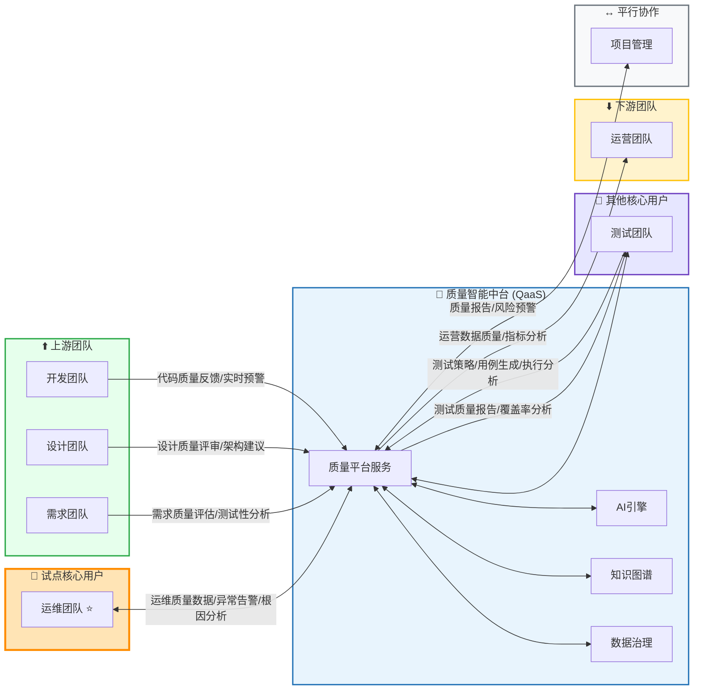
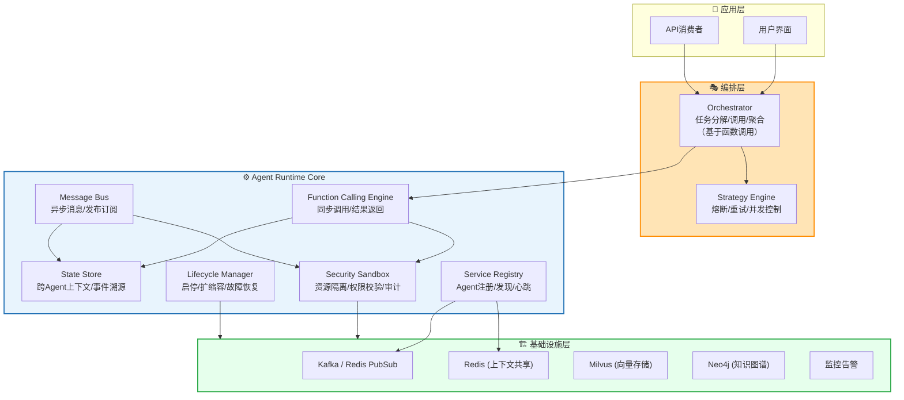

# AI Agent Quality Platform - 质量智能中台平台工程

| 属性 | 值 |
|-----|-----|
| **文档类型** | ARCH |
| **版本** | v3.0.0 |
| **最后更新** | 2026-04-26 |
| **维护者** | 质量智能中台团队 |
| **关联文档** | [docs/SPEC/TERMINOLOGY.md](docs/SPEC/TERMINOLOGY.md), [docs/SPEC/VERSIONING.md](docs/SPEC/VERSIONING.md), [docs/INDEX.md](docs/INDEX.md) |

> 🚦 **当前阶段**：技术方案讨论阶段（Technology Discussion Phase）
>
> 本阶段聚焦于架构设计、技术选型、方案论证与文档完善，**不涉及任何编码实现**。所有工程决策必须通过文档化方式记录，确保方案的可追溯性与可评审性。

---

# ⭐ 战略核心概要

> **质量智能中台的核心定位、设计原则与试点策略，是整个方案的"宪法"，所有技术决策必须与此保持一致。**

## 战略核心定位

```
┌─────────────────────────────────────────────────────────────────┐
│                                                                 │
│   使命：软件质量保障从「人工密集」走向「AI驱动」                   │
│                                                                 │
│   愿景：构建软件工程AI化的智能基础设施                            │
│         让每个研发环节都拥有AI赋能的质量守护者                     │
│         从需求到运维，全链路智能质量保障                          │
│                                                                 │
│   定位：Quality as a Service (QaaS) - 全生命周期质量即服务平台    │
│                                                                 │
└─────────────────────────────────────────────────────────────────┘
```

## 分角色价值主张

> 💡 **核心理念**：不是替代人，而是增强人。每个角色都拥有专属的AI质量助手。

| 角色 | AI助手名称 | 核心价值 | 关键能力 |
|-----|-----------|---------|----------|
| **产品经理** | 需求质量Agent | 需求零缺陷 | 可测试性分析、完整性检查、一致性验证 |
| **架构师** | 架构评审Agent | 架构无隐患 | 风险识别、性能预估、安全扫描 |
| **开发工程师** | 代码质量Agent | 代码高质量 | 实时反馈、智能修复、异味检测 |
| **测试工程师** | 测试智能Agent | 覆盖无死角 | 用例生成、探索测试、缺陷预测 |
| **运维工程师** | 运维智能Agent | 故障可预测 | 异常检测、根因分析、容量规划 |
| **运营人员** | 数据质量Agent | 数据可信赖 | 质量监控、血缘追踪、异常告警 |

## 核心设计原则（5条）

| # | 原则 | 说明 | 为什么重要 |
|---|-----|------|---------|
| 1 | **全生命周期覆盖** | 覆盖需求→设计→开发→测试→部署→运维全阶段 | 拒绝孤立视角，质量问题要从源头抓起 |
| 2 | **平台化服务化** | 质量能力作为平台服务输出，统一接口、自助使用 | 避免重复建设，提升复用率 |
| 3 | **AI驱动+人工监督** | AI负责执行与建议，人工负责关键决策，置信度分级策略 | AI是助手不是主角，关键决策在人 |
| 4 | **渐进式演进** | 分阶段实施，逐步扩展覆盖范围，先止血再扩展 | 复杂度太大，必须分阶段验证价值 |
| 5 | **组织融合** | 平台团队+嵌入式质量联络员，不颠覆现有组织而是嵌入增强 | 质量不是单独一个团队的事 |

## 试点策略

```
┌─────────────────────────────────────────────────────────────────┐
│                                                                 │
│   🚀 试点路径：运维团队 → 开发+测试 → 需求+设计 → 运营+项目     │
│                                                                 │
│   ⭐ 首批试点：运维团队                                          │
│      原因：数据标准化高 / 反馈闭环清晰 / 价值可衡量               │
│      目标：验证AI在运维场景的价值，打造标杆案例                    │
│                                                                 │
│   首批Agent矩阵：                                                │
│      ├── 异常检测Agent（告警准确率 > 80%）                      │
│      ├── 根因分析Agent（定位时间 < 5min）                       │
│      ├── 容量规划Agent（预测准确率 > 85%）                       │
│      └── 告警收敛Agent（噪音降低 > 60%）                         │
│                                                                 │
└─────────────────────────────────────────────────────────────────┘
```

## 核心价值目标（用户视角）

> 💡 **说明**：以下以运维团队为例展示核心价值，其他角色的价值主张见上文"分角色价值主张"章节。

### 运维团队价值目标

| 用户痛点 | 平台如何解决 | 目标指标 |
|---------|-------------|----------|
| **告警太多，看不过来** | AI智能识别，告警收敛 | 噪音降低 > 60% |
| **故障来了找不到根因** | 知识图谱推理，自动定位 | MTTR缩短 > 40% |
| **故障总是突然发生** | 异常检测，提前预警 | 漏报率 < 5% |
| **老员工走了经验就丢了** | 案例沉淀，知识复用 | 知识复用率 > 50% |
| **总是重复处理同类问题** | 智能推荐，复用方案 | 案例复用率 > 50% |

### 其他角色核心价值（摘要）

| 角色 | 核心痛点 | 平台价值 | 关键指标 |
|-----|---------|---------|----------|
| **产品经理** | 需求评审主观、质量风险后置 | AI评估可测试性、完整性 | 需求返工率降低 > 30% |
| **开发工程师** | 代码审查耗时、质量问题滞后 | 实时质量反馈、智能修复 | 开发效率提升 > 50% |
| **测试工程师** | 用例设计依赖经验、覆盖率不足 | AI生成场景、智能探索测试 | 测试效率提升 3x |
| **运营人员** | 数据质量难保证、指标混乱 | 数据质量监控、血缘追踪 | 数据可信度提升 > 80%

## 用户故事示例：运维工程师的转变

> 💡 **说明**：以下为运维团队的Before/After对比示例，展示AI赋能前后的工作模式变化。其他角色的详细用户故事将在各阶段扩展时补充。

> **Before（现状）：**
> - 半夜告警炸醒爬起来处理
> - 面对海量告警不知道哪个是关键
> - 排查问题靠经验+猜测
> - 故障处理完经验就忘了
> - **总是向不同的人重复解释同样的技术问题**
> - 新同事反复问相同的操作问题，耗费大量时间
> - 跨团队沟通时，每个团队都要解释一遍同样的架构和流程

> **After（使用平台后）：**
> - AI提前发现异常，告警来之前就知道要出事
> - 告警自动收敛，只看真正重要的
> - 根因分析Agent给出推荐答案，验证即可
> - 故障案例自动沉淀，下次类似问题直接查
> - **知识库智能问答，常见问题AI自动回复**
> - 新人自助查询知识库，无需反复人工解答
> - 统一的知识分享平台，文档集中管理、实时同步

---

## 修订历史

| 版本 | 日期 | 修改内容 | 作者 |
|-----|------|---------|-----|
| v1.0.0 | 2026-01 | 初始版本 | - |
| v2.0.0 | 2026-03 | 增加协作协议、Self-Play机制 | - |
| v3.0.0 | 2026-04 | 重大改版：升级为质量智能中台平台工程，全生命周期覆盖 | - |
| v4.0.0 | 2026-04 | 引入三层协作架构（函数调用/消息总线/知识共享） | - |

---

# 一、质量智能中台平台定位与使命

## 1.1 与传统质量管理的核心差异

| 维度 | 传统质量管理 | 质量智能中台 | 改进幅度 |
|-----|------------|-------------|---------|
| **覆盖范围** | 各阶段割裂 | 全生命周期贯通 | 从点到线 |
| **组织模式** | 各团队独立 | 平台+嵌入式 | 从分散到统一 |
| **数据管理** | 各团队私有 | 统一治理+分级共享 | 从孤岛到共享 |
| **能力建设** | 分散重复建设 | 平台复用 | 减少60%+重复 |
| **响应速度** | 多层审批 | 自助服务 | 效率提升10x |
| **价值定位** | 局部优化 | 全局优化 | 质量成本-40% |

---

# 二、质量智能中台职责定位

## 2.1 平台在企业研发体系中的定位

```
┌─────────────────────────────────────────────────────────────────┐
│                    企业研发体系中的定位                             │
├─────────────────────────────────────────────────────────────────┤
│                                                                 │
│                         用户（开发/业务/产品）                     │
│                               │                                  │
│                               ▼                                  │
│  ┌───────────────────────────────────────────────────────────┐  │
│  │              质量智能中台 (Quality Platform)               │  │
│  │                                                           │  │
│  │   Quality as a Service (QaaS)                            │  │
│  │   ├── 需求质量服务  │  设计质量服务  │  代码质量服务    │  │
│  │   ├── 测试质量服务  │  部署质量服务  │  运维质量服务    │  │
│  │                                                           │  │
│  │   共享能力层                                                │  │
│  │   ├── AI引擎  │  知识图谱  │  数据治理  │  指标体系     │  │
│  └───────────────────────────────────────────────────────────┘  │
│                               │                                  │
│                               ▼                                  │
│                    各业务团队（使用方）                           │
│                                                                 │
└─────────────────────────────────────────────────────────────────┘
```

## 2.2 与上下游系统的交互

> 🚀 **试点策略**：运维团队作为**核心试点用户**优先接入，原因：
> - 数据标准化程度高（监控指标、告警事件、日志）
> - 反馈闭环清晰（异常检测→根因分析→修复验证）
> - 价值直接可衡量（故障率、MTTR、可用性）



| 交互方向 | 系统/团队 | 交互内容 | 试点优先级 |
|---------|----------|---------|-----------|
| **⭐ 试点核心** | 运维团队 | 异常检测、根因分析、容量规划、告警收敛 | **P0 - 首批试点** |
| **上游** | 需求团队 | 需求质量评估、测试性分析 | P2 |
| **上游** | 设计团队 | 设计质量评审、架构建议 | P2 |
| **上游** | 开发团队 | 代码质量反馈、实时质量预警 | P1 |
| **核心用户** | 测试团队 | 测试策略/用例生成/执行分析/覆盖率报告 | P1 |
| **下游** | 运营团队 | 运营数据质量、指标分析 | P2 |
| **平行** | 项目管理 | 质量报告、风险预警 | P3 |

### 运维团队试点价值链

```
┌─────────────────────────────────────────────────────────────────┐
│                    运维质量智能体价值链                             │
├─────────────────────────────────────────────────────────────────┤
│                                                                 │
│  监控数据 ──▶ 异常检测 ──▶ 根因分析 ──▶ 修复建议 ──▶ 验证闭环  │
│     │            │            │            │              │       │
│     ▼            ▼            ▼            ▼              ▼       │
│  日志/指标    AI智能识别   知识图谱推理  操作建议       反馈优化  │
│                                                                 │
│  核心价值：                                                     │
│  ├── 📉 故障率降低：异常提前预警，防患于未然                  │
│  ├── ⏱️ MTTR缩短：智能根因分析，快速定位问题                 │
│  ├── 📊 告警收敛：减少噪音，提升运维效率                       │
│  └── 🔄 知识沉淀：经验转化为可复用知识库                      │
│                                                                 │
└─────────────────────────────────────────────────────────────────┘
```

## 2.3 服务边界定义

| 服务类型 | 平台负责 | 业务团队负责 |
|---------|---------|------------|
| **质量能力** | 建设与运营质量平台 | 需求提出与使用反馈 |
| **数据** | 统一数据治理与指标定义 | 按标准提供源数据 |
| **决策** | AI建议与参考 | 人工确认与执行 |
| **规则** | 通用质量规则库 | 业务特定规则补充 |

---

# 三、组织架构设计

## 3.1 质量平台团队架构

> 🚀 **试点策略**：运维团队作为**首批试点核心用户**，优先接入平台，验证价值后再扩展至其他团队。

```
┌─────────────────────────────────────────────────────────────────┐
│                    质量平台团队架构                               │
├─────────────────────────────────────────────────────────────────┤
│                                                                 │
│  ┌───────────────────────────────────────────────────────────┐  │
│  │                   质量平台团队 (Platform Team)              │  │
│  │                                                           │  │
│  │   ┌─────────────┐                                        │  │
│  │   │  Platform   │ ← 负责平台战略、技术架构、团队管理       │  │
│  │   │   Lead     │                                        │  │
│  │   └──────┬──────┘                                        │  │
│  │          │                                                │  │
│  │   ┌──────┴──────┬──────────────┬───────────────┐         │  │
│  │   ▼             ▼              ▼               ▼         │  │
│  │ ┌──────┐  ┌────────┐  ┌──────────┐  ┌──────────┐      │  │
│  │ │AI/ML │  │ Data   │  │ 知识工程  │  │ 产品运营  │      │  │
│  │ │Engineer│ │Engineer│  │ Engineer │  │ Manager  │      │  │
│  │ └──────┘  └────────┘  └──────────┘  └──────────┘      │  │
│  │                                                           │  │
│  └───────────────────────────────────────────────────────────┘  │
│                            │                                    │
│                            ▼                                    │
│            ┌─────────────────────────────┐                     │
│            │   ⭐ 试点核心：运维团队      │                     │
│            │   ┌─────────┐               │                     │
│            │   │质量联络员│ ← 首批试点接口 │                     │
│            │   └─────────┘               │                     │
│            └─────────────────────────────┘                     │
│                            │                                    │
│           ┌────────────────┼────────────────┐               │
│           ▼                ▼                ▼                │
│  ┌─────────────┐   ┌─────────────┐   ┌─────────────┐       │
│  │ 需求团队    │   │  开发团队   │   │  测试团队   │       │
│  │ ┌─────────┐ │   │ ┌─────────┐ │   │ ┌─────────┐ │       │
│  │ │质量联络员│ │   │ │质量联络员│ │   │ │质量联络员│ │       │
│  │ └─────────┘ │   │ └─────────┘ │   │ └─────────┘ │       │
│  └─────────────┘   └─────────────┘   └─────────────┘       │
│                                                                 │
│           ┌────────────────┼────────────────┐               │
│           ▼                ▼                ▼                │
│  ┌─────────────┐   ┌─────────────┐   ┌─────────────┐       │
│  │ 运维团队    │   │  运营团队   │   │  项目管理   │       │
│  │(试点核心)  │   │ ┌─────────┐ │   │             │       │
│  │ ┌─────────┐ │   │ │质量联络员│ │   │             │       │
│  │ │质量联络员│ │   │ └─────────┘ │   │             │       │
│  │ └─────────┘ │   └─────────────┘   └─────────────┘       │
│  └─────────────┘                                              │
│                                                                 │
└─────────────────────────────────────────────────────────────────┘
```

## 3.2 核心角色定义

| 角色 | 归属 | 核心职责 | 关键能力 | 试点阶段 |
|-----|------|---------|---------|---------|
| **Platform Lead** | 质量平台团队 | 平台战略、技术架构、团队管理 | AI+质量管理+平台运营 | 全程 |
| **AI/ML Engineer** | 质量平台团队 | AI引擎开发、模型训练、算法优化 | LLM+RAG+ML | 全程 |
| **Data Engineer** | 质量平台团队 | 数据采集、数据治理、指标体系 | 数据工程+质量度量 | 全程 |
| **Knowledge Engineer** | 质量平台团队 | 知识图谱、知识工程、经验沉淀 | 知识管理+RAG | 全程 |
| **Product Manager** | 质量平台团队 | 需求对接、产品运营、价值度量 | 质量管理+产品能力 | 全程 |
| **Quality Liaison - 运维** | 运维团队 | ⭐试点需求翻译、平台推广、反馈收集 | 业务理解+沟通能力 | **P0 - 首批试点** |
| **Quality Liaison - 开发** | 开发团队 | 需求翻译、平台推广、反馈收集 | 业务理解+沟通能力 | P1 |
| **Quality Liaison - 测试** | 测试团队 | 需求翻译、平台推广、反馈收集 | 业务理解+沟通能力 | P1 |

## 3.3 团队演进路径

| 阶段 | 时间 | 团队规模 | 团队形态 | 融合程度 | 试点重点 |
|-----|------|---------|---------|---------|---------|
| **Phase 1** | 0-6个月 | 3-5人 | 专项小组 | 松耦合 | **运维团队试点** |
| **Phase 2** | 6-12个月 | 6-8人 | 独立中台团队 | 部分耦合 | 开发+测试团队扩展 |
| **Phase 3** | 12-18个月 | 10-12人 | 中台+嵌入式联络员 | 较强耦合 | 需求+设计团队接入 |
| **Phase 4** | 18-24个月 | 12-15人 | 大一统一体化团队 | 完全耦合 | 运营+项目管理整合 |

## 3.4 运维团队试点计划

| 里程碑 | 时间 | 目标 | 验证指标 |
|-------|------|-----|---------|
| **M1** | 第1个月 | 异常检测Agent上线 | 告警准确率 > 80% |
| **M2** | 第2个月 | 根因分析Agent上线 | 根因定位时间 < 5min |
| **M3** | 第3个月 | 容量规划Agent上线 | 容量预测准确率 > 85% |
| **M4** | 第4-6个月 | 告警收敛Agent上线 | 告警噪音降低 > 60% |

### 3.4.1 知识能力优先级（运维试点）

> 运维团队试点需要优先建设的知识能力，决定了Agent能否"理解"运维场景并提供智能辅助。

| 优先级 | 知识能力 | 内容描述 | 与Agent关系 |
|-------|---------|---------|-----------|
| **P0** | **故障案例库** | 历史故障记录、根因、解决方案 | 根因分析Agent核心知识源 |
| **P0** | **告警知识图谱** | 告警关联关系、根因映射 | 异常检测Agent知识支撑 |
| **P0** | **运维SOP知识** | 标准操作流程、故障恢复手册 | 修复建议Agent决策依据 |
| **P1** | **监控指标知识** | 指标定义、异常阈值、计算公式 | 异常检测+容量规划 |
| **P1** | **变更影响知识** | 变更历史、影响分析、回滚方案 | 发布风险评估 |
| **P2** | **容量模型知识** | 容量基线、扩容标准、性能模型 | 容量规划Agent |

### 3.4.2 运维知识体系建设路径

```
┌─────────────────────────────────────────────────────────────────┐
│                 运维知识体系建设路径                               │
├─────────────────────────────────────────────────────────────────┤
│                                                                 │
│  第1阶段（P0知识 - 支撑异常检测+根因分析）：                     │
│  ├── 📦 故障案例库建设                                          │
│  │   ├── 历史故障的结构化录入（时间、现象、根因、解决步骤）      │
│  │   ├── 故障分类体系建立（基础设施/应用/网络/安全）            │
│  │   └── 案例标签与检索索引构建                                  │
│  │                                                               │
│  ├── 🔗 告警知识图谱构建                                        │
│  │   ├── 告警与告警关联关系（同一根因的不同表现）               │
│  │   ├── 告警与故障的映射关系                                   │
│  │   └── 告警处理历史积累                                       │
│  │                                                               │
│  └── 📋 运维SOP知识化                                          │
│      ├── 标准操作流程文档化                                      │
│      └── 故障恢复 playbook结构化                                │
│                                                                 │
│  第2阶段（P1知识 - 支撑容量规划+变更评估）：                     │
│  ├── 📊 监控指标知识库                                          │
│  │   ├── 指标定义与计算公式                                     │
│  │   └── 异常阈值规则库                                         │
│  │                                                               │
│  └── 🔄 变更影响知识                                            │
│      ├── 变更类型与影响模式                                      │
│      └── 回滚方案知识库                                         │
│                                                                 │
│  第3阶段（P2知识 - 支撑智能容量规划）：                          │
│  └── 📈 容量模型知识                                            │
│      ├── 性能基线建立                                           │
│      └── 扩容决策模型                                           │
│                                                                 │
└─────────────────────────────────────────────────────────────────┘
```

### 3.4.3 知识录入与治理机制

| 机制 | 说明 | 责任人 |
|-----|------|--------|
| **故障后24h内录入** | 故障Review完成后强制录入案例库 | 运维Quality Liaison |
| **告警处理即知识沉淀** | 每次告警处理后积累处理经验 | 值班运维 |
| **SOP季度Review** | 定期审核更新运维手册 | 运维团队 |
| **知识质量评审** | 定期评估知识完整性与准确性 | 知识工程师 |

### 3.4.4 运维试点KPI量化指标

> 所有KPI需在试点启动前与运维团队负责人确认基线值，目标值为6个月后需达到的指标。

| KPI类别 | 指标名称 | 当前基线（预估） | 6个月目标 | 测量方法 | 数据来源 |
|-------|---------|-----------------|----------|---------|---------|
| **异常检测** | 告警准确率 | 60% | **> 80%** | (准确告警数 / 总告警数) × 100% | 告警系统 |
| **异常检测** | 告警漏报率 | 15% | **< 5%** | (漏报异常数 / 总异常数) × 100% | 故障记录 |
| **根因分析** | MTTR（平均故障恢复时间） | 30min | **< 15min** | 故障开始到恢复的平均时间 | 故障管理系统 |
| **根因分析** | 根因定位准确率 | 50% | **> 75%** | (准确定位数 / 总故障数) × 100% | 故障复盘记录 |
| **容量规划** | 容量预测准确率 | N/A | **> 85%** | (预测值 / 实际值) 误差 < 15% | 监控系统 |
| **告警收敛** | 告警噪音降低率 | 0% | **> 60%** | (收敛前告警数 - 收敛后) / 收敛前 × 100% | 告警系统 |
| **效率提升** | 人均处理告警数/天 | 50条 | **> 120条** | 日均处理告警总量 / 运维人数 | 工单系统 |
| **知识沉淀** | 案例入库率 | 30% | **> 90%** | (入库案例数 / 实际故障数) × 100% | 案例库 |
| **知识复用** | 案例复用率 | 10% | **> 50%** | (被复用案例数 / 总案例数) × 100% | 案例库 |

### 3.4.5 运维试点ROI预估

> ROI计算基于6个月试点周期，需要运维团队提供真实人力成本数据进行修正。

```
┌─────────────────────────────────────────────────────────────────┐
│                 运维试点ROI预估（6个月）                             │
├─────────────────────────────────────────────────────────────────┤
│                                                                 │
│  【投入成本】                                                    │
│                                                                 │
│  人力成本：                                                      │
│  ├── 平台团队：3人 × 6个月 × 3万/月 = 54万                     │
│  ├── 运维Quality Liaison：0.5人 × 6个月 × 2.5万/月 = 7.5万     │
│  └── 合计人力投入：61.5万                                       │
│                                                                 │
│  基础设施：                                                      │
│  ├── K8S集群/Docker环境：约5万/6个月                           │
│  ├── 数据库/缓存/向量数据库：约3万/6个月                        │
│  └── 合计基础设施：8万                                          │
│                                                                 │
│  外部服务：                                                      │
│  ├── LLM API调用：约2万/6个月                                   │
│  ├── 监控/日志服务：约1万/6个月                                  │
│  └── 合计外部服务：3万                                           │
│                                                                 │
│  ─────────────────────────────────────────────                   │
│  总投入预估：72.5万                                              │
│                                                                 │
│  【价值产出】                                                    │
│                                                                 │
│  效率提升价值：                                                  │
│  ├── 当前运维人均日处理告警：50条                                │
│  ├── 试点后人均日处理告警：120条（提升2.4倍）                    │
│  ├── 运维团队5人，年人工成本约150万                              │
│  └── 效率提升折算：（1 - 50/120）× 150万 × 0.5年 ≈ 44万        │
│                                                                 │
│  故障损失减少：                                                  │
│  ├── 当前MTTR：30min，试点后MTTR：15min                         │
│  ├── 预估月均故障数：10次                                        │
│  ├── 单次故障损失（人工+业务）：约2万                             │
│  └── 故障时间减少价值：10次 × 0.5h × 2万/h × 6月 = 60万        │
│                                                                 │
│  告警噪音减少：                                                  │
│  ├── 月均告警量：1000条                                          │
│  ├── 噪音降低60%：减少600条/月                                   │
│  ├── 单条告警处理成本：约100元                                   │
│  └── 年度节约：600条 × 100元 × 12月 = 72万 → 半年36万           │
│                                                                 │
│  ─────────────────────────────────────────────                   │
│  总价值产出预估：44 + 60 + 36 = 140万                            │
│                                                                 │
│  【ROI计算】                                                    │
│                                                                 │
│  ROI = (产出 - 投入) / 投入 × 100%                             │
│     = (140 - 72.5) / 72.5 × 100%                               │
│     = 93%                                                       │
│                                                                 │
│  回本周期：约4个月                                               │
│                                                                 │
└─────────────────────────────────────────────────────────────────┘
```

> ⚠️ **说明**：以上为基于行业经验和假设的估算值，实际ROI需在试点启动后：
> 1. 第1个月：建立真实基线数据
> 2. 第3个月：中期评估，调整预估模型
> 3. 第6个月：最终ROI核算，与预估对比分析

### 3.4.6 运维试点风险识别与应对

| 风险类别 | 风险描述 | 发生概率 | 影响程度 | 风险等级 | 应对策略 | 监控指标 |
|---------|---------|---------|---------|---------|---------|---------|
| **数据风险** | 历史故障数据缺失或不完整 | 高 | 中 | 🔴 高 | 1. 启动数据治理专项 2. 补充录入历史数据 3. 先用小数据集验证 | 数据完整率 |
| **数据风险** | 监控数据接入困难 | 中 | 高 | 🔴 高 | 1. 提前与监控团队沟通 2. 准备多套接入方案 3. 初期使用模拟数据验证 | 数据接入率 |
| **技术风险** | Agent准确率不达预期 | 中 | 高 | 🔴 高 | 1. 设置多轮迭代计划 2. 保持人工兜底 3. 优先场景简化版 | 准确率指标 |
| **技术风险** | 知识图谱构建周期长 | 高 | 中 | 🟡 中 | 1. 先用RAG替代复杂图谱 2. 分批建设 3. 与业务同步推进 | 知识覆盖度 |
| **人员风险** | 运维团队配合度不足 | 中 | 高 | 🔴 高 | 1. 高层背书推广 2. KPI与试点成果挂钩 3. 快速产出可见价值 | 配合度评分 |
| **人员风险** | Quality Liaison能力不足 | 低 | 中 | 🟡 中 | 1. 提供专项培训 2. 平台团队下沉支持 3. 建立知识库降低依赖 | Liaison能力评估 |
| **业务风险** | 故障场景超出Agent处理范围 | 高 | 中 | 🟡 中 | 1. 建立场景分级 2. 复杂场景人工介入 3. 持续扩充处理能力 | 兜底次数 |
| **业务风险** | 运维流程变更导致系统不适应 | 低 | 中 | 🟢 低 | 1. 保持系统灵活性 2. 定期与运维流程对齐 3. 模块化设计 | 流程适配度 |
| **组织风险** | 试点成功后无法规模化推广 | 中 | 高 | 🟡 中 | 1. 早期规划可复制性 2. 建立推广手册 3. 培养更多Liaison | 推广成功率 |

### 3.4.7 运维试点成功标准

> 试点是否成功的判定标准，需在试点启动会上与所有相关方确认。

```
┌─────────────────────────────────────────────────────────────────┐
│                 运维试点成功标准                                   │
├─────────────────────────────────────────────────────────────────┤
│                                                                 │
│  【必须达成】（任一项未达成则试点判定为不通过）                    │
│                                                                 │
│  ✅ KPI达成：                                                   │
│     ├── 告警准确率 ≥ 80%                                        │
│     ├── MTTR降低 ≥ 40%                                         │
│     └── 案例入库率 ≥ 80%                                       │
│                                                                 │
│  ✅ 用户认可：                                                   │
│     ├── 运维团队满意度 ≥ 3.5/5                                 │
│     └── 愿意继续使用并推广                                       │
│                                                                 │
│  【期望达成】（达成越多试点评价越高）                             │
│                                                                 │
│  ⭐ ROI实现正值                                                  │
│  ⭐ 告警噪音降低 > 50%                                          │
│  ⭐ 知识复用率 > 30%                                            │
│  ⭐ 可复制推广文档完成                                           │
│                                                                 │
│  【试点周期】6个月                                              │
│                                                                 │
│  【评审时间点】第3个月中期评估 + 第6个月终期评审                  │
│                                                                 │
└─────────────────────────────────────────────────────────────────┘
```

---

# 四、技术架构设计

## 4.1 Agent Runtime（智能体运行时）- 核心基础设施

> ⭐ **核心设计决策**：Agent Runtime是支撑整个Agent体系执行、协作、管理的底层技术底座，应在架构设计最早期明确定义，类似于微服务架构中的Service Mesh或容器时代的Kubernetes。

### 4.1.1 Agent Runtime概念定义

```
┌─────────────────────────────────────────────────────────────────┐
│                 Agent Runtime 核心定位                              │
├─────────────────────────────────────────────────────────────────┤
│                                                                 │
│  类比参考：                                                     │
│  ├── 容器时代：Docker Engine + Kubernetes = 容器编排底座         │
│  ├── 微服务时代：Service Mesh (Istio) + API Gateway           │
│  └── Agent时代：Agent Runtime + 三层协作架构 = 智能体编排底座   │
│                                                                 │
│  Agent Runtime 定义：                                            │
│  统一管理Agent生命周期、函数调用、消息路由、状态共享、安全隔离的  │
│  底层基础设施层，是Agent体系的"操作系统"                        │
│                                                                 │
└─────────────────────────────────────────────────────────────────┘
```

### 4.1.2 分层架构



### 4.1.3 核心组件职责

| 组件 | 英文名 | 核心职责 | 技术实现 |
|-----|-------|---------|---------|
| **Orchestrator** | Orchestrator | 任务分解、Agent调用、结果聚合 | LangChain LCEL / Agno Team |
| **函数调用引擎** | Function Calling Engine | 同步调用、参数传递、结果返回 | @tool装饰器 / Python直接调用 |
| **消息总线** | Message Bus | 异步消息、发布订阅、事件驱动 | Kafka + Redis PubSub |
| **状态存储** | State Store | 跨Agent上下文、事件溯源、快照 | Event Store + Redis |
| **安全沙箱** | Security Sandbox | 资源限制、权限校验、审计日志 | OPA + NetworkPolicy |
| **服务注册** | Service Registry | Agent注册、心跳保活、负载均衡 | Consul/Etcd |
| **策略引擎** | Strategy Engine | 熔断降级、超时重试、并发控制 | Resilience4j |
| **生命周期管理** | Lifecycle Manager | 版本控制、扩缩容、故障恢复 | K8s Operator |

### 4.1.4 任务执行时序

```
┌─────────────────────────────────────────────────────────────────┐
│                    Agent任务执行时序                              │
├─────────────────────────────────────────────────────────────────┤
│                                                                 │
│  用户 ──▶ 轻量协调器                                          │
│              │                                                   │
│              ▼                                                   │
│         [任务分解]                                               │
│              │                                                   │
│              ▼                                                   │
│     ┌───────────────────┐                                       │
│     │ Runtime Dispatch  │ ← 服务注册发现 + 负载均衡              │
│     └─────────┬─────────┘                                       │
│               │                                                 │
│     ┌────────┴────────┐                                        │
│     ▼                 ▼                                        │
│ ┌─────────┐      ┌─────────┐                                   │
│ │ Agent A │      │ Agent B │                                   │
│ │ (执行)  │      │ (执行)  │                                   │
│ └────┬────┘      └────┬────┘                                   │
│      │                │                                        │
│      ▼                ▼                                        │
│ ┌─────────┐      ┌─────────┐                                   │
│ │状态存储 │      │状态存储 │ ← 跨Agent状态同步                  │
│ └────┬────┘      └────┬────┘                                   │
│      │                │                                        │
│      └────────┬───────┘                                        │
│               ▼                                                  │
│         [结果聚合]                                               │
│               │                                                  │
│               ▼                                                  │
│         轻量协调器 ──▶ 用户                                    │
│                                                                 │
└─────────────────────────────────────────────────────────────────┘
```

### 4.1.5 与Platform Engineering的结合

```
┌─────────────────────────────────────────────────────────────────┐
│              Agent Runtime + Platform Engineering                │
├─────────────────────────────────────────────────────────────────┤
│                                                                 │
│  Platform Engineering 原则：                                    │
│  ├── 🔧 Self-Service：开发者自助使用Agent能力                   │
│  ├── 📦 Platform产品思维：把Agent能力当作产品交付               │
│  ├── ♻️ 可复用性：避免重复建设，统一能力抽象                   │
│  └── 📈 开发者体验：降低使用复杂度，提供良好接口               │
│                                                                 │
│  结合点：                                                       │
│  ├── Internal Developer Portal (IDP)                           │
│  │   └── 集成Agent调用能力，提供自助服务平台                   │
│  ├── CI/CD Pipeline                                            │
│  │   └── Agent作为Pipeline Stage嵌入质量门禁                   │
│  └── Observability Platform                                     │
│      └── Agent执行链路纳入统一可观测性                          │
│                                                                 │
└─────────────────────────────────────────────────────────────────┘
```

### 4.1.6 技术选型建议

| 组件 | 推荐方案 | 备选方案 |
|-----|---------|---------|
| **编排/状态流** | LangChain LCEL / Agno Team | 自研状态机 |
| **Layer1: 函数调用** | @tool装饰器 / Python直接调用 | LangChain Tool Calling |
| **Layer2: 消息总线** | Kafka + Redis PubSub | RabbitMQ / RocketMQ |
| **Layer3: 知识共享** | Redis + Milvus + Neo4j | Elasticsearch + Redis |
| **状态存储** | Redis + Event Store | PostgreSQL + 事件表 |
| **服务注册** | Consul | etcd / K8s Service |
| **安全策略** | OPA (Open Policy Agent) | 自研策略引擎 |
| **容器化** | Kubernetes | Docker |
| **可观测性** | Prometheus + Grafana + Jaeger | ELK |

> 📌 **三层协作架构说明**：
> - **Layer1 函数调用**：用于Orchestrator同步编排Agent，延迟最低(<10ms)
> - **Layer2 消息总线**：用于异步通知、一对多广播、耗时任务解耦
> - **Layer3 知识共享**：用于RAG增强、历史案例共享、上下文传递

### 4.1.7 多形态部署架构

> ⭐ **核心设计决策**：Agent Runtime需支持Kubernetes与独立Docker两种部署形态，通过统一部署抽象层屏蔽底层差异。

| 部署模式 | 适用场景 | 关键特性 |
|---------|---------|---------|
| **Kubernetes** | 生产环境 | 自动扩缩容、自愈、高可用 |
| **Docker** | 线下IDC | 轻量、简化运维、快速启动 |

**设计要点**：统一部署抽象层 + 部署适配器（K8S Operator / Docker Compose）

> 📄 **详细设计**：见 [docs/ARCH/DEPLOYMENT_ARCHITECTURE_DETAILED.md](docs/ARCH/DEPLOYMENT_ARCHITECTURE_DETAILED.md)

---

### 4.1.8 分布式系统设计

> ⭐ **核心设计决策**：质量智能中台本质是分布式Agent系统，必须遵循分布式系统设计原则，确保可靠性、可扩展性、可观测性与数据一致性。

**设计原则**：
- **可靠性**：故障隔离、冗余部署、自动恢复
- **可扩展性**：水平/垂直扩展、弹性伸缩
- **可观测性**：日志、指标、链路追踪
- **数据一致性**：CAP权衡，关键业务强一致，其他最终一致

**关键技术**：服务发现（Consul）、负载均衡、限流熔断、分布式事务（Saga）

**多租户**：当前逻辑隔离，预留物理隔离扩展能力

> 📄 **详细设计**：见 [docs/ARCH/DISTRIBUTED_SYSTEM_DESIGN.md](docs/ARCH/DISTRIBUTED_SYSTEM_DESIGN.md)

---

### 4.1.9 灾难恢复(Disaster Recovery)设计

> ⭐ **核心设计决策**：质量智能中台作为核心业务系统，必须具备完善的灾难恢复能力。

| 目标 | 定义 | 目标值 |
|-----|------|--------|
| **RTO** | Recovery Time Objective（恢复时间目标） | **≤ 15分钟** |
| **RPO** | Recovery Point Objective（数据恢复点目标） | **≤ 5分钟** |
| **RLO** | Recovery Level Objective（恢复级别目标） | **核心功能优先** |

**关键设计要点**：
- 跨区域容灾架构：主备Region部署，Warm Standby模式
- 数据分级复制：Event Store同步复制，其他异步复制
- 自动故障切换：检测→决策→执行→验证四阶段流程
- 分级恢复策略：按P0-P3优先级逐级恢复

> 📄 **详细设计**：见 [docs/ARCH/DISASTER_RECOVERY.md](docs/ARCH/DISASTER_RECOVERY.md)

---

## 4.2 平台核心基础设施能力定义

> ⭐ **核心设计决策**：质量智能中台必须先建设**平台核心基础设施能力**，才能支撑业务Agent的运行。这类似于"要跑应用，先建操作系统"的逻辑。平台能力是**公共服务**，业务Agent是**应用**。

### 4.2.0 平台能力 vs 业务Agent的边界

```
┌─────────────────────────────────────────────────────────────────┐
│                    平台能力 vs 业务Agent                            │
├─────────────────────────────────────────────────────────────────┤
│                                                                 │
│  【平台核心基础设施能力】（必须先建）                             │
│  ├── 定义：所有业务Agent共享的底层能力                          │
│  ├── 特点：跨业务复用、不依赖特定场景、稳定收敛                  │
│  └── 类比：操作系统内核 / 云原生底座 / 数据库引擎               │
│                                                                 │
│  【业务Agent能力】（基于平台能力构建】                            │
│  ├── 定义：针对特定业务场景的Agent能力                          │
│  ├── 特点：依赖平台能力、可快速迭代、面向用户价值                │
│  └── 类比：操作系统上的应用程序                                │
│                                                                 │
│  核心原则：平台能力 ≠ 业务Agent                                  │
│  └── 平台团队负责建设"管道"，业务团队负责填充"水"              │
│                                                                 │
└─────────────────────────────────────────────────────────────────┘
```

### 4.2.1 平台核心能力矩阵

| 能力名称 | 功能定义 | 技术要求 | 实现标准 | 优先级 |
|---------|---------|---------|---------|--------|
| **1. Agent生命周期管理** | 管理Agent的创建、注册、启停、扩缩容、故障恢复 | 高可用、自动恢复、多实例 | Agent启动<30s，故障自愈<60s | P0 |
| **2. 消息路由与协作** | 实现Agent间消息传递、任务分发、结果聚合 | 三层协作架构（函数调用+消息总线+知识共享） | 消息投递成功率>99.9%，P99<500ms | P0 |
| **3. 统一状态管理** | 跨Agent共享状态、上下文传递、事件溯源 | 分布式存储、事务支持 | 状态一致性>99.99% | P0 |
| **4. 身份认证与权限** | 统一身份管理、访问控制、审计日志 | mTLS、零信任、最小权限 | 100%鉴权覆盖，审计留存>1年 | P0 |
| **5. 可观测性服务** | 统一日志、指标、链路追踪、告警 | Prometheus/Loki/Jaeger | 全链路可追踪，问题定位<5min | P0 |
| **6. 知识检索服务** | RAG/向量检索/全文检索能力 | 向量数据库、全文索引 | 检索P99<200ms，召回率>90% | P0 |
| **7. 编排与执行引擎** | 任务分解、路由选择、执行调度 | 状态机、策略引擎 | 支持100+并发任务，任务成功率>99% | P1 |
| **8. 工具网关** | 统一工具发现、调用、安全管理 | 三层协作架构 + MCP协议、沙箱隔离 | 工具调用成功率>99.9%，P99<200ms | P1 |
| **9. 配置中心** | 统一配置管理、动态配置、热更新 | 高可用、版本管理、灰度发布 | 配置变更生效<10s | P1 |
| **10. 事件总线** | 跨服务事件发布订阅、异步解耦 | 高吞吐、低延迟、顺序保证 | 支持10万+事件/秒 | P1 |

### 4.2.2 平台核心能力详解

平台必须先建设8项核心基础设施能力，才能支撑业务Agent的运行。

| # | 能力 | 核心职责 | 优先级 |
|---|-----|---------|-------|
| 1 | **Agent生命周期管理** | 注册/注销、启停控制、扩缩容、故障恢复 | P0 |
| 2 | **消息路由与协作** | Agent间消息传递、任务路由、结果聚合 | P0 |
| 3 | **统一状态管理** | 上下文存储、事件溯源、分布式事务 | P0 |
| 4 | **身份认证与权限** | mTLS认证、RBAC/ABAC权限、审计日志 | P0 |
| 5 | **可观测性服务** | 日志、指标、链路追踪、告警 | P0 |
| 6 | **知识检索服务** | 向量/全文检索、混合检索、知识索引 | P0 |
| 7 | **编排与执行引擎** | 任务分解、路由调度、DAG工作流 | P1 |
| 8 | **工具网关** | 工具注册、协议转换、安全隔离 | P1 |

**建设顺序**：P0能力（2-3个月）→ P1能力（1-2个月）

> 📄 **详细设计**：见 [docs/ARCH/PLATFORM_CAPABILITIES_DETAILED.md](docs/ARCH/PLATFORM_CAPABILITIES_DETAILED.md)

---


## 4.2.6 数据治理与血缘追踪

> ⭐ **核心设计决策**：质量智能中台依赖高质量数据，必须建立完善的数据治理体系。

| 治理维度 | 核心能力 | 目标 |
|---------|---------|------|
| **数据质量** | 完整性、时效性、准确性监控 | 质量合格率 > 98% |
| **数据血缘** | 端到端追踪、Agent血缘、决策血缘 | 血缘覆盖率 > 95% |
| **生命周期** | 创建→存储→处理→消费→归档→销毁 | 合规、成本优化 |
| **安全管控** | 加密、脱敏、访问控制 | 100%合规 |

**实施路径**：血缘基础（2月）→ 质量监控（1月）→ 生命周期管理（1月）→ 自动化（持续）

> 📄 **详细设计**：见 [docs/ARCH/DATA_GOVERNANCE_DETAILED.md](docs/ARCH/DATA_GOVERNANCE_DETAILED.md)

---

## 4.3 Agent体系架构（顶层设计）

> 基于Agent Runtime构建的全生命周期Agent矩阵，定义各Agent的角色、职责与协作模式。

### 4.3.1 全生命周期Agent矩阵

| 阶段 | Agent名称 | 核心职责 | 决策边界 | 依赖Runtime组件 |
|-----|----------|---------|---------|----------------|
| **需求** | 需求质量Agent | 需求完整性检查、测试性评估 | AI建议，人工确认 | 编排器+状态存储 |
| **设计** | 设计质量Agent | 架构评审建议、设计规范检查 | AI建议，人工确认 | 编排器+状态存储 |
| **开发** | 代码质量Agent | 代码审查、实时代码质量反馈 | AI自主+人工确认 | 执行引擎+安全沙箱 |
| **测试** | 测试质量Agent | 测试生成、执行、分析 | AI自主执行 | 执行引擎+服务注册 |
| **部署** | 部署质量Agent | 灰度监控、发布风险评估 | AI建议，人工确认 | 执行引擎+策略引擎 |
| **运维** | 运维质量Agent | 异常检测、根因分析、容量规划 | AI建议+自主预警 | 执行引擎+状态存储 |

### 4.3.2 Agent注册规范

```yaml
# Agent注册信息示例
agent_registration:
  agent_id: "quality_data_agent_v1"
  agent_type: "QualityDataAgent"
  capabilities:
    - quality_data_collection
    - metrics_calculation
  endpoints:
    - layer: "function_call"
      url: "http://quality-data-agent:8080"
  runtime:
    resource_limits:
      cpu: "2 cores"
      memory: "4Gi"
      timeout: "300s"
    security:
      required_roles: ["quality:read"]
      max_concurrent_tasks: 10
```

### 4.3.3 Agent协作机制

```
┌─────────────────────────────────────────────────────────────────┐
│                    Agent协作机制                                  │
├─────────────────────────────────────────────────────────────────┤
│                                                                 │
│  协作场景：                                                     │
│                                                                 │
│  1. 端到端质量追踪                                              │
│     需求质量Agent → 设计质量Agent → 代码质量Agent → 测试质量Agent │
│        ↓                                                         │
│     部署质量Agent → 运维质量Agent                                │
│                                                                 │
│  2. 跨阶段根因分析                                              │
│     运维质量Agent 发现异常 → 代码质量Agent 审查相关代码          │
│        ↓                                                         │
│     测试质量Agent 检查相关测试 → 需求质量Agent 确认需求完整性    │
│                                                                 │
│  3. 质量门禁协同                                                │
│     代码质量Agent 审查通过 → 测试质量Agent 生成测试              │
│        ↓                                                         │
│     测试通过 → 部署质量Agent 允许发布                            │
│                                                                 │
└─────────────────────────────────────────────────────────────────┘
```

---

## 4.4 三层协作架构

> **核心设计决策**：采用**三层协作架构**实现Agent间的高效协作。三层架构分别解决不同问题，互为补充：
> - **Layer1 函数调用**：解决"下一步该调用哪个Agent"（同步流程编排）
> - **Layer2 消息总线**：解决"如何通知多个Agent"（异步解耦通知）
> - **Layer3 知识共享**：解决"Agent之间如何共享知识"（状态与上下文共享）

### 4.4.1 三层架构详解

| 层级 | 名称 | 解决问题 | 技术实现 | 延迟 | 适用场景 |
|-----|------|---------|---------|------|---------|
| **Layer1** | 函数调用 | 下一步该调用哪个Agent | @tool / Python直接调用 | < 10ms | Orchestrator同步编排 |
| **Layer2** | 消息总线 | 如何通知多个Agent | Kafka / Redis PubSub | 10-100ms | 异步通知、一对多广播 |
| **Layer3** | 知识共享 | 如何共享状态和知识 | Redis + Milvus + Neo4j | < 5ms | RAG、上下文共享 |

### 4.4.2 三层协作场景对照

| 典型场景 | 涉及层级 | 协作模式 |
|---------|---------|---------|
| 用户问 "订单服务响应慢怎么排查？" | L1 函数调用 | Orchestrator→意图分类→知识检索→回答生成 |
| 异常检测Agent发现异常 | L2 消息总线 | 日志分析→广播→根因分析+告警通知+报告生成 |
| 根因分析需要查询历史案例 | L3 知识共享 | Agent→Milvus向量检索→返回相似案例 |
| 用户多轮对话上下文 | L3 知识共享 | Redis存储上下文，所有Agent共享 |

### 4.4.3 三层架构与Agent配合

```
┌─────────────────────────────────────────────────────────────────┐
│                    三层架构与Agent协作示意图                        │
├─────────────────────────────────────────────────────────────────┤
│                                                                 │
│  用户请求 ──▶ API Gateway ──▶ Orchestrator (L1函数调用)        │
│                                              │                   │
│                      ┌───────────────────────┼───────────────┐  │
│                      │                       │               │  │
│                      ▼                       ▼               ▼  │
│              AnomalyDetection          RootCause        Report  │
│                  Agent                   Agent           Agent   │
│                      │                       │               │  │
│                      └───────────────────────┼───────────────┘  │
│                                              │                   │
│                                              ▼                   │
│                                    Kafka广播 (L2消息总线)        │
│                                              │                   │
│                      ┌───────────────────────┼───────────────┐  │
│                      │                       │               │  │
│                      ▼                       ▼               ▼  │
│              AlertNotification          Knowledge       Storage │
│                  Agent                 Retrieval       System  │
│                                              │                   │
│                                              ▼                   │
│                                    Milvus/Neo4j (L3知识共享)    │
│                                                                 │
└─────────────────────────────────────────────────────────────────┘
```

> ⚠️ **协作架构说明**：当前采用三层协作架构（函数调用/消息总线/知识共享），主流框架（LangChain/Agno/CrewAI）均原生支持。后续如需跨框架协作，可通过适配器接入。

## 4.5 轻量协调架构

> **核心设计决策**：采用 Orchestrator + 三层协作架构，实现简化的协调机制。

| 架构维度 | 实现方式 | 优势 |
|---------|---------|------|
| **协调方式** | Orchestrator + 函数调用 | 简单、低延迟 |
| **消息传递** | L1函数调用 + L2消息总线 | 标准化、低延迟 |
| **一致性** | 最终一致性（Event Store） | 性能优 |
| **故障恢复** | 监控告警 + 人工/自动重启 | 简单可控 |

---

# 五、Agent体系详细设计

## 5.1 核心Agent职责定义

| Agent | 核心职责 | 输入 | 输出 | 决策边界 |
|-------|---------|------|------|---------|
| **需求质量Agent** | 需求完整性分析、测试性评估、质量评分 | 需求文档、用户故事 | 质量报告、测试性评估 | AI检查/人工确认影响范围 |
| **设计质量Agent** | 架构评审、技术债识别、规范检查 | 架构文档、技术方案 | 评审报告、技术债报告 | AI检查/人工确认架构决策 |
| **代码质量Agent** | 代码审查、安全扫描、质量评分 | 源代码、PR | 审查报告、改进建议 | AI检查/人工确认重构建议 |
| **测试质量Agent** | 用例生成、执行编排、结果分析 | 源代码、需求、历史数据 | 测试用例、测试报告 | AI生成调度/人工确认策略 |
| **部署质量Agent** | 发布风险评估、回滚分析、监控配置 | 发布包、配置、历史数据 | 风险评估、发布建议 | AI评估/人工确认发布决策 |
| **运维质量Agent** | 异常检测、根因分析、容量规划 | 监控数据、日志、事件 | 告警收敛、根因定位 | AI检测分析/人工确认处置 |

**能力边界**：详见各Agent详细设计

> 📄 **详细职责**：见 [docs/ARCH/AGENT_RESPONSIBILITIES_DETAILED.md](docs/ARCH/AGENT_RESPONSIBILITIES_DETAILED.md)

# 六、AI决策场景规划

## 6.1 AI决策场景分类标准

```
┌─────────────────────────────────────────────────────────────────┐
│                    AI决策场景分类标准                              │
├─────────────────────────────────────────────────────────────────┤
│                                                                 │
│  分类维度：                                                     │
│  ├── 影响范围：局部（单系统）vs 全局（跨系统）                    │
│  ├── 可逆性：可逆 vs 不可逆                                     │
│  ├── 回滚成本：低 vs 中 vs 高                                    │
│  └── 决策频率：高频 vs 低频                                      │
│                                                                 │
│  ┌───────────────────────────────────────────────────────────┐  │
│  │  AI自主决策区（P0）                                      │  │
│  │  • 影响范围局部 + 可逆 + 回滚成本低                       │  │
│  │  • 例：测试用例生成、代码规范检查、异常检测              │  │
│  └───────────────────────────────────────────────────────────┘  │
│  ┌───────────────────────────────────────────────────────────┐  │
│  │  AI建议+人工确认区（P1）                                 │  │
│  │  • 影响范围全局 或 不可逆 或 回滚成本中高                 │  │
│  │  • 例：发布时机决策、测试策略选择、架构建议              │  │
│  └───────────────────────────────────────────────────────────┘  │
│  ┌───────────────────────────────────────────────────────────┐  │
│  │  人工决策区（P2）                                        │  │
│  │  • 关键操作（生产部署、权限变更、策略删除）              │  │
│  └───────────────────────────────────────────────────────────┘  │
│                                                                 │
└─────────────────────────────────────────────────────────────────┘
```

## 6.2 AI决策场景清单

| 场景 | 分类 | AI决策范围 | 人工确认触发条件 |
|-----|------|-----------|----------------|
| 测试用例生成 | AI自主决策 | 生成测试用例代码 | 覆盖率为0时 |
| 代码规范检查 | AI自主决策 | 规范违反标记 | 严重安全缺陷 |
| 异常检测 | AI自主决策 | 告警触发、初步分析 | 影响范围>1系统 |
| 测试策略生成 | AI建议+确认 | 策略推荐 | 高风险场景 |
| 代码重构建议 | AI建议+确认 | 建议方案 | 影响范围>3文件 |
| 发布时机决策 | AI建议+确认 | 风险评估 | 风险评分>0.7 |
| 架构设计建议 | AI建议+确认 | 方案推荐 | 涉及系统>2个 |
| 回滚决策 | 人工决策 | - | 始终人工确认 |
| 权限变更 | 人工决策 | - | 始终人工确认 |

## 6.3 AI置信度分级策略

| 置信度范围 | 风险等级 | 执行策略 |
|-----------|---------|---------|
| ≥ 0.95 | 🔵 低 | ✅ 自动执行 |
| 0.85 ~ 0.95 | 🟡 中 | ⏳ 通知后执行（5分钟撤销窗口） |
| < 0.85 | 🔴 高 | 🛑 强制确认 |
| 任意（关键操作） | ⚫ 关键 | 🛑 强制确认（生产部署等） |

## 6.4 人工干预机制

```
┌─────────────────────────────────────────────────────────────────┐
│                    人工干预机制设计                                  │
├─────────────────────────────────────────────────────────────────┤
│                                                                 │
│  干预触发条件：                                                  │
│  ├── 置信度 < 0.85                                             │
│  ├── 影响范围 = 全局                                             │
│  ├── 不可逆操作                                                  │
│  └── 人工主动介入                                                │
│                                                                 │
│  干预流程：                                                      │
│  ┌──────────┐    触发    ┌──────────┐    确认    ┌──────────┐  │
│  │ AI决策   │ ────────▶ │ 人工审核  │ ────────▶ │ 执行/拒绝 │  │
│  └──────────┘            └──────────┘            └──────────┘  │
│                                                                 │
│  异常处理：                                                      │
│  ├── 人工否决 → 记录原因 → 反馈学习                              │
│  ├── 人工修改 → 记录差异 → 模型优化                              │
│  └── 系统故障 → 自动降级 → 全人工模式                            │
│                                                                 │
└─────────────────────────────────────────────────────────────────┘
```

---

# 六、迁移策略设计

> ⭐ **核心设计决策**：从传统质量保障向AI驱动转型的过程中，必须采用渐进式迁移策略，确保业务连续性和风险控制。

## 6.1 迁移阶段定义

采用三阶段渐进式迁移：

| 阶段 | 策略 | 流量分配 | 目标 |
|-----|------|---------|------|
| **阶段1** | 影子模式 | AI并行处理100%流量（仅对比，不影响生产） | 验证AI能力，收集对比数据 |
| **阶段2** | 金丝雀 | 10%流量AI处理，90%传统流程 | 小流量验证，可控风险 |
| **阶段3** | 全量发布 | 100%流量AI处理 | 完全AI驱动，保留兜底机制 |

## 6.2 迁移准入条件

| 阶段转换 | 准入条件 | 退出标准 |
|---------|---------|---------|
| **影子→金丝雀** | AI准确率 > 85%，假阳性率 < 10%，无系统级Bug | 影子模式运行 ≥ 2周 |
| **金丝雀→全量** | 金丝雀成功率 > 95%，人工介入率 < 15%，无P1级事故 | 金丝雀运行 ≥ 4周 |

## 6.3 回滚与兜底策略

| 级别 | 触发条件 | 动作 | 恢复时间 |
|-----|---------|------|---------|
| **Level 1** | 准确率轻微下降 | 降低AI流量至5% | < 30s |
| **Level 2** | 特定Agent异常 | 关闭该Agent，切回传统 | < 1min |
| **Level 3** | 系统级故障 | 100%切回传统流程 | < 2min |
| **Level 4** | 平台不可用 | 启用备用系统/人工模式 | < 15min |

> 📄 **详细设计**：见 [docs/IMPL/MIGRATION_STRATEGY.md](docs/IMPL/MIGRATION_STRATEGY.md)

---

# 七、分阶段实施路径

## 7.1 整体演进路线

```
┌─────────────────────────────────────────────────────────────────┐
│                    分阶段实施路线图                                │
├─────────────────────────────────────────────────────────────────┤
│                                                                 │
│  Phase 1        Phase 2        Phase 3        Phase 4          │
│  (2026 Q1-Q2)   (2026 Q3-Q4)   (2027 Q1-Q2)   (2027 Q3-Q4)   │
│                                                                 │
│  ┌─────────┐    ┌─────────┐    ┌─────────┐    ┌─────────┐     │
│  │ 止血期  │───▶│ 扩展期  │───▶│ 深化期  │───▶│ 生态期  │     │
│  │ 测试优先│    │ 全链路  │    │ 智能化  │    │ 平台化  │     │
│  └─────────┘    └─────────┘    └─────────┘    └─────────┘     │
│                                                                 │
│  核心指标:       核心指标:       核心指标:       核心指标:      │
│  - 测试效率     - 覆盖率       - 缺陷率       - 知识复用      │
│  - 根因定位     - 代码质量      - 预测准确率    - 自动化率      │
│                                                                 │
└─────────────────────────────────────────────────────────────────┘
```

## 7.2 Phase 1：止血期（2026 Q1-Q2）

**目标**：解决当前最痛点的问题，快速验证价值

| 任务 | 交付物 | 成功标准 |
|-----|-------|---------|
| 测试质量Agent MVP | 测试代码自动生成 | 生成效率 3x |
| 根因分析能力 | 根因分析报告 | 定位时间 < 10分钟 |
| 3个Agent协同 | 端到端演示 | 任务成功率 > 90% |

**资源需求**：
- 人力：3-5人（AI工程师2人 + 测试专家1人 + Data工程师1人）
- 时间：6个月

**里程碑**：
- Month 2：测试质量Agent MVP
- Month 4：根因分析能力上线
- Month 6：3Agent协同演示

## 7.3 Phase 2：扩展期（2026 Q3-Q4）

**目标**：将能力扩展到开发+测试全链路

| 任务 | 交付物 | 成功标准 |
|-----|-------|---------|
| 代码质量Agent | AI代码审查报告 | 覆盖 80%+ 代码库 |
| 部署质量Agent | 灰度监控平台 | 覆盖率 100% |
| 运维质量Agent | 异常检测系统 | 告警准确率 > 85% |
| 质量联络员试点 | 2名联络员嵌入 | 团队满意度 > 4.0 |

**里程碑**：
- Month 8：代码质量Agent上线
- Month 10：部署+运维质量Agent上线
- Month 12：质量联络员机制验证

## 7.4 Phase 3：深化期（2027 Q1-Q2）

**目标**：深化智能化能力，向设计和需求延伸

| 任务 | 交付物 | 成功标准 |
|-----|-------|---------|
| 设计质量Agent | 架构评审系统 | 评审覆盖率 > 80% |
| 需求质量Agent | 需求分析系统 | 测试性评估准确率 > 85% |
| 知识图谱v1.0 | 知识图谱平台 | > 5000 条知识 |
| AI能力深化 | 模型优化 | AI决策准确率 > 85% |

**里程碑**：
- Month 14：设计和需求质量Agent上线
- Month 16：知识图谱v1.0发布
- Month 18：全生命周期覆盖完成

## 7.5 Phase 4：生态期（2027 Q3-Q4）

**目标**：形成质量智能生态，平台化输出

| 任务 | 交付物 | 成功标准 |
|-----|-------|---------|
| 质量平台门户 | 统一入口 | 支持自助服务 |
| Open API | API文档 | 3+ 外部系统接入 |
| 最佳实践输出 | 白皮书 | 2+ 最佳实践 |
| 行业标准参与 | 标准提案 | 参与 1+ 标准制定 |

**里程碑**：
- Month 20：平台门户上线
- Month 22：Open API发布
- Month 24：生态体系形成

---

# 八、KPI框架与反馈机制

## 8.1 核心KPI体系

| KPI维度 | 指标名称 | 基线值 | 目标值 | 测量方式 |
|---------|---------|-------|--------|---------|
| **效率** | 测试生成效率 | 100行/天 | 500行/天 | 人均测试代码产出 |
| **效率** | 缺陷定位时间 | 60分钟 | 5分钟 | 从告警到根因时间 |
| **质量** | 缺陷逃逸率 | 15% | < 5% | 生产缺陷数/总缺陷数 |
| **质量** | 代码覆盖率 | 60% | > 85% | 自动覆盖率 |
| **成本** | 人力成本占比 | 30% | < 15% | 质量人力/研发总人力 |
| **响应** | 响应时间 | 5分钟 | < 30秒 | 告警到感知延迟 |

## 8.2 各阶段KPIs

### 测试场景KPIs

| 指标 | 定义 | 计算方法 | 目标 |
|-----|------|---------|------|
| 测试生成效率 | 人均测试代码产出 | 生成代码行数/人工时 | 3x提升 |
| 代码覆盖率 | 被测代码行/总代码行 | 覆盖率工具测量 | > 85% |
| 缺陷逃逸率 | 漏测缺陷/总缺陷 | 生产缺陷/总缺陷 | < 5% |
| AI决策采纳率 | 采纳建议/总建议 | 人工确认通过率 | > 80% |

### 部署场景KPIs

| 指标 | 定义 | 计算方法 | 目标 |
|-----|------|---------|------|
| 发布成功率 | 成功发布/总发布 | 发布系统统计 | > 99% |
| 发布时长缩短 | 缩短比例 | (原时长-新时长)/原时长 | 50% |
| 回滚次数降低 | 降低比例 | (原次数-新次数)/原次数 | 60% |
| 灰度覆盖率 | 覆盖发布/总发布 | 灰度系统统计 | 100% |

### 运维场景KPIs

| 指标 | 定义 | 计算方法 | 目标 |
|-----|------|---------|------|
| 告警准确率 | 准确告警/总告警 | 人工确认准确 | > 90% |
| 根因定位时间 | 从告警到定位 | 运维系统统计 | < 5分钟 |
| MTTR降低 | 故障恢复时间缩短 | (原MTTR-新MTTR)/原MTTR | 60% |
| 知识复用率 | 复用知识/总知识 | 知识库使用统计 | > 85% |

## 8.3 数据采集机制

| 指标类型 | 采集频率 | 数据源 | 采集工具 |
|---------|---------|-------|---------|
| 测试代码 | 实时 | 代码仓库 | Git hooks |
| 覆盖率 | 每次构建 | CI系统 | Jacoco/ Coverage.py |
| 缺陷数据 | 实时 | 缺陷系统 | JIRA API |
| 发布数据 | 每次发布 | 发布系统 | Pipeline日志 |
| 告警数据 | 实时 | 监控系统 | Prometheus |
| 运维数据 | 实时 | 日志系统 | ELK/Loki |

## 8.4 Feedback Loop设计

```
┌─────────────────────────────────────────────────────────────────┐
│                    Feedback Loop设计                                │
├─────────────────────────────────────────────────────────────────┤
│                                                                 │
│  ┌─────────────┐                                                │
│  │ 数据收集    │ ← KPI采集、人工反馈、用户评价                    │
│  └──────┬──────┘                                                │
│         ▼                                                        │
│  ┌─────────────┐                                                │
│  │ 问题归因    │ ← 分析偏差原因、识别改进点                       │
│  └──────┬──────┘                                                │
│         ▼                                                        │
│  ┌─────────────┐                                                │
│  │ 方案迭代    │ ← Prompt优化、模型微调、知识更新                 │
│  └──────┬──────┘                                                │
│         ▼                                                        │
│  ┌─────────────┐                                                │
│  │ 效果验证    │ ← A/B测试、指标对比、用户确认                   │
│  └──────┬──────┘                                                │
│         │                                                        │
│         └──────────────────────────────────────                  │
│                     持续优化闭环                                  │
└─────────────────────────────────────────────────────────────────┘
```

---

# 九、风险管控

## 9.1 风险矩阵

| 风险类型 | 具体风险 | 概率 | 影响 | 缓解措施 |
|---------|---------|------|-----|---------|
| **技术风险** | LLM理解业务场景能力不足 | 高 | 高 | 人工兜底 + 领域知识库 |
| **技术风险** | Agent协作不稳定 | 中 | 高 | 充分测试 + 监控告警 |
| **组织风险** | 跨团队协作难 | 高 | 中 | 高层支持 + 明确ROI |
| **组织风险** | 文化抵触（AI抢饭碗） | 中 | 中 | 培训 + 价值展示 |
| **数据风险** | 历史数据质量差 | 中 | 中 | 数据清洗 + 增量积累 |
| **业务风险** | 价值难以量化 | 中 | 高 | 明确KPI + 阶段验证 |

## 9.2 关键成功因素

| 关键成功因素 | 描述 | 重要性 |
|-------------|------|--------|
| **高层支持** | 质量中台需要VP/CTO级别支持 | ★★★★★ |
| **跨团队共识** | 指标体系、协作流程需各团队认可 | ★★★★★ |
| **快速价值验证** | 前6个月需快速验证价值 | ★★★★☆ |
| **渐进式推进** | 不可冒进，需循序渐进 | ★★★★☆ |
| **数据基础** | 质量中台依赖数据，需提前建设 | ★★★★☆ |
| **人才培养** | 复合型人才稀缺，需提前储备 | ★★★☆☆ |

---

# 十、待办事项与待确认项

## 10.1 待确认事项（需跨团队对齐）

| 序号 | 待确认项 | 负责方 | 状态 | 说明 |
|-----|---------|-------|------|-----|
| 1 | 质量平台归属（CTO/质量部/共享中台） | 高层 | ⏳ 待确认 | 影响组织架构设计 |
| 2 | 数据共享协议（分级共享规则） | 数据团队 | ⏳ 待确认 | 影响数据治理方案 |
| 3 | Agent建议执行权归属 | 各业务团队 | ⏳ 待确认 | 影响协作流程 |
| 4 | KPI指标具体数值 | 各团队 | ⏳ 待确认 | 需与团队对齐 |
| 5 | 质量联络员机制 | 各业务团队 | ⏳ 待确认 | 影响组织融合 |

## 10.2 待细化设计

| 序号 | 待细化项 | 说明 | 优先级 |
|-----|---------|------|--------|
| 1 | 需求质量Agent详细设计 | 需求分析的具体实现方案 | P1 |
| 2 | 设计质量Agent详细设计 | 架构评审的具体实现方案 | P2 |
| 3 | 知识图谱Schema设计 | 知识表示的具体模型 | P1 |
| 4 | 数据治理方案细化 | 数据标准、元数据管理 | P2 |
| 5 | 跨团队协作SLA | 服务级别协议 | P2 |

## 10.3 技术选型待验证

| 序号 | 技术选型 | 待验证项 | 优先级 |
|-----|---------|---------|--------|
| 1 | LLM模型选择 | GPT-4o vs Claude-3.5 vs 开源模型 | P0 |
| 2 | 向量数据库选型 | Pinecone vs Milvus vs Chromadb | P1 |
| 3 | 知识图谱技术 | Neo4j vs TigerGraph vs 自研 | P2 |
| 4 | 事件存储方案 | Kafka vs RabbitMQ vs 自研 | P1 |

---

# 附录

## 附录A：与现有AGENTS.md v2.x的差异说明

| 维度 | v2.x | v3.0 | 说明 |
|-----|------|------|-----|
| **定位** | 质量智能体 | 质量智能中台平台工程 | 升级为平台化思维 |
| **覆盖** | 测试为主 | 全生命周期 | 需求→设计→开发→测试→部署→运维 |
| **组织** | 未涉及 | 平台+嵌入式联络员 | 新增组织架构设计 |
| **决策** | 简单描述 | 完整的AI决策场景规划 | 新增决策机制设计 |
| **指标** | 单点指标 | 完整KPI框架+Feedback Loop | 新增量化管理体系 |
| **路径** | 8周学习计划 | 4Phase实施路线图 | 调整为工程实施路径 |

## 附录B：行业标杆参考

| 公司 | 实践 | 可借鉴点 |
|-----|------|---------|
| **Google** | Site Reliability Engineering | 质量+运维融合 |
| **Netflix** | Chaos Engineering | 全生命周期质量保障 |
| **阿里** | AIOps平台 | 智能化运维实践 |
| **Microsoft** | DevOps + AI | 代码到运维全链路 |

## 附录C：相关文档索引

| 文档 | 说明 |
|-----|------|
| [docs/ARCH/QUALITY_PLATFORM_ARCHITECTURE.md](docs/ARCH/QUALITY_PLATFORM_ARCHITECTURE.md) ⏳(待创建) | 质量平台详细架构设计 |
| [docs/ARCH/QUALITY_AGENT_ARCHITECTURE.md](docs/ARCH/QUALITY_AGENT_ARCHITECTURE.md) | Agent技术架构 |
| [docs/SPEC/TERMINOLOGY.md](docs/SPEC/TERMINOLOGY.md) | 术语体系 |
| [docs/SPEC/VERSIONING.md](docs/SPEC/VERSIONING.md) | 版本管理规范 |
| [docs/ARCH/QUALITY_AGENT_ARCHITECTURE.md](docs/ARCH/QUALITY_AGENT_ARCHITECTURE.md) | Agent架构设计 |
| [docs/IMPL/QUALITY_AGENT_EXECUTION.md](docs/IMPL/QUALITY_AGENT_EXECUTION.md) | 执行Agent实现 |
| [docs/IMPL/QUALITY_AGENT_EVOLUTION.md](docs/IMPL/QUALITY_AGENT_EVOLUTION.md) | 进化机制实现 |
| [docs/INDEX.md](docs/INDEX.md) | 文档索引 |

---

> 📝 **文档状态**：v3.0 初稿完成，核心框架已确定，部分细节待跨团队对齐后完善
>
> ⏳ **待办**：组织跨团队Workshop，对齐第十章的待确认事项
