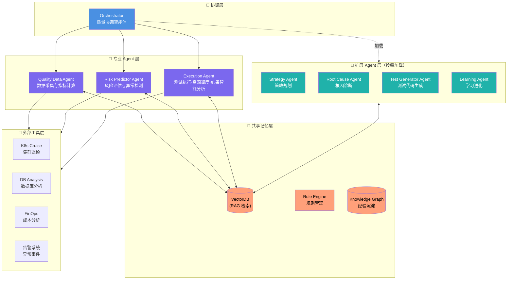

[TOC]
# AI Agent Testing - 质量智能体成长计划

> 🎯 **项目定位**：构建逐成熟完善的质量智能体（Quality Agent）的完整成长体系
>
> 🌱 **核心理念**：不是简单掌握测试工具，而是培养一个不断提升质量决策能力的 AI 质量伙伴
>
> 📈 **成长路径**：从「效率工具」到「自主决策」，从「执行者」到「质量智能体」
>
> 🏗️ **技术架构**：混合Agent架构 + RAG + Tool Use + 规则引擎
>
> 🎁 **交付标准**：通用框架 + 测试/运维领域最佳实践（可开源）

---

## 一、质量智能体的明确定义与长远目标

### 1. 质量智能体的正式定义

```
【质量智能体 (Quality Agent)】

一个具备自主决策能力的AI系统，能够:
  1. 理解业务质量目标
  2. 感知产品状态与风险
  3. 自主制定质量策略
  4. 协调多方资源执行
  5. 持续学习与进化

质量智能体 ≠ 增强的测试工具
质量智能体 = 具备质量思维的AI伙伴
```

### 2. 质量智能体的五维能力模型

| 能力维度 | 说明 | 传统测试 vs 质量智能体 |
|---------|------|---------------------|
| **感知层** | 感知质量状态 | • 传统：🔥 工程师读日志监控<br>• 质量智能体：📈 实时数据流感知 |
| **认知层** | 认知质量风险 | • 传统：📊 手动分析报告<br>• 质量智能体：🧠 AI 自动风险评估 |
| **决策层** | 决策质量策略 | • 传统：📝 工程师编写测试策略<br>• 质量智能体：🎯 AI 动态制定策略 |
| **执行层** | 执行测试任务 + 智能分析 | • 传统：⚡ 自动化脚本执行<br>• 质量智能体：🤖 多 Agent 协同执行 + 🧠 AI 驱动结果分析（根因定位、归因分析、优化建议） |
| **进化层** | 持续学习进化 | • 传统：❌ 无学习能力<br>• 质量智能体：🔄 经验沉淀 + 策略优化 |

### 3. 质量智能体的长远目标（2026-2030）

> 💡 **两个维度的成长路径**
> - **行业发展愿景（2026-2030）**：质量智能体技术在行业内的演进路线
> - **个人能力培养（8 周）**：单个学习者从零到 Level 3 的成长路径

| 阶段 | 年份 | 能力等级 | 重点能力 | 代表项目 |
|-----|------|---------|---------|---------|
| 启航 | 2026 | Level 1-2 | 数据感知、基础分析、测试生成、认知决策 | 自动化测试脚本生成、数据报告生成、多 Agent 协同 |
| 成长 | 2027 | Level 2-3 | 风险预测、根因分析、策略优化 | 智能根因分析、动态测试策略、A/B 测试编排 |
| 协同 | 2028 | Level 3-4 | 多智能体协同、质量战略规划 | 跨团队质量协同、质量中台建设 |
| 自治 | 2029 | Level 4 | 自主质量治理、质量策略持续演进 | 自治质量中台、AI 质量决策引擎 |
| 共生 | 2030 | Level 5 | 质量文化培育、质量价值创造 | 智能质量生态系统、质量价值网络 |

### 4. 质量智能体 vs 传统自动化测试

| 维度 | 传统自动化测试（2025） | 质量智能体（2026） |
|-----|---------------------|------------------|
| **AI定位** | 加速器（节省时间） | 质量伙伴（主动预防） |
| **决策模式** | 工程师定义规则 → AI 执行 | 工程师定目标 → AI 决策 → 工程师监督 |
| **响应方式** | 被动响应：问题发生 → 测试发现 → 修复 | 主动预防：风险预测 → 自动干预 → 避免问题 |
| **优化范围** | 单点优化：提高测试速度与覆盖率 | 系统优化：质量策略持续进化，驱动业务提升 |
| **价值定位** | 降低测试成本 | 提升质量决策质量 |
| **本质** | AI 是流水线上的自动工具 | AI 与工程师共同构建的质量生态系统 |

### 5. 质量智能体的学习目标（2026 年）

| 阶段 | 能力等级 | 核心能力 | 代表 Agent |
|-----|---------|---------|-----------|
| 第 1-2 周 | Level 1: 数据感知 | 质量数据采集与治理 | Quality Data Agent |
| 第 3-4 周 | Level 2: 认知分析 | 质量状态评估、风险识别 | Risk Predictor Agent |
| 第 5-6 周 | Level 3: 决策规划 | 动态质量标准、策略优化 | Strategy Agent |
| 第 7-8 周 | Level 3: 执行协调 | 自动化测试编排、资源调度 | Execution Agent |
| Capstone | Level 3: 多智能体协同 | 质量协调、自主决策 | Orchestrator |

---

## 二、质量智能体技术架构

### 1. 技术架构总览



### 2. 核心组件职责

| 组件 | 类型 | 核心职责 | 技术选型 |
|-----|------|---------|---------|
| **Orchestrator** | 协调层 | 全局协调、目标分解、策略决策 | LLM + State Machine |
| **Quality Data Agent** | 专业Agent | 数据采集、质量指标计算、感知层 | Tool Use + Data Pipeline |
| **Risk Predictor Agent** | 专业Agent | 风险评估、异常检测、根因分析 | ML Model + LLM |
| **Strategy Agent** | 专业Agent | 动态测试策略生成、质量规划 | LLM + Rule Engine |
| **Root Cause Agent** | 专业Agent | 智能根因诊断、故障定位 | LLM + Knowledge Graph |
| **Execution Agent** | 专业Agent | 测试执行、资源调度、结果智能分析（根因定位、归因分析、优化建议） | Workflow Engine + LLM + Knowledge Graph |
| **Test Generator Agent** | 专业Agent | 代码理解、测试框架生成、测试用例实现 | LLM + Code Analysis + RAG |
| **Learning Agent** | 专业Agent | 经验沉淀、知识图谱更新、策略优化 | RAG + Reinforcement Learning |
| **Shared Memory** | 记忆层 | 经验存储、RAG检索、规则管理 | VectorDB + Rule Engine + GraphDB |

**各 Agent 核心能力概述**：

**Strategy Agent（策略规划智能体）**
- **核心能力**：动态生成测试策略、质量规划、资源分配
- **技术要点**：LLM + Rule Engine（基于历史数据的质量规则）

**Root Cause Agent（根因诊断智能体）**
- **核心能力**：智能根因诊断、故障定位、关联分析
- **技术要点**：LLM + Knowledge Graph（故障知识图谱）+ 多维度关联分析

**Execution Agent（执行协调智能体）**
- **核心能力**：测试执行、资源调度、AI驱动的测试结果智能分析
- **架构特色**：双引擎架构（执行引擎 + 分析引擎），分析引擎包含四大核心能力：
  - 测试结果智能分析（关键指标提取 + 异常模式识别 + 历史趋势关联）
  - 根因分析（失败分类 → 多维度关联 → 因果链路推导）
  - 归因分析（责任维度映射 → 影响范围评估 → 归因报告生成）
  - 优化建议生成（建议分类 → 优先级排序 → 上下文相关建议）

📖 **双引擎架构、四大能力流程图、技术架构表、数据流图、协作关系详见**：[docs/QUALITY_AGENT_EXECUTION.md](./docs/QUALITY_AGENT_EXECUTION.md)

**Learning Agent（学习进化智能体）**
- **核心能力**：经验沉淀、知识图谱更新、策略优化
- **技术要点**：RAG + Reinforcement Learning（策略优化）

### 3. 测试代码生成智能体 (Test Generator Agent)

Test Generator Agent 是质量智能体的核心专业 Agent 之一，负责**代码理解 → 测试框架生成 → 测试用例实现**的全流程自动化。

**核心能力三合一**：代码理解（源码解析/业务逻辑识别/API抽取/依赖分析） → 测试框架自动生成（框架选型/脚手架/数据模型/环境配置） → 测试用例实现（边界值/异常场景/集成/E2E）

**技术架构核心组件**：

| 组件 | 职责 | 技术选型 |
|-----|------|---------|
| **Code Parser** | 源码解析、业务逻辑识别、API 抽取 | LLM + AST Parser + Code Summarization |
| **Test Planner** | 测试范围确定、框架选型、数据策略 | 规则引擎 + LLM |
| **Test Case Generator** | 边界值/异常场景/集成/E2E 用例生成 | LLM + RAG + Test-Agent（集成扩展） |
| **RAG Knowledge Base** | 测试模式库、最佳实践、编码规范 | VectorDB |
| **Hybrid Analysis Engine** | 静态控制流 + 动态覆盖率迭代分析 | Panta 方法论（CFG + Coverage Feedback） |

**技术可行性**：代码解析 ✅ | 框架生成 ✅ | 用例生成 ⚠️ | 业务逻辑理解 ⚠️ | E2E测试 ⚠️ | 混合分析迭代 ✅

**里程碑检查点**：

| 里程碑 | 时间 | 核心交付 | 通过条件 |
|-------|------|---------|---------|
| **M1: MVP 可用** | Week 2 末 | Python 单元测试生成 CLI | 3 个示例项目全部通过 |
| **M2: 多类型覆盖** | Week 5 末 | 单元 + 集成 + API 测试生成 | 覆盖 ≥ 3 种测试类型 |
| **M3: E2E 突破** | Week 6 末 | Playwright E2E 测试生成 | 简单 CRUD 流程自动化 |
| **M4: 进化闭环** | Week 7 末 | 反馈驱动的策略优化 | 二次生成通过率提升 ≥ 15% |
| **M5: 多语言就绪** | Week 8 末 | Python + Java + Go 支持 | 各语言 ≥ 85% 语法正确率 |

**核心 KPI 目标**：

| KPI | Phase 1 | Phase 2 | Phase 3 |
|-----|---------|---------|---------|
| 语法正确率 | ≥ 90% | ≥ 93% | ≥ 95% |
| 断言有效率 | ≥ 60% | ≥ 75% | ≥ 85% |
| 分支覆盖率增量 | +10% | +20% | +30% |
| 人工修改率 | ≤ 40% | ≤ 25% | ≤ 15% |

📖 **完整架构图、技术架构详解、框架适配矩阵、业界调研、集成方案、风险评估详见**：[docs/QUALITY_AGENT_TEST_GENERATOR.md](./docs/QUALITY_AGENT_TEST_GENERATOR.md)

---

## 三、工具集成方案

#### 与现有系统桥接

| 现有能力 | 在质量智能体中的角色 | 集成方式 |
|---------|-------------------|---------|
| **K8s集群巡检** | 感知层 - 基础设施健康 | mcp_hdops_mcp_get_k8s_* |
| **DB分析** | 感知层 - 数据层健康 | mysql-analysis-aliyun, pg-analysis-aliyun |
| **FinOps分析** | 感知层 - 成本质量 | finops-analysis-aliyun |
| **告警系统** | 感知层 - 异常事件源 | mcp_hdops_mcp_get_k8s_current_alert |

#### 开源工具生态集成

| 开源工具 | 定位 | 集成方式 | 核心价值 |
|---------|------|---------|---------|
| **Test-Agent** (蚂蚁 CodeFuse) | 测试生成能力层 | **直接集成并扩展** | 多语言测试用例自动生成、智能断言补全、测试策略推荐 |
| **Superpowers Framework** | 方法论参考 | 参考借鉴，不直接集成 | TDD 红绿重构循环、微任务规划、并行子 Agent 执行、结构化代码审查 |
| **Panta 方法论** | 核心分析能力 | **当前架构纳入** | 静态控制流分析 + 动态覆盖率分析 → 迭代引导 LLM 生成测试 |

#### 感知层数据流

```
K8s巡检数据 ──┐
              ├──► Quality Data Agent ──► 质量指标计算 ──► RAG存储
DB分析数据 ───┤                                           │
              │                                           ▼
FinOps数据 ───┤                                  ┌───────────────┐
              │                                  │    VectorDB   │
告警数据 ─────┴──► Risk Predictor Agent ─────► │  + Rule Engine │
                                                 └───────────────┘
```

---

## 四、进化机制技术路径

### 三层进化架构概要

| 层级 | 存储技术 | 检索方式 | 更新机制 | 生命周期 |
|-----|---------|---------|---------|---------|
| **短期记忆** | Redis / Memory | 直接访问 | 会话结束时清理 | 单次任务会话 |
| **长期记忆** | VectorDB (Milvus/Pinecone) | ANN检索 | 定时增量更新 | 持久化，可跨会话检索 |
| **规则库** | PostgreSQL / JSON | 规则引擎匹配 | 自动 + 人工审核 | 自动更新 + 人工审核 |

**进化流程**：任务执行 → 经验沉淀 → RAG索引 → 规则抽取 → 规则应用

**失败学习**：失败案例 → 根因分析 → 预防策略 → 规则库更新

📖 **三层进化架构图、实施代码示例、经验沉淀机制详见**：[docs/QUALITY_AGENT_EVOLUTION.md](./docs/QUALITY_AGENT_EVOLUTION.md)

---

## 五、能力成熟度评估体系

### Quality Agent Readiness Model

| 成熟度等级 | 能力描述 | 评估指标 | 2026年目标 |
|-----------|---------|---------|-----------|
| **Level 1** | 基础执行 | 测试脚本自动生成率 > 80% | Week 1-2 |
| **Level 2** | 数据感知 | 质量指标采集覆盖率 > 90% | Week 3-4 |
| **Level 3** | 风险认知 | 风险预测准确率 > 85% | Week 5-6 |
| **Level 4** | 自主决策 | 策略自动生成 + 人工确认 | Week 7-8 |
| **Level 5** | 自我进化 | 规则自动更新 + 零人工干预 | Capstone |

### 核心指标对比

| 维度 | 指标 | 行业基线 | 本项目目标 | 测量方法 |
|-----|------|---------|-----------|---------|
| **感知能力** | 数据采集覆盖率 | 60-70% | > 90% | 日志采集点数 / 总服务数 |
| **感知能力** | 监控数据实时性 | 5-10 分钟 | < 2 分钟 | 数据采集到可用延迟 |
| **认知能力** | 风险识别准确率 | 50-60% | > 85% | 预测正确次数 / 总预测次数 |
| **认知能力** | 根因定位时间 | 30-60 分钟 | < 5 分钟 | 从告警到根因报告时间 |
| **决策能力** | 策略生成采纳率 | 40-50% | > 80% | 人工确认通过的策略数 / 总生成数 |
| **执行能力** | 任务自动化完成率 | 70-80% | > 95% | 无需人工干预的任务比例 |
| **进化能力** | 规则自动更新占比 | < 20% | > 60% | 自动生成的规则 / 总规则数 |

---

## 六、质量智能体成长目标

### 2026 年的核心转变：从「效率工具」到「质量智能体」

### 质量智能体的五大核心能力

| 能力 | 说明 | 学习路径中的体现 |
|------|------|---------------|
| **自主质量定义** | AI 能根据业务目标自动生成质量标准 | 第 1-2 周：理解质量标准的动态性 |
| **主动风险预测** | AI 能提前预测质量问题的发生 | 第 3-4 周：数据驱动的质量评估 |
| **智能根因分析** | AI 能自动分析问题根因并提供建议 | 第 5-6 周：多维度关联分析 |
| **动态策略优化** | AI 能根据实时数据调整测试策略 | 第 7-8 周：自适应测试策略 |
| **多智能体协同** | AI 能协调多个智能体协同工作 | Capstone：多 Agent 协作系统 |

---

## 七、项目结构

```
ai-testing/
├── docs/
│   ├── README.md                             # docs 目录索引
│   ├── ai-agent-testing-knowledge-system.md  # 完整知识体系（质量智能体理论基础）
│   ├── 8-week-daily-task-list.md             # 8 周成长路径（质量智能体能力演进）
│   ├── week1-detailed-plan.md ~ week8-detailed-plan.md  # 各周详细计划
│   │
│   ├── QUALITY_AGENT_TEST_GENERATOR.md       # ✅ 测试代码生成智能体详解
│   ├── QUALITY_AGENT_EXECUTION.md            # ✅ 执行协调智能体详解（双引擎架构）
│   ├── QUALITY_AGENT_EVOLUTION.md            # ✅ 进化机制详解
│   ├── QUALITY_AGENT_RISK_MANAGEMENT.md      # ✅ 技术风险与缓解策略详解
│   └── QUALITY_AGENT_ARCHITECTURE.md         # ✅ 架构设计 + 安全与性能详解
│
├── .agents/
│   └── rules/
│       └── python-automation-testing-coding-standard.md  # 编码规范
│
├── AGENTS.md                                  # 本文件（质量智能体架构与培养指南）
├── README.md                                  # 项目说明（快速入门）
└── LICENSE
```

### 文档说明

| 文档 | 状态 | 说明 |
|-----|------|------|
| [AGENTS.md](./AGENTS.md) | ✅ 已完成 | 质量智能体核心架构与行动指南 |
| [docs/QUALITY_AGENT_EXECUTION.md](./docs/QUALITY_AGENT_EXECUTION.md) | ✅ 已完成 | 执行协调智能体详解（双引擎架构、四大能力流程、技术架构、数据流、协作关系） |
| [docs/QUALITY_AGENT_TEST_GENERATOR.md](./docs/QUALITY_AGENT_TEST_GENERATOR.md) | ✅ 已完成 | 测试代码生成智能体详解（架构图、框架适配、业界调研、集成方案） |
| [docs/QUALITY_AGENT_EVOLUTION.md](./docs/QUALITY_AGENT_EVOLUTION.md) | ✅ 已完成 | 进化机制详解（三层架构、实施代码示例） |
| [docs/QUALITY_AGENT_RISK_MANAGEMENT.md](./docs/QUALITY_AGENT_RISK_MANAGEMENT.md) | ✅ 已完成 | 技术风险与缓解策略详解 |
| [docs/QUALITY_AGENT_ARCHITECTURE.md](./docs/QUALITY_AGENT_ARCHITECTURE.md) | ✅ 已完成 | 架构设计 + 安全与性能详解 |
| [docs/ai-agent-testing-knowledge-system.md](./docs/ai-agent-testing-knowledge-system.md) | ✅ 已完成 | 质量智能体完整知识体系 |
| [docs/8-week-daily-task-list.md](./docs/8-week-daily-task-list.md) | ✅ 已完成 | 8 周成长路径详细任务清单 |
| [docs/week1-detailed-plan.md](./docs/week1-detailed-plan.md) ~ [week8-detailed-plan.md](./docs/week8-detailed-plan.md) | ✅ 已完成 | 第 1-8 周详细计划 |

---

## 八、质量智能体成长计划总览

### 学习本质：培养一个 AI 质量伙伴

**这不是一门「自动化测试技术」课，而是一门「质量智能体成长学」**

| 阶段 | 质量智能体能力 | 代表项目 | 与工程师关系 |
|-----|--------------|---------|----------|
| **初级** | 执行者 | 自动化测试脚本 | 工程师命令，AI 执行 |
| **中级** | 协助者 | 数据分析 + 报告 | 工程师定义，AI 辅助 |
| **高级** | 合作者 | 风险预测 + 决策 | 工程师监督，AI 决策 |
| **顶级** | 主导者 | 多智能体协同 | AI 主导，工程师指导 |

---

## 九、技术风险与缓解策略

### 风险清单概要

| 风险 | 可能性 | 影响 | 缓解策略 | 状态 |
|-----|-------|------|---------|------|
| **LLM 响应延迟 > 10 秒** | 高 | 用户体验差 | 流式响应 + 进度提示 + 本地缓存 | ✅ 已缓解 |
| **RAG 检索准确率 <70%** | 中 | 决策质量差 | 多路召回 + 重排序 + 混合检索 | ✅ 已缓解 |
| **Agent 执行死循环** | 低 | 资源浪费 | 超时熔断 + 最大迭代次数 + 人工介入 | ✅ 已缓解 |
| **测试代码质量不稳定** | 中 | 维护成本高 | Lint 检查 + 人工审核流程 + 代码评审 | 🔄 进行中 |
| **E2E 测试定位失败** | 中 | 测试不稳定 | Vision Model + 多重定位策略 + 自愈机制 | 🔄 进行中 |
| **知识图谱更新延迟** | 低 | 策略滞后 | 增量更新 + 异步处理 + 定期全量刷新 | ✅ 已缓解 |

📖 **风险详解、缓解措施、预期效果详见**：[docs/QUALITY_AGENT_RISK_MANAGEMENT.md](./docs/QUALITY_AGENT_RISK_MANAGEMENT.md)

---

## 十、快速开始：构建你的第一个 Agent

### 1. 环境准备

```bash
pip install langchain langchain-openai milvus-client pyyaml

export OPENAI_API_KEY="your-api-key"
export MILVUS_HOST="localhost"
export MILVUS_PORT="19530"
```

### 2. 创建 Quality Data Agent 示例

```python
from langchain.agents import AgentExecutor, Tool
from langchain_openai import ChatOpenAI
from langchain.prompts import ChatPromptTemplate

class QualityDataAgent:
    def __init__(self):
        self.llm = ChatOpenAI(model="gpt-4", temperature=0.3)
    
    def k8s_cruise(self, cluster_name: str) -> str:
        return f"✅ {cluster_name} 健康度：98%, CPU: 45%, 内存：72%"
    
    def analyze_quality(self, query: str) -> str:
        prompt = ChatPromptTemplate.from_template(
            "你是质量数据智能体，请分析:\n{query}"
        )
        chain = prompt | self.llm
        return chain.invoke({"query": query}).content

if __name__ == "__main__":
    agent = QualityDataAgent()
    result = agent.analyze_quality("分析 production-qa 集群")
    print(result)
```

### 3. 下一步

- 📖 阅读 [docs/week1-detailed-plan.md](./docs/week1-detailed-plan.md) 开始第 1 周学习
- 🔧 查看 [docs/QUALITY_AGENT_TEST_GENERATOR.md](./docs/QUALITY_AGENT_TEST_GENERATOR.md) 了解 Test Generator
- 🏗️ 参考 [docs/ai-agent-testing-knowledge-system.md](./docs/ai-agent-testing-knowledge-system.md) 学习完整知识体系

---

## 十一、学习路径指南

### Capstone 交付物标准

| 维度 | 标准 |
|-----|------|
| **代码质量** | 符合 PEP8 + 编码规范，可直接开源 |
| **文档完整度** | README + API文档 + 架构图 + 使用示例 |
| **生产可用性** | 具备监控、日志、告警能力 |
| **可扩展性** | 易于添加新的Agent和工具 |

---

## 十二、安全与性能考虑

### 安全设计原则

| 安全维度 | 措施 | 说明 |
|---------|------|------|
| **数据安全** | 敏感信息脱敏 | 测试数据不包含生产敏感信息 |
| **访问控制** | RBAC权限管理 | 按角色控制Agent访问权限 |
| **代码安全** | 沙箱执行环境 | 生成的测试代码在隔离环境运行 |
| **模型安全** | Prompt注入防护 | 防止恶意输入影响Agent决策 |
| **审计追踪** | 全链路日志 | 所有Agent操作可追溯 |

### 性能指标要求（概要）

| 指标 | 目标值 | 说明 |
|-----|-------|------|
| **代码理解速度** | < 30秒/千行 | AST解析+语义分析耗时 |
| **测试生成速度** | < 60秒/用例 | 单个测试用例生成时间 |
| **根因分析速度** | < 300秒 | 复杂故障根因定位时间 |
| **归因分析速度** | < 120秒 | 失败用例责任方/模块归因时间 |
| **RAG检索延迟** | < 2秒 | 向量数据库检索响应时间 |
| **并发处理能力** | > 10 Agent并行 | 多Agent协同并发数 |
| **根因分析准确率** | > 80% | Top-3 根因命中率 |
| **归因准确率** | > 85% | 责任方/模块归因正确率 |

### 容错与降级策略

| 场景 | 降级策略 | 恢复机制 |
|-----|---------|---------|
| **LLM服务不可用** | 使用本地规则引擎 | 服务恢复后自动切换 |
| **VectorDB不可用** | 使用本地缓存 | 数据同步后重建索引 |
| **测试执行失败** | 重试3次后标记失败 | 人工介入处理 |
| **代码解析失败** | 使用LLM辅助解析 | 记录失败样本用于优化 |
| **分析引擎不可用** | 降级为仅执行+结果收集 | 服务恢复后补全分析 |
| **Knowledge Graph不可用** | 根因分析降级为基于规则的分类 | 数据同步后恢复深度分析 |

📖 **安全设计详解、完整性能指标、容错降级策略详见**：[docs/QUALITY_AGENT_ARCHITECTURE.md](./docs/QUALITY_AGENT_ARCHITECTURE.md)

---

## 🔗 相关文档

| 文档 | 内容 |
|-----|------|
| [docs/QUALITY_AGENT_EXECUTION.md](docs/QUALITY_AGENT_EXECUTION.md) | 执行协调智能体详解（双引擎架构、四大能力、技术架构、数据流） |
| [docs/QUALITY_AGENT_TEST_GENERATOR.md](docs/QUALITY_AGENT_TEST_GENERATOR.md) | 测试代码生成智能体详解（架构图、框架适配、业界调研） |
| [docs/QUALITY_AGENT_EVOLUTION.md](docs/QUALITY_AGENT_EVOLUTION.md) | 进化机制详解（三层架构、代码示例） |
| [docs/QUALITY_AGENT_RISK_MANAGEMENT.md](docs/QUALITY_AGENT_RISK_MANAGEMENT.md) | 技术风险与缓解策略详解 |
| [docs/QUALITY_AGENT_ARCHITECTURE.md](docs/QUALITY_AGENT_ARCHITECTURE.md) | 架构设计 + 安全与性能详解 |
| [docs/ai-agent-testing-knowledge-system.md](docs/ai-agent-testing-knowledge-system.md) | 质量智能体完整知识体系 |
| [docs/8-week-daily-task-list.md](docs/8-week-daily-task-list.md) | 8周成长路径详细任务 |
| [.agents/rules/python-automation-testing-coding-standard.md](.agents/rules/python-automation-testing-coding-standard.md) | 编码规范与最佳实践 |
