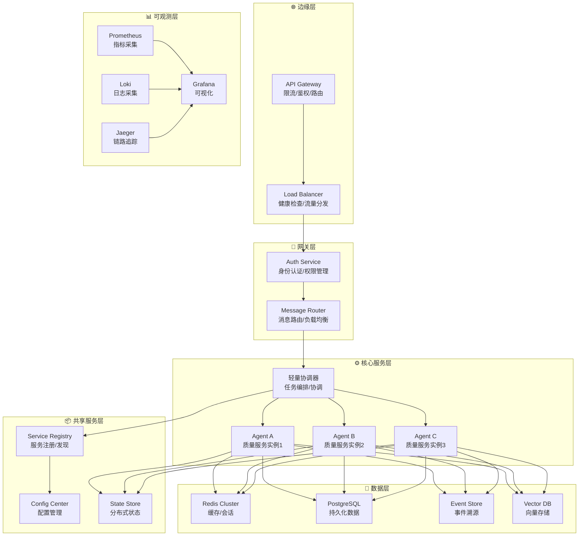

# 分布式系统设计

| 属性 | 值 |
|-----|-----|
| **文档类型** | ARCH |
| **版本** | v1.0.0 |
| **最后更新** | 2026-04-26 |
| **维护者** | 质量智能中台团队 |
| **关联文档** | [AGENTS.md](../../AGENTS.md) |

---

## 变更历史

| 版本 | 日期 | 变更内容 | 变更人 |
|-----|------|---------|--------|
| v1.0.0 | 2026-04-26 | 从AGENTS.md迁移详细设计 | - |

---

## 核心设计决策

> 质量智能中台本质是分布式Agent系统，必须遵循分布式系统设计原则，确保可靠性、可扩展性、可观测性与数据一致性。

#### 4.1.8.1 分布式架构核心原则

```
┌─────────────────────────────────────────────────────────────────┐
│                 分布式架构核心原则                                 │
├─────────────────────────────────────────────────────────────────┤
│                                                                 │
│  1. 可靠性（Reliability）                                       │
│     ├── 故障隔离：单点故障不影响全局                             │
│     ├── 冗余部署：关键组件多副本部署                            │
│     └── 自动恢复：故障自动检测与愈合                            │
│                                                                 │
│  2. 可扩展性（Scalability）                                     │
│     ├── 水平扩展：增加节点提升容量                              │
│     ├── 垂直扩展：提升单节点资源                                │
│     └── 弹性伸缩：基于负载动态扩缩                              │
│                                                                 │
│  3. 可观测性（Observability）                                    │
│     ├── 日志（Logs）：结构化日志，分布式追踪                    │
│     ├── 指标（Metrics）：RED/USE方法论                         │
│     └── 链路追踪（Traces）：端到端请求追踪                      │
│                                                                 │
│  4. 数据一致性（Consistency）                                    │
│     ├── 强一致性：关键业务操作（如计费）                        │
│     ├── 最终一致性：非关键数据（如配置）                        │
│     └── CAP权衡：根据场景选择合适策略                           │
│                                                                 │
└─────────────────────────────────────────────────────────────────┘
```

#### 4.1.8.2 分布式系统架构图



#### 4.1.8.3 分布式关键技术方案

| 技术领域 | 方案选型 | 说明 |
|---------|---------|------|
| **服务发现** | Consul + K8S Service | 跨环境统一服务发现 |
| **负载均衡** | L4/L7负载均衡 | 金丝雀发布/流量分割 |
| **故障检测** | 健康检查 + 心跳 | 主动故障检测 |
| **限流熔断** | Resilience4j / Sentinel | 保护系统不被冲垮 |
| **分布式锁** | Redis Redlock | 跨节点协调 |
| **分布式事务** | Saga / 最终一致性 | 避免2PC的性能问题 |
| **消息队列** | Kafka / RabbitMQ | 异步解耦 |
| **配置中心** | Apollo / Nacos | 配置统一管理 |

#### 4.1.8.4 数据分区与复制策略

| 数据类型 | 分区策略 | 复制因子 | 一致性模型 |
|---------|---------|---------|-----------|
| **Agent注册信息** | Hash(AgentID) | 3副本 | 强一致性 |
| **任务状态** | Hash(TaskID) | 3副本 | 最终一致性 |
| **质量指标** | Hash(Namespace) | 3副本 | 最终一致性 |
| **知识图谱** | Hash(EntityType) | 3副本 | 最终一致性 |
| **向量索引** | Hash(Namespace) | 2副本 | 最终一致性 |
| **会话状态** | Hash(SessionID) | 2副本 | 最终一致性 |

#### 4.1.8.5 故障处理与容灾

```
┌─────────────────────────────────────────────────────────────────┐
│                    故障处理与容灾机制                             │
├─────────────────────────────────────────────────────────────────┤
│                                                                 │
│  故障等级与处理策略：                                            │
│                                                                 │
│  ┌─────────┐  单Agent实例故障   ┌─────────────────────────────┐ │
│  │ 故障检测 │ ─────────────────▶ │ 自动重启/切换到健康实例    │ │
│  └─────────┘                    └─────────────────────────────┘ │
│                                       │                          │
│  ┌─────────┐  节点级故障         ▼                          │
│  │ 故障隔离 │ ─────────────────▶ 流量切换到其他节点           │
│  └─────────┘                                       │          │
│                                       ┌──────────┴──────────┐  │
│  ┌─────────┐  数据中心级故障      ▼                      ▼   │
│  │ 容灾切换 │ ─────────────────▶ 跨数据中心切换       人工介入 │
│  └─────────┘                    └───────────────────────────┘ │
│                                                                 │
│  核心机制：                                                     │
│  ├── 健康检查：Liveness Probe + Readiness Probe                │
│  ├── 熔断器：故障快速失败，防止雪崩                            │
│  ├── 重试机制：指数退避 + 抖动                                 │
│  ├── 幂等设计：重复请求安全处理                                │
│  └── 兜底策略：降级服务 + 人工告警                             │
│                                                                 │
└─────────────────────────────────────────────────────────────────┘
```

#### 4.1.8.6 性能与延迟优化

| 优化维度 | 策略 | 目标 |
|---------|------|------|
| **网络延迟** | 就近部署、同AZ优先 | P99 < 50ms |
| **API延迟** | 缓存、本地优先 | P99 < 100ms |
| **Agent协作** | 异步消息、批量处理 | P99 < 500ms |
| **长任务** | 后台任务、SSE推送 | 实时反馈 |
| **冷启动** | 预热、镜像缓存 | 启动 < 30s |

#### 4.1.8.7 多租户隔离设计（P1 - 预留扩展架构）

> ⭐ **设计决策**：多租户隔离在试点阶段（Phase 1）不强制实施，但在架构设计中预留完整扩展空间，确保未来可平滑演进。当前采用"逻辑隔离 + 物理隔离能力预留"策略。

**架构演进路径**：

```
┌─────────────────────────────────────────────────────────────────┐
│              多租户隔离演进路径                                  │
├─────────────────────────────────────────────────────────────────┤
│                                                                 │
│  Phase 1-2（试点期）：逻辑隔离                                  │
│  ├── 命名空间隔离（Namespace）                                  │
│  ├── 基于角色的访问控制（RBAC）                                │
│  └── 数据访问层过滤（行级/列级权限）                           │
│                                                                 │
│  Phase 3-4（成熟期）：物理隔离                                   │
│  ├── 独立数据库/Schema（可选）                                  │
│  ├── 独立K8s命名空间（可选）                                    │
│  ├── 网络隔离（NetworkPolicy）                                │
│  └── 存储隔离（独立Volume）                                     │
│                                                                 │
│  【关键设计原则】                                               │
│  ├── 代码层提前抽象：所有数据操作必须包含 tenant_id             │
│  ├── 配置驱动：隔离级别通过配置切换，无需代码修改               │
│  └── 渐进升级：逻辑隔离 → 物理隔离无缝升级                      │
│                                                                 │
└─────────────────────────────────────────────────────────────────┘
```

**当前架构预留（逻辑隔离层）**：

```
┌─────────────────────────────────────────────────────────────────┐
│                    多租户隔离架构（预留）                          │
├─────────────────────────────────────────────────────────────────┤
│                                                                 │
│  应用层（统一入口）：                                           │
│  ├─ 请求上下文注入 tenant_id                                    │
│  ├─ 租户认证与权限校验                                          │
│  └─ 跨租户访问审计日志                                          │
│                                                                 │
│  服务层（逻辑隔离）：                                           │
│  ├─ 数据访问自动过滤（WHERE tenant_id = ?）                    │
│  ├─ 资源配额限制（QPS/存储/计算）                              │
│  └─ 租户级别限流熔断                                            │
│                                                                 │
│  数据层（物理隔离预留）：                                        │
│  ├─ 共享数据库 + tenant_id 字段（当前）                        │
│  ├─ 独立Schema（预留）                                          │
│  └─ 独立数据库实例（预留）                                      │
│                                                                 │
│  基础设施层（K8s预留）：                                         │
│  ├─ 共享Namespace + 标签隔离（当前）                           │
│  ├─ 独立Namespace（预留）                                       │
│  └─ 独立集群（远期预留）                                        │
│                                                                 │
│  ┌───────────────────────────────────────────────────────────┐  │
│  │  预留扩展点：                                              │  │
│  │  • 配置项：tenant.isolation.level=[logical|physical]       │  │
│  │  • 接口：TenantDataSourceRouter（多数据源路由）            │  │
│  │  • 注解：@TenantAware（自动注入租户上下文）                │  │
│  │  • CRD：TenantResource（K8s租户资源定义）                  │  │
│  └───────────────────────────────────────────────────────────┘  │
│                                                                 │
└─────────────────────────────────────────────────────────────────┘
```

---

### 4.1.9 灾难恢复(Disaster Recovery)设计
